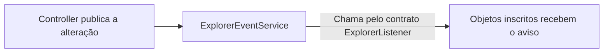

# Arquitetura e padrões: quem faz o quê

[Índice](README.md) · [Domínio](modelo-de-dominio.md) · [Interface](interface-e-fluxos.md) · [Banco](banco-de-dados.md)

Uma responsabilidade é o trabalho que uma classe assume. Uma colaboração acontece quando um objeto usa outro para completar esse trabalho. Esta página mostra como essas partes se conectam no Tag-File.

<a id="arq-01"></a>

## Divisão de responsabilidades

| Grupo | Responsabilidade | Exemplo |
|---|---|---|
| Models | Representar conceitos e dados do domínio. | LocalFile, NativeFile, NativeDirectory e Tag. |
| Components | Apresentar partes reutilizáveis da UI. | Representação visual de um arquivo ou de uma etiqueta. |
| Screens | Montar a apresentação e ligar os eventos dos componentes ao Controller. | Receber a seleção de um arquivo e de uma Tag. |
| Controllers | Coordenar solicitações e publicar alterações pertinentes. | Receber a ação de associar um arquivo. |
| Managers | Coordenar um assunto específico. | LocalFileManager combina leitura nativa e persistência dos cadastros. |
| Services | Executar trabalho especializado. | NativeFileService manipula arquivos reais. |
| DAOs | Ler e gravar dados no SQL. | LocalFileTagDAO persiste uma associação. |

A Screen conhece seus componentes, mas não executa SQL nem operações físicas. O DAO conhece a persistência, mas não manipula arquivos nem publica eventos de UI. Os pacotes implementados usam nomes em minúsculas; a organização completa está no [guia](implementacao.md).

<a id="arq-05"></a>

## Os dois Controllers

| Controller | Recebe solicitações da visão |
|---|---|
| TagExplorerController | Arquivos por Tag. |
| LocalFileExplorerController | Arquivos Local. |

A Screen registra listeners nos seus componentes e encaminha as ações ao Controller. Um listener é um objeto que recebe uma chamada quando ocorre um evento, como um clique. O Controller não precisa conhecer os botões internos da Screen para coordenar a solicitação.

Os dois Controllers compartilham os Managers, Services, DAOs e clipboard pertinentes. A comunicação visual entre exploradores não exige que um Controller chame diretamente o outro.

<a id="arq-06"></a>

## Observer: avisar sobre uma alteração

Ao associar uma etiqueta a um arquivo, as duas visões podem precisar mostrar a mudança.

O Controller coordena a operação e publica a alteração no **ExplorerEventService**. Esse serviço mantém uma lista de objetos interessados e chama um método de cada um, seguindo a interface **ExplorerListener**. Essa comunicação por avisos aplica o padrão **Observer**.



Inscrever um objeto significa guardar sua referência na lista de interessados. A interface define quais métodos ele precisa oferecer. O serviço usa esse contrato para avisá-lo, sem precisar conhecer seus botões ou sua disposição visual. A chamada recebida é frequentemente chamada de callback.

Os Panels exercem o papel de Screens e implementam ExplorerListener. Recebem fotografias imutáveis já consultadas, incluindo arquivos nativos sem cadastro. Inscrição, remoção e parâmetros estão em [P-04](decisoes-e-pendencias.md#p-04), [P-05](decisoes-e-pendencias.md#p-05) e nos Javadocs.

**Receber o aviso não repete a associação nem inicia outro Refresh global.** O Observer também não vigia o disco continuamente. As verificações de disponibilidade acontecem nos [gatilhos definidos](requisitos-e-regras.md#syn-01).

onFileChanged, onTagChanged e onFileTagsChanged são nomes de referência para os avisos. A API precisa atender também a arquivos sem LocalFile; não se cria cadastro artificial para notificar. DAOs e NativeFileService não publicam eventos de UI. A versão permanece sem classe ExplorerEvent e sem enum de eventos.

### Ligação com Swing

O listener de um componente encaminha uma solicitação do usuário. O aviso do Observer comunica uma alteração que precisa aparecer na UI. Essas duas chamadas têm propósitos diferentes.

Swing atualiza seus componentes, em geral, na **Event Dispatch Thread (EDT)**. Uma chamada comum de callback executa na thread que a chama; usar Observer não transfere automaticamente o trabalho para a EDT. Operações demoradas nessa thread deixam a interface sem responder. [Política de threads do Swing](https://docs.oracle.com/en/java/javase/24/docs/api/java.desktop/javax/swing/package-summary.html).

SwingWorker é uma alternativa para trabalho em segundo plano. Nesta implementação, ActionGate admite a solicitação por AtomicBoolean e cria uma thread apenas se estiver livre. Publicações e diálogos passam pela EDT; a ação mantém a posse até terminarem. Isso implementa [OP-09](requisitos-e-regras.md#op-09), sem fila. [API de SwingWorker para comparação](https://docs.oracle.com/en/java/javase/24/docs/api/java.desktop/javax/swing/SwingWorker.html).

O padrão Observer já era usado antes de 2025. As classes java.util.Observable e java.util.Observer foram desaconselhadas desde Java 9 por limitações do modelo de eventos; o JDK 24 mantém essa depreciação. O projeto usa seu próprio ExplorerListener. [API de Observable](https://docs.oracle.com/en/java/javase/24/docs/api/java.base/java/util/Observable.html).

<a id="arq-03"></a>

## Como uma operação é executada

```text
Screen recebe a ação
→ Controller chama o Manager/Service responsável
→ colaboradores executam o trabalho e informam o resultado
→ Controller publica a atualização pertinente
```

Quando há LocalFile, LocalFileManager coordena as etapas de disco pelo NativeFileService e as etapas de banco pelos DAOs. Um arquivo sem cadastro usa NativeFileService sem criar LocalFile apenas para permitir a operação.

O Controller acompanha o resultado real, inclusive falhas parciais. Uma consulta sem alteração não exige evento de sucesso. As chamadas são diretas: a retirada de Command está encerrada em [DEC-01](decisoes-e-pendencias.md#dec-01), preservando as funcionalidades físicas.

O filtro restringe resultados; o usuário seleciona os alvos; a operação usa a seleção confirmada. Repetir o filtro não pode trocar silenciosamente os arquivos afetados depois da confirmação.

Os dois Controllers devem respeitar o mesmo controle de ação em andamento. Uma nova solicitação recebida enquanto outra executa é bloqueada, sem enfileiramento; isso vale também para gatilhos automáticos e reentrância. Consultas, etapas físicas, persistência e avisos necessários ao fluxo pertencem à ação atual. O controle é liberado ao encerrar a ação por sucesso, falha ou cancelamento. O mecanismo concreto permanece em P-12, sem exigir uma nova classe ou padrão pelo nome.

<a id="arq-07"></a>

## Arquivos, cadastros e clipboard

| Participante | Trabalho |
|---|---|
| NativeFileService | Lê metadados e manipula arquivos reais. Recebe NativeFile/NativeDirectory e usa Path internamente quando necessário. Não executa SQL. |
| LocalFileManager | Coordena disponibilidade, sincronização e ciclo de vida dos cadastros, combinando serviço nativo e DAOs. Não administra o processo MySQL. |
| ClipboardService | Guarda COPY ou CUT, compartilhado pelos dois exploradores, para a colagem de arquivos com ou sem cadastro. |

Recortar só guarda intenção. Colar consulta o clipboard compartilhado de um arquivo. COPY permanece após sucesso; CUT limpa após sucesso completo. Associação em lote para na primeira falha, conforme [P-12](decisoes-e-pendencias.md#p-12). O clipboard não se integra ao do sistema operacional.

refresh/refreshAll são nomes de referência para atualização; cleanupOrphans/cleanupMissingTagFiles, para limpeza. O comportamento a preservar é separar atualização rotineira da limpeza exclusiva da inicialização.

<a id="arq-02"></a>

## Factory: centralizar a criação

Uma única Factory cria **Tag e LocalFile**; EntityFactory é o nome de referência. NativeFile e NativeDirectory são instanciados diretamente. Criar LocalFile inclui preparar corretamente sua referência nativa.

A centralização reúne o trabalho pertinente à criação. Os construtores validam os dados imutáveis; a Factory gera UUID/datas de entidades novas e obtém metadados físicos pelo serviço; o Manager obtém confirmações e aplica as regras entre entidades.

Ao carregar um cadastro do banco, o DAO usa o construtor com UUID e datas persistidos. A Factory só cria entidades novas. Gerar outro UUID em cada consulta faria o mesmo cadastro parecer novo.

Essa é uma **Factory simples**; não está classificada como Factory Method ou Abstract Factory GoF.

<a id="arq-04"></a>

## DAO: concentrar o acesso ao banco

DAO significa Data Access Object. Ele reúne o código de consulta e gravação para que a UI e os demais colaboradores não precisem montar SQL. [Catálogo de DAO da Oracle](https://www.oracle.com/java/technologies/dataaccessobject.html).

| DAO | Dados sob sua responsabilidade |
|---|---|
| LocalFileDAO | Cadastros de arquivos. |
| TagDAO | Tags e suas extensões; carrega e persiste as extensões junto da Tag. |
| LocalFileTagDAO | Associações entre arquivos e Tags e consultas relacionais pertinentes. |

O contrato genérico definido é:

```text
CrudDAO<T, F extends Filter>

LocalFileDAO implements CrudDAO<LocalFile, LocalFileFilter>
TagDAO       implements CrudDAO<Tag, TagFilter>
```

T representa o tipo de entidade, e F o tipo de filtro que deriva de Filter. O contrato contempla criação, consulta por UUID, consulta por filtro, atualização e exclusão. A interface implementada usa Optional vazio para ausência por UUID, List para consulta por filtro e SQLException para falhas; erros não se tornam resultados vazios.

LocalFileTagDAO é especializado em associar, desassociar e consultar vínculos. Não precisa implementar CrudDAO nem ter um UPDATE sem utilidade. Também não há DAO de extensões separado obrigatório.

**CRUD** nomeia criar, ler, atualizar e excluir dados; **DAO** organiza o acesso a eles. Os dois termos são distintos do catálogo GoF.

Consultar Tags retorna Tags. Pesquisar arquivos por Tags retorna arquivos. O encaixe dessa segunda consulta permanece em [P-05](decisoes-e-pendencias.md#p-05); TagDAO mantém seu tipo de retorno Tag.

<a id="arq-08"></a>

## Servidor e conexão MySQL

| Participante | Trabalho |
|---|---|
| DatabaseManager | Verifica/prepara a instância local, aciona instalação autorizada e scripts, prepara a estrutura e coordena início/parada. |
| DatabaseConnection | Centraliza abertura, tratamento e fechamento da conexão JDBC compartilhada. |
| DAOs | Guardam referência à mesma DatabaseConnection para executar SQL. |

Administrar o servidor e consultar uma tabela são trabalhos diferentes. A aplicação usa a conexão compartilhada, sem pool. Um DAO não deve fechá-la inadvertidamente ao concluir cada chamada.

open, getConnection e close implementam o ciclo explícito da conexão compartilhada. Os procedimentos e versões estão em [ambiente](instalacao-e-execucao.md) e [P-11](decisoes-e-pendencias.md#p-11).

<a id="arq-09"></a>

## Padrões e justificativas no projeto

A equipe deve conseguir explicar qual problema cada padrão resolve e quais objetos participam. Observer, DAO e as responsabilidades GRASP já estão ligados a necessidades do Tag-File.

| Conceito | Categoria | Aplicação e justificativa |
|---|---|---|
| Observer | GoF comportamental | Comunicar alterações às apresentações interessadas por uma interface. |
| DAO | Acesso a dados | Concentrar SQL e reconstrução dos dados fora da UI. |
| Factory simples | Organização da criação | Centralizar a construção de Tag e LocalFile. |
| GRASP Controller | Atribuição de responsabilidades | Coordenar solicitações fora dos componentes visuais. |
| GRASP Information Expert | Atribuição de responsabilidades | Identificar quem possui a informação necessária para uma decisão. A compatibilidade, por exemplo, depende das extensões da Tag e do arquivo; sua validação final ainda precisa ser distribuída. |
| GRASP High Cohesion | Atribuição de responsabilidades | Reunir trabalhos relacionados, como operações de disco em NativeFileService. |
| GRASP Low Coupling | Atribuição de responsabilidades | Evitar conhecimento desnecessário entre partes, como um DAO conhecer botões Swing. |

Compartilhar DatabaseConnection não demonstra Singleton; herdar de Filter não demonstra Strategy; usar o nome Factory não demonstra uma fábrica GoF. Creator, Strategy, Singleton e fábricas GoF não são requisitos adicionais. Classes Manager também não são padrões GoF por seu nome.

Nos comentários arquiteturais futuros, expliquem o problema, os participantes e a colaboração implementada. Eventos estruturados, clipboard do sistema, transações e Undo/Redo são evoluções apenas comentadas; não reintroduzem Command.

<a id="percurso-associacao"></a>

## Exemplo: associar prova.pdf a Faculdade

A Screen encaminha o arquivo e a Tag ao Controller. Os colaboradores verificam compatibilidade e procuram o cadastro pelo caminho. Se ele existir, reutilizam seu UUID; caso contrário, a Factory cria o LocalFile necessário. Os DAOs persistem o cadastro e a associação.

Adicionar uma Tag normal retira o vínculo com Etiqueta Ausente, quando houver. Criar LocalFile também aciona a sugestão de predefinida compatível, cujo efeito de supressão está em P-03. O Controller publica a alteração e a apresentação mostra as Tags. Os detalhes estão em [UC-05](casos-de-uso.md#uc-05).

<a id="percurso-movimentacao"></a>

## Exemplo: recortar em uma visão e colar na outra

Recortar em Arquivos por Tag guarda CUT no ClipboardService; o arquivo permanece na origem. Na colagem em Arquivos Local, o Controller recebe a pasta de destino e aciona os colaboradores responsáveis.

Para um arquivo cadastrado, LocalFileManager coordena o movimento pelo NativeFileService e a atualização do caminho pelos DAOs. Para arquivo sem cadastro, a operação física usa NativeFileService diretamente. Em sucesso completo, o arquivo muda de pasta e conserva UUID e Tags quando cadastrado.

Se mover funcionar e salvar falhar, a mensagem distingue as duas etapas. Conflitos e estado do clipboard após colagem permanecem nos limites de [UC-09](casos-de-uso.md#uc-09) e P-12.

<a id="percurso-refresh"></a>

## Exemplo: Refresh compartilhado

```text
Botão Refresh, troca de aba ou aplicação de filtros
→ Controller coordena uma atualização global
→ LocalFileManager lê metadados com NativeFileService e persiste com DAOs
→ Controller publica a atualização pertinente
→ apresentações atualizam o que mostram
```

Uma solicitação admitida pelo controle de [OP-09](requisitos-e-regras.md#op-09) atualiza todos os LocalFile uma vez. O aviso não provoca outro Refresh; refreshAll não limpa cadastros sem classificação. Dados ausentes e escritas sem alteração continuam em P-10. P-12 mantém aberta a implementação do controle compartilhado; impedir reentrância já é requisito. Veja [UC-14](casos-de-uso.md#uc-14).

<a id="orientacao-construcao"></a>

## Ordem de construção

A sequência abaixo organiza as responsabilidades existentes. Os contratos usados nesta implementação estão no [registro de decisões](decisoes-implementacao.md); revise-os antes de alterar uma integração.

<a id="bloco-dominio"></a>

1. **Domínio:** representar arquivos, cadastros, Tags e identidade. Começar pelo [modelo](modelo-de-dominio.md) e conferir as validações, coleções imutáveis e a reconstrução com identidade preservada.

<a id="bloco-ambiente"></a>

2. **Persistência e ambiente:** preparar a instância, a conexão compartilhada e os DAOs. Escolher os detalhes de schema e ambiente de P-06/P-07/P-11 antes de integrar os procedimentos.

<a id="bloco-classificacao"></a>

3. **Classificação:** criar Tags, associar arquivos e consultar a classificação. Combinar consultas em P-05 e sugestões em P-03; conferir os casos [UC-04](casos-de-uso.md#uc-04) e [UC-05](casos-de-uso.md#uc-05).

<a id="bloco-coordenacao"></a>

4. **Coordenação e avisos:** encaminhar ações, acompanhar resultados e publicar alterações. A ligação dos observadores e as assinaturas seguem P-04/P-05.

<a id="bloco-interface"></a>

5. **Interface:** apresentar arquivos, Tags, filtros, confirmações e falhas. Conferir as duas visões com dados consistentes; estados vazios e o mecanismo de execução de uma ação por vez seguem P-12/P-13.

<a id="bloco-operacoes"></a>

6. **Operações e ciclo de vida:** completar sincronização, clipboard, cópia, movimentação, renomeação e exclusão. Resolver os efeitos pertinentes de P-01/P-02/P-08/P-10/P-12 antes de declarar cada fluxo concluído.

<a id="bloco-verificacao"></a>

7. **Verificação:** usar os [critérios de aceite](criterios-de-aceite.md) relacionados em cada caso de uso. Eles conferem aspectos do comportamento; não substituem a leitura dos contratos e dos limites de cada cenário.
