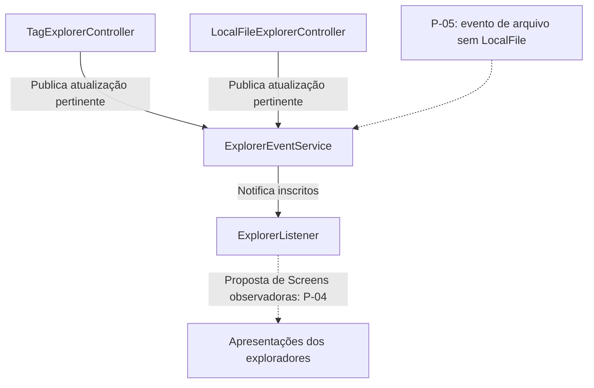
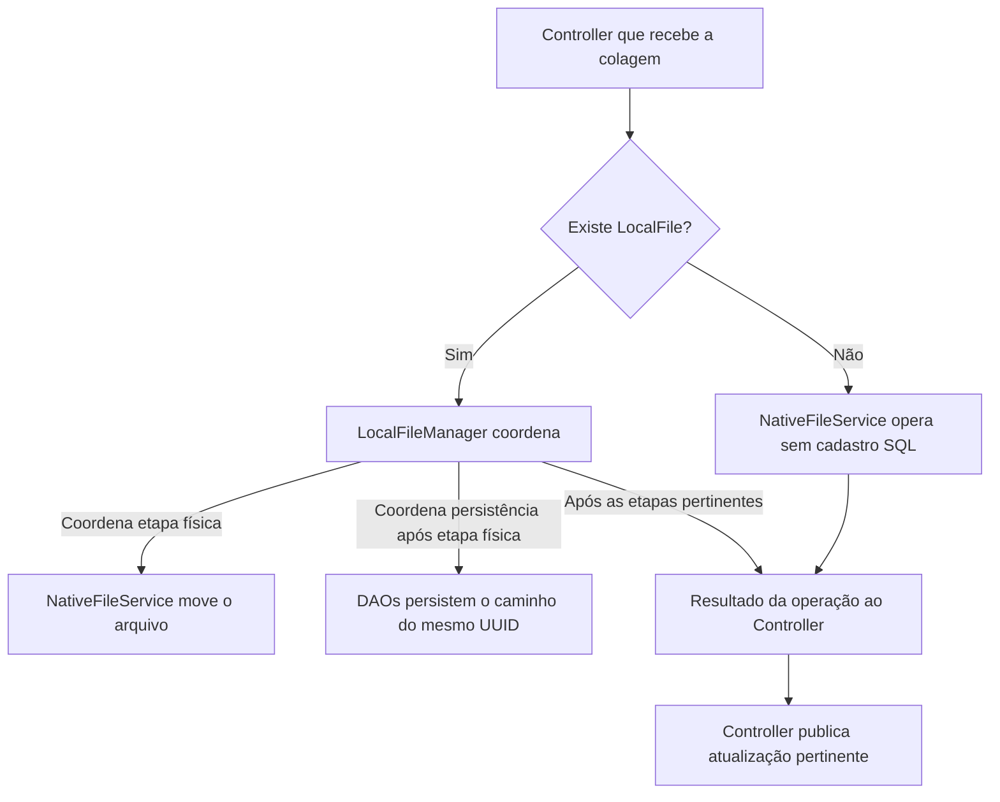
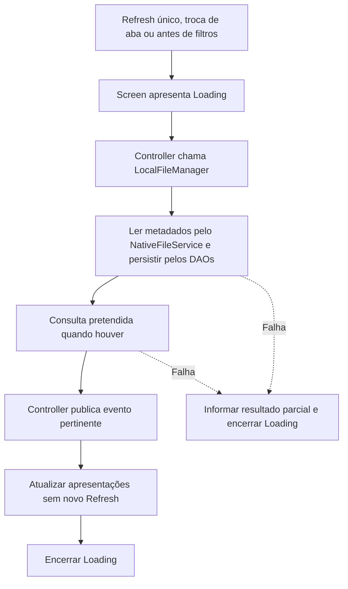

# Arquitetura e padrões

[Índice](README.md) · [Rastreabilidade](rastreabilidade.md) · [Decisões e pendências](decisoes-e-pendencias.md)

A arquitetura explica o que cada parte deverá fazer e como colaborará. Responsabilidade é o trabalho atribuído a uma parte; colaboração é o uso de outra responsabilidade para realizar um fluxo. [ARQ-01](arquitetura-e-padroes.md#arq-01) a [ARQ-09](arquitetura-e-padroes.md#arq-09) são as referências principais. A decisão encerrada [DEC-01](decisoes-e-pendencias.md#dec-01) orienta as chamadas diretas dos Controllers aos Managers/Services.

Os nomes indicam participantes planejados. APIs ilustrativas não são assinaturas finais. A [orientação para a implementação futura](#orientacao-construcao) organiza responsabilidades, dados e percursos para a equipe.

<a id="arq-01"></a>

## ARQ-01 — Separação geral

| Elemento | Responsabilidade | Limite |
|---|---|---|
| Models | Conceitos, dados e relações do domínio | Não executar UI nem assumir persistência por padrão |
| Components | Apresentação reutilizável | Não conter a regra de negócio completa |
| Screens | Montar tela e ligar eventos aos Controllers | Não realizar SQL ou movimentação física diretamente |
| Controllers | Coordenar solicitações e publicar eventos | Não criar os componentes internos da UI |
| Services | Trabalho especializado | Não concentrar UI, banco e disco indistintamente |
| DAOs | Persistência e consultas | Não manipular arquivos físicos nem publicar eventos de UI |
| Managers aprovados | Coordenação específica do seu assunto | Não criar novos padrões ou camadas pelo nome |

Models, Components, Screens, Controllers, Services, DAOs e os Managers aprovados são os grupos de responsabilidade desta arquitetura. Não existe uma decisão final de capitalização dos pacotes nem permissão para reorganizar o código nesta missão.

<a id="arq-02"></a>

## ARQ-02 — Factory de entidades

**Estado: confirmada.**

Uma mesma Factory cria `LocalFile` e `Tag`. `EntityFactory` foi o nome usado nos exemplos. Não criar duas fábricas independentes ou outra para Native como requisito do projeto.

`NativeFile` e `NativeDirectory` são instanciados diretamente. Ao construir um `LocalFile`, os atributos Native precisam ser inicializados corretamente; instanciar um Native internamente não o transforma em produto público adicional da Factory.

A motivação é centralizar a construção das entidades e suas regras pertinentes. A lista exata de validações e a distribuição entre construtor, Factory e serviços não foram totalmente homologadas.

**Consequência derivada:** materializar uma entidade já existente no banco deve preservar UUID e datas. Uma função de criação de entidade nova não pode gerar outro UUID ao carregar cada linha. O contrato de reconstrução não está definido; não invente métodos para preencher o diagrama.

**Classificação:** centralização de criação / Factory simples discutida. Não declarar Factory Method ou Abstract Factory GoF sem correspondência real e aprovação.

<a id="arq-03"></a>

## ARQ-03 — Execução de operações pelos Managers e Services

**Estado: confirmada.**

Os Controllers chamam diretamente os Managers/Services responsáveis pelas operações sobre os elementos escolhidos. Os Managers coordenam o trabalho pertinente ao seu domínio, os Services executam responsabilidades especializadas e os DAOs realizam a persistência. Não exigir uma classe adicional para cada ação.

Participação funcional:

```text
Screen recebe interação
→ Controller chama diretamente o Manager/Service responsável
→ Colaboradores realizam as etapas físicas e de persistência pertinentes
→ Controller publica a atualização pelo ExplorerEventService
```

Quando a operação envolve um arquivo registrado, o `LocalFileManager` coordena o trabalho pertinente entre o `NativeFileService` e os DAOs. O serviço nativo continua responsável pelo arquivo físico; não assume SQL. Para um arquivo sem `LocalFile`, a operação física usa o `NativeFileService` sem criar um registro apenas para executá-la.

O `ClipboardService` continua guardando a intenção de cópia/recorte. Na colagem, o Controller chama os colaboradores responsáveis, respeitando as regras de identidade, associações e falhas já definidas e as pendências ainda abertas.

Filtro, seleção e operação continuam separados: o filtro restringe resultados; o usuário seleciona os elementos; a operação atua sobre a seleção confirmada. Não executar novamente um filtro para alterar silenciosamente os arquivos afetados após a confirmação.

Essa colaboração utiliza as classes já definidas em [ARQ-05](arquitetura-e-padroes.md#arq-05) a [ARQ-08](arquitetura-e-padroes.md#arq-08). Não criar novos Managers, interfaces, assinaturas ou métodos apenas para preencher o desenho. As regras funcionais, o tratamento de falhas parciais e a responsabilidade dos Controllers pela publicação de eventos permanecem inalterados.

<a id="arq-04"></a>

## ARQ-04 — CrudDAO e DAO de associação

**Estado: confirmada.**

Abstração aprovada:

```java
CrudDAO<T, F extends Filter>
```

Especializações:

```text
LocalFileDAO implements CrudDAO<LocalFile, LocalFileFilter>
TagDAO       implements CrudDAO<Tag, TagFilter>
```

O contrato discutido abrange criar entidade, consultar por UUID, consultar por filtro, atualizar e excluir. Não fixar retorno de ausência, exceções, nomes alternativos ou assinaturas adicionais como se estivessem aprovados.

`LocalFileTagDAO` é especializado em associação/desassociação e consultas relacionais, sem obrigação de implementar o mesmo CRUD genérico. Métodos como `associate`, `disassociate`, `findTagsByFile`, `findFilesByTag` e `hasAssociation` foram exemplos de operações pertinentes.

A join-table continua sofrendo criação, leitura e exclusão de registros. Ausência de método chamado literalmente `create` não elimina o conceito de CRUD. Não fabricar um UPDATE sem necessidade apenas para ter quatro métodos.

`TagDAO` também deve reconstruir/persistir as extensões da Tag. Não exigir que a UI monte a entidade consultando um DAO de extensões separado.

<a id="arq-05"></a>

## ARQ-05 — Dois Controllers

**Estado: confirmada.**

```text
TagExplorerController
LocalFileExplorerController
```

São separados e compartilham os Managers, Services, DAOs e o clipboard pertinentes. Chamam diretamente os colaboradores responsáveis pelas operações. Não devem chamar diretamente um ao outro como mecanismo necessário de sincronização visual.

As Screens registram eventos dos componentes e chamam seus Controllers. O Controller decide quando coordenar atualização ou operação e é responsável por publicar notificações pelo `ExplorerEventService`.

Consultas auxiliares que não alteram estado não devem ser documentadas como publicação obrigatória de sucesso. Falhas parciais também não autorizam afirmar sucesso completo.

<a id="arq-06"></a>

## ARQ-06 — Observer

**Estado: núcleo confirmado; ligação concreta e assinaturas em [P-04](decisoes-e-pendencias.md#p-04)/[P-05](decisoes-e-pendencias.md#p-05).**

Participantes centrais:

```text
ExplorerListener     → interface de Observer
ExplorerEventService → mantém os inscritos e notifica
Controllers         → responsáveis por disparar/publicar os eventos
```

Os comentários devem identificar explicitamente a relação com o GoF Observer. DAOs e serviço nativo não publicam diretamente eventos de UI.

Inicialmente os Controllers foram apresentados como Observers. Depois, o solicitante propôs que as Screens implementassem `ExplorerListener` e tivessem seu próprio `onFileChanged()`. A solução foi desenvolvida nessa direção nas respostas subsequentes, mas os nomes e a composição de Panels/Screens não foram formalizados inequivocamente. A proposta final permanece em [P-04](decisoes-e-pendencias.md#p-04); as duas arquiteturas não são simultaneamente obrigatórias.

Os métodos didáticos foram `onFileChanged`, `onTagChanged` e `onFileTagsChanged`, com notificações correspondentes no serviço. Não há API final de todos os eventos.

Problema concreto: assinaturas ilustrativas que aceitam somente `LocalFile` não cobrem arquivo nativo sem cadastro. A mudança para `NativeFile` foi uma proposta de ajuste ainda não aprovada. [P-05](decisoes-e-pendencias.md#p-05) mantém esse contrato aberto, sem criar registro artificial apenas para publicar evento.

Não criar classe `ExplorerEvent` nem enum de eventos nesta versão como requisito. A equipe deverá comentar essa possibilidade de evolução no código futuro, sem criar a classe ou enum nesta versão. Esta missão apenas registra a exigência.

<a id="arq-07"></a>

## ARQ-07 — Services e LocalFileManager

**Estado: confirmada.**

| Classe | Responsabilidade e colaboradores |
|---|---|
| `NativeFileService` | Lê metadados e manipula arquivos reais; recebe NativeFile/NativeDirectory e usa Path internamente quando necessário. |
| `ClipboardService` | Guarda o estado interno de cópia/recorte e viabiliza colagem entre exploradores. |
| `LocalFileManager` | Coordena disponibilidade, sincronização de metadados e ciclo de vida dos registros, combinando serviço nativo e DAOs. |

`NativeFileService` substituiu o nome `FileService`. `LocalFileManager` substituiu a proposta de `LocalFileService` para a mesma coordenação. Não exigir coexistência redundante.

Nomes de operações como `refresh`, `refreshAll`, `cleanupOrphans` e `cleanupMissingTagFiles` foram utilizados como referência. A obrigação funcional é separar atualização rotineira de limpeza exclusiva da inicialização; não é copiar exatamente um exemplo que as misturava.

<a id="arq-08"></a>

## ARQ-08 — DatabaseManager e DatabaseConnection

**Estado: confirmada.**

| Classe | Responsabilidade |
|---|---|
| `DatabaseManager` | Administração da instância local: verificação/instalação autorizada, scripts, preparação dos dados, estrutura e procedimentos de início/parada. |
| `DatabaseConnection` | Concentrar abertura/tratamento/fechamento da conexão JDBC compartilhada. |
| DAOs | Guardar um atributo de tipo DatabaseConnection e usá-lo para SQL. |

A mesma instância de `DatabaseConnection` é compartilhada. Não criar pool nem várias classes de administração de sessões. Não transferir administração do processo MySQL para `LocalFileManager`.

Métodos como `getConnection()` e `close()` são referências de API discutidas. Explique o papel previsto de disponibilizar e encerrar a conexão compartilhada; a implementação ainda será feita pela equipe. Não apresente esses métodos como existentes, testados ou como uma API final além do que foi aprovado.

<a id="arq-09"></a>

## ARQ-09 — Padrões e justificativas acadêmicas

| Conceito | Categoria e explicação no Tag-File |
|---|---|
| Observer | GoF comportamental; comunica alterações aos interessados sem exigir dependência direta entre exploradores. |
| Factory simples | Centraliza construção de Tag e LocalFile; não é automaticamente um dos padrões GoF de fábrica. |
| DAO | Organização do acesso aos dados e isolamento de SQL. |
| CRUD | Operações de persistência; não é padrão GoF. |
| GRASP Controller | Responsabilidade de coordenar eventos atribuída aos Controllers, não aos componentes visuais. |
| Low Coupling | Reduz conhecimento direto entre UI, banco, sistema de arquivos e os dois exploradores. |
| High Cohesion | Mantém responsabilidades relacionadas nas classes específicas. |
| Information Expert | Analisar qual objeto dispõe da informação necessária; não rotular toda classe sem justificativa. |
| Herança de Filter | Abstração/polimorfismo; não comprova Strategy por si só. |
| Classes Manager | Coordenação aprovada; o nome não é um padrão GoF. |

Creator, Strategy, Singleton e fábricas GoF apareceram em explicações ou possibilidades. Não são padrões adicionais aprovados por isso. Não os inclua no roteiro de construção nem nos diagramas como obrigatórios. Caso um esboço opcional utilize algum deles, sua presença não muda o escopo aprovado.

A documentação deve explicar quais comentários arquiteturais a equipe deverá escrever ao implementar os padrões e registrar as melhorias futuras já permitidas. A missão não autoriza criar arquivos Java nem inserir comentários neles. A ausência atual desses comentários não é uma falha, pois a implementação virá depois.


<a id="orientacao-construcao"></a>

## Orientação para a implementação futura

Esta sequência é uma organização didática dos elementos já aprovados, não um cronograma ou novas funcionalidades. Em cada bloco, a equipe deverá compreender a responsabilidade, os dados envolvidos e o resultado esperado antes de definir a API concreta. Os três percursos ao final mostram como combinar os blocos. Consultar as pendências no ponto de uso evita construir uma alternativa ainda não decidida.

<a id="bloco-dominio"></a>

### 1. Representações do domínio e identidade

**Finalidade e motivo:** separar o arquivo que está no disco do registro conhecido pelo Tag-File. LocalFile precisa conservar UUID e Tags mesmo quando o caminho muda ou fica indisponível; NativeFile permite representar arquivos sem cadastro. Composição atende a essa diferença melhor que tratar LocalFile como herança de NativeFile, que não é a direção aprovada.

| Parte | Dados recebidos/representados e resultado previsto | Colaboração e limite |
|---|---|---|
| NativeFile / NativeDirectory | Path de arquivo ou diretório; representação nativa para leitura, navegação e operação. | Instanciados diretamente; não exigem tabela ou Factory própria. Não exigir existência contínua do arquivo representado. |
| LocalFile | UUID, NativeFile, disponibilidade, tamanho, datas físicas e associações. | Factory na criação; DAOs ao persistir/reconstruir; LocalFileManager ao sincronizar. Caminho não substitui identidade. |
| Tag | UUID, nome, cor, extensões permitidas e datas próprias. | Factory na criação; TagDAO inclui extensões. Não persistir contador de disponíveis. |
| Factory única | Dados pertinentes à criação de LocalFile ou Tag; entidade inicializada. | `EntityFactory` é nome de referência, não contrato completo. Reconstrução conserva UUID/datas; validações exatas e API estão abertas. |

**Exercício de compreensão:** percorra [DOM-02](modelo-de-dominio.md#dom-02) e compare o mesmo UUID antes e depois de mover `prova.pdf`. Compare com [ACE-02](criterios-de-aceite.md#ace-02)/[ACE-03](criterios-de-aceite.md#ace-03): reutilizar um caminho cadastrado é diferente de fundir arquivos homônimos. [DOM-03](modelo-de-dominio.md#dom-03)/[DOM-04](modelo-de-dominio.md#dom-04) e [P-06](decisoes-e-pendencias.md#p-06)/[P-08](decisoes-e-pendencias.md#p-08)/[P-09](decisoes-e-pendencias.md#p-09)/[P-10](decisoes-e-pendencias.md#p-10) delimitam as escolhas de representação.

<a id="bloco-classificacao"></a>

### 2. Regras de classificação e consultas

**Finalidade:** transformar Tags e associações em critérios previsíveis. A compatibilidade usa as extensões da Tag e a extensão real do arquivo. A informação necessária está no domínio; a divisão final de validação entre entidade, Factory e serviço não está inteiramente fechada. Não atribuir um método novo a Tag apenas para encerrar essa escolha.

| Informação de entrada | Resultado que deverá orientar a construção | Colaboradores / limites |
|---|---|---|
| Arquivo e Tag escolhidos | Reutilizar/criar o registro necessário e persistir associação aprovada. | Controller, Factory, colaboradores pertinentes do domínio e DAOs; [EXT-02](requisitos-e-regras.md#ext-02) cobre incompatibilidade. |
| Conjunto final de extensões | Identificar associações incompatíveis e pedir confirmação antes da retirada. | Screen apresenta afetados; operação coordena alterações; TagDAO sincroniza extensões. Sem política geral de lote fechada. |
| Última Tag normal retirada | Associar Etiqueta Ausente durante a reorganização. | LocalFileManager coordena ciclo de vida com DAOs; [P-02](decisoes-e-pendencias.md#p-02) limita remoções explícitas. |
| Critérios físicos | Lista resultante de arquivos físicos obtidos por NativeFileService e NativeFileFilter. | Filter é classe abstrata; campos/intervalos completos não homologados. |
| Critérios de registros | Registros consultados com LocalFileFilter. | LocalFileDAO; não refazer consulta para alterar a seleção já confirmada. |
| Critérios de Tags | Tags consultadas com TagFilter. | TagDAO retorna Tags, não LocalFile. |
| Tags selecionadas com AND/OR | Arquivos que possuem todas/ao menos uma, sem duplicação de identidade. | Consulta relacional com API em [P-05](decisoes-e-pendencias.md#p-05); caso sem seleção em [P-13](decisoes-e-pendencias.md#p-13). |
| Caminhos de uma listagem | Map de Path para LocalFile que acrescenta metadados e Tags. | Consulta em lote por DAOs pertinentes; sem descartar os NativeFile sem correspondência. |

**Percurso concreto:** `foto.png` em uma Tag restrita a `.pdf` deve apresentar as três alternativas de [EXT-02](requisitos-e-regras.md#ext-02). O filtro visual não substitui essa regra no Drop. Depois, comparar [TAG-03](requisitos-e-regras.md#tag-03): uma Tag só com arquivos indisponíveis não está vazia. [UC-03](casos-de-uso.md#uc-03) a [UC-07](casos-de-uso.md#uc-07), [UC-12](casos-de-uso.md#uc-12)/[UC-13](casos-de-uso.md#uc-13) e [ACE-04](criterios-de-aceite.md#ace-04) a [ACE-16](criterios-de-aceite.md#ace-16) orientam esses resultados. [P-01](decisoes-e-pendencias.md#p-01) a [P-10](decisoes-e-pendencias.md#p-10) aplicam-se conforme o fluxo; não são todos um bloqueio para cada consulta.

<a id="bloco-ambiente"></a>

### 3. Ambiente local e persistência

**Finalidade e motivo:** separar a administração de um processo MySQL do trabalho de armazenar informações do domínio. Iniciar servidor e abrir conexão não são a mesma operação; um DAO não deve instalar serviços.

| Parte | Entradas e resultado previsto | Colaboradores e fronteira |
|---|---|---|
| DatabaseManager | Configuração local, estado da preparação e decisões de autorização; instância/estrutura preparadas ou resultado parcial. | Scripts PowerShell/Bash via ProcessBuilder; instalação, dados, início e parada. Não assumir propriedade sobre todo MySQL da máquina. |
| DatabaseConnection | Parâmetros de conexão; acesso JDBC compartilhado e seu fechamento. | Mesma instância referenciada pelos DAOs. Sem pool ou nova classe de sessão; não confundir reconexão com reinício do domínio. |
| LocalFileDAO | LocalFile, UUID e LocalFileFilter pertinentes; persistência/consulta de registros. | DatabaseConnection; não manipular disco nem publicar UI. |
| TagDAO | Tag, UUID e TagFilter pertinentes; Tag reconstruída/persistida com extensões. | DatabaseConnection; não transferir montagem de entidade para Screen. |
| LocalFileTagDAO | IDs/vínculos pertinentes; associação, desassociação e consultas relacionais. | DatabaseConnection; DAO especializado, sem obrigatoriedade de CrudDAO ou UPDATE artificial. |

**Percurso concreto:** na abertura, DatabaseManager prepara/reconhece a instância e a estrutura; a conexão é disponibilizada; a inicialização de domínio limpa apenas os registros de [CIC-02](requisitos-e-regras.md#cic-02) e atualiza os remanescentes. Na próxima abertura, os dados são reutilizados. A ordem de comandos administrativos, a versão e a recuperação de schema incompleto continuam em [P-11](decisoes-e-pendencias.md#p-11). O objetivo dos scripts está em [AMB-01](instalacao-e-execucao.md#amb-01) a [AMB-07](instalacao-e-execucao.md#amb-07), e os dados/relações em [SQL-01](banco-de-dados.md#sql-01) a [SQL-06](banco-de-dados.md#sql-06). [ACE-23](criterios-de-aceite.md#ace-23)/[ACE-24](criterios-de-aceite.md#ace-24) serão verificados futuramente.

Não confundir ausência de transações explícitas com garantia de que etapas múltiplas darão certo. O DDL físico está em [P-06](decisoes-e-pendencias.md#p-06); nenhuma escolha de cascade/trigger é consequência automática do desenho.

<a id="bloco-operacoes"></a>

### 4. Operações nativas e ciclo de vida

| Parte | Finalidade, dados e resultado previsto | Por que fica nessa parte / limite |
|---|---|---|
| NativeFileService | Recebe NativeFile/NativeDirectory, usa Path internamente, lê metadados e manipula arquivos físicos. | Concentra trabalho de sistema de arquivos; não executa SQL nem publica UI. |
| LocalFileManager | Usa registro, referência nativa e dados pertinentes da operação; coordena metadados, disponibilidade e ciclo de vida. | Combina NativeFileService e DAOs quando houver registro. Não administra a instância MySQL. |
| ClipboardService | Mantém intenção COPY/CUT e os elementos pertinentes à colagem entre exploradores. | Estado compartilhado interno; deve suportar arquivos cadastrados e não cadastrados. Representação final e estado após colagem permanecem abertos. |

**Percurso concreto:** recortar guarda intenção; colar realiza o movimento. Para arquivo registrado, LocalFileManager coordena a operação física e a atualização do registro. Para arquivo sem LocalFile, Controller usa NativeFileService sem cadastrar apenas para operar. [OP-01](requisitos-e-regras.md#op-01) a [OP-08](requisitos-e-regras.md#op-08), CIC e SYN definem os efeitos; [UC-09](casos-de-uso.md#uc-09) e [ACE-17](criterios-de-aceite.md#ace-17) mostram identidade preservada.

Copiar continua perguntando sobre herdar Tags; [P-01](decisoes-e-pendencias.md#p-01) limita identidade em substituição e cópia sem Tags. [P-02](decisoes-e-pendencias.md#p-02) limita a remoção explícita; [P-12](decisoes-e-pendencias.md#p-12) limita lotes e repetição de CUT. Nenhuma camada adicional é necessária para representar cada ação. [ARQ-03](arquitetura-e-padroes.md#arq-03) e [DEC-01](decisoes-e-pendencias.md#dec-01) já encerraram a escolha de colaboração.

<a id="bloco-coordenacao"></a>

### 5. Coordenação e notificações

**Finalidade e dados:** cada Controller recebe a solicitação da sua Screen e os elementos escolhidos pelo usuário. Ele chama diretamente o Manager/Service pertinente, acompanha o resultado e publica a atualização pertinente por ExplorerEventService. TagExplorerController e LocalFileExplorerController compartilham colaboradores; não precisam chamar um ao outro.

ExplorerEventService mantém inscritos e notifica através de ExplorerListener, interface do GoF Observer. Isso permite que uma alteração relevante alcance as apresentações interessadas sem acoplar os dois exploradores. DAOs e NativeFileService não publicam eventos de UI. O payload e as assinaturas finais estão em [P-05](decisoes-e-pendencias.md#p-05).

**Núcleo aprovado e ligação proposta:** setas contínuas mostram publicação/notificação; a seta pontilhada para Screens marca [P-04](decisoes-e-pendencias.md#p-04). O diagrama não escolhe o tipo de payload.



Os nomes didáticos `onFileChanged`, `onTagChanged` e `onFileTagsChanged` explicam assuntos de notificação, sem API final. Receber somente LocalFile deixa descoberto o evento de um arquivo sem cadastro; isso não autoriza criar um registro artificial. [ARQ-05](arquitetura-e-padroes.md#arq-05)/[ARQ-06](arquitetura-e-padroes.md#arq-06), [UC-14](casos-de-uso.md#uc-14) e [ACE-21](criterios-de-aceite.md#ace-21) orientam a coordenação. Receber o evento atualiza a apresentação, sem iniciar novo Refresh global.

<a id="bloco-interface"></a>

### 6. Interface e integração dos fluxos

**Components** organizam apresentação reutilizável: recebem dados pertinentes à exibição e compõem a interface, sem concentrar regra de negócio. `TagBadge`, `TagButton` e `FileItemPanel` são exemplos, não uma lista obrigatória de classes.

**Screens** montam a tela, apresentam resultados, registram listeners dos componentes e encaminham solicitações aos Controllers. Sua entrada inclui dados de apresentação e interações; sua saída é a solicitação pertinente e a atualização visual. Elas não executam SQL nem operações de disco. TagExplorerPanel e LocalFileExplorerPanel são nomes aprovados; a relação com Screens segue [P-04](decisoes-e-pendencias.md#p-04).

**Percurso concreto:** a Screen recebe o Drop de um arquivo na Tag e aciona o Controller. A interface apresenta confirmação de incompatibilidade, se necessária, e a classificação resultante depois da operação. As etiquetas aparecem junto do arquivo; quando não há associação, a região fica em branco. A sentinela realmente associada continua visível.

[EXP-01](interface-e-fluxos.md#exp-01)/[UI-01](interface-e-fluxos.md#ui-01)/[UI-02](interface-e-fluxos.md#ui-02) e [UC-04](casos-de-uso.md#uc-04) a [UC-15](casos-de-uso.md#uc-15) definem as interações. [UI-03](interface-e-fluxos.md#ui-03) exige Loading durante trabalho e bloqueio de novas interações conflitantes; [ERR-01](requisitos-e-regras.md#err-01) exige mensagem, concluído, falha e detalhes expansíveis. SwingWorker é possibilidade, não classe obrigatória. Reentrância, arranjo lado a lado e lotes estão em [P-12](decisoes-e-pendencias.md#p-12); estados vazios/ordenação em [P-13](decisoes-e-pendencias.md#p-13). [ACE-07](criterios-de-aceite.md#ace-07)/[ACE-08](criterios-de-aceite.md#ace-08)/[ACE-18](criterios-de-aceite.md#ace-18)/[ACE-19](criterios-de-aceite.md#ace-19)/[ACE-21](criterios-de-aceite.md#ace-21)/[ACE-22](criterios-de-aceite.md#ace-22) ajudam a avaliar esses resultados.

<a id="bloco-verificacao"></a>

### 7. Verificação futura

A equipe deverá relacionar o comportamento construído aos [critérios de aceite](criterios-de-aceite.md). Cada cenário contém condição, ação, resultado esperado e limites. O objetivo é observar efeitos no domínio, banco, disco e UI, sem confundir uma tela exibida com persistência concluída.

[ACE-01](criterios-de-aceite.md#ace-01) a [ACE-24](criterios-de-aceite.md#ace-24) estão não executados nesta missão. [P-01](decisoes-e-pendencias.md#p-01) impede fechar o resultado completo da cópia; [P-02](decisoes-e-pendencias.md#p-02) impede fechar a modalidade 2 e certas remoções explícitas; [P-03](decisoes-e-pendencias.md#p-03) impede escolher o efeito de silenciar sugestões. Partes já confirmadas continuam verificáveis no futuro independentemente desses resultados em aberto. Não há ferramentas de teste, massa executada, datas ou cronograma acrescentados.

<a id="percurso-associacao"></a>

## Percurso pedagógico: associar arquivo a uma Tag

Exemplo ilustrativo: usuário escolhe `prova.pdf` e `Faculdade` por seleção ou Drop sobre a Tag ([UC-05](casos-de-uso.md#uc-05)).

1. A Screen captura a interação e encaminha a solicitação ao Controller. Nome repetido de Tag não substitui seu UUID.
2. O fluxo valida a compatibilidade conforme [EXT-02](requisitos-e-regras.md#ext-02). Para uma extensão incompatível, apresenta criar Tag, ampliar extensões ou cancelar. A API/distribuição exata da validação continua aberta; a decisão do usuário precede a associação autorizada.
3. O caminho é consultado pelos colaboradores de persistência pertinentes. Existindo registro, reutiliza seu UUID. Caso contrário, a Factory cria o LocalFile necessário com sua referência nativa; a persistência grava a associação conforme o fluxo confirmado.
4. Receber Tag normal retira a associação com Etiqueta Ausente. O arquivo físico não é movido nem duplicado pela classificação. A ordem de gravações e a recuperação de falha intermediária não foram homologadas.
5. O Controller publica a atualização pertinente e a apresentação mostra as Tags. Se criou LocalFile, apresenta a possibilidade de predefinida compatível; [P-03](decisoes-e-pendencias.md#p-03) limita o efeito nos próximos arquivos ao silenciar a sessão.

[ACE-02](criterios-de-aceite.md#ace-02)/[ACE-07](criterios-de-aceite.md#ace-07)/[ACE-11](criterios-de-aceite.md#ace-11) orientam os resultados; [P-04](decisoes-e-pendencias.md#p-04)/[P-05](decisoes-e-pendencias.md#p-05) mantêm o contrato visual/evento aberto. [ERR-01](requisitos-e-regras.md#err-01) cobre persistência parcial sem prometer rollback.

<a id="percurso-movimentacao"></a>

## Percurso pedagógico: recortar em uma visão e colar na outra

Exemplo de [UC-09](casos-de-uso.md#uc-09): selecionar `prova.pdf` em `Faculdade`, recortar por `Arquivos por Tag` e colar em `~/Documentos/Faculdade` por `Arquivos Local`.

**Recorte:** a Screen de origem encaminha a ação ao seu Controller; ClipboardService guarda CUT. O arquivo permanece no caminho original.

**Colagem:** a Screen de destino informa a solicitação ao seu Controller. Ele consulta a intenção do clipboard, verifica o arquivo utilizado conforme [OP-02](requisitos-e-regras.md#op-02) e chama os colaboradores responsáveis. Para registro existente, LocalFileManager coordena NativeFileService e DAOs; para arquivo sem cadastro, a operação usa NativeFileService sem criar LocalFile.



**Legenda:** colaborações do percurso de sucesso, sem assinaturas novas ou ordem de todas as confirmações definida. LocalFileManager coordena separadamente serviço nativo e DAOs; NativeFileService não chama SQL. Após sucesso completo, caminho muda e UUID/Tags permanecem; a visão local exibe as etiquetas. Se o movimento ocorreu e a gravação falhou, [ERR-01](requisitos-e-regras.md#err-01) distingue essas etapas. Conflitos seguem [OP-06](requisitos-e-regras.md#op-06); estado do clipboard após colagem e lotes seguem [P-12](decisoes-e-pendencias.md#p-12). Esse diagrama não decide a identidade de cópia/substituição de [P-01](decisoes-e-pendencias.md#p-01).

<a id="percurso-refresh"></a>

## Percurso pedagógico: Refresh compartilhado

O botão único, a troca de aba e a aplicação de filtros pedem atualização de todos os LocalFile. Não se limita aos arquivos visíveis. A verificação ao utilizar um arquivo é pontual, e entrar em pasta faz leitura/listagem sem disparar atualização global a cada navegação.



[SYN-01](requisitos-e-regras.md#syn-01) a [SYN-03](requisitos-e-regras.md#syn-03) e [UC-14](casos-de-uso.md#uc-14) orientam esse percurso; [ACE-13](criterios-de-aceite.md#ace-13)/[ACE-21](criterios-de-aceite.md#ace-21)/[ACE-22](criterios-de-aceite.md#ace-22) orientam a observação futura. Metadados indisponíveis e gravar UPDATE sem mudança estão em [P-10](decisoes-e-pendencias.md#p-10). Observer atualiza a apresentação; sua notificação não deve chamar Refresh novamente. [P-04](decisoes-e-pendencias.md#p-04)/[P-05](decisoes-e-pendencias.md#p-05) tratam inscrição/payload; [P-12](decisoes-e-pendencias.md#p-12) trata reentrância. A figura não implementa threads, fila ou travas.

Na inicialização, a limpeza de [CIC-02](requisitos-e-regras.md#cic-02) é uma responsabilidade separada, anterior à atualização dos registros remanescentes. Refresh, filtros, navegação e reconexão não executam essa limpeza.

## Comentários arquiteturais e justificativa acadêmica

| Assunto | O que a equipe deverá explicar ao implementar | Limite |
|---|---|---|
| Observer | Interface de observação, inscritos, publicação pelos Controllers e atualização visual. | [P-04](decisoes-e-pendencias.md#p-04)/[P-05](decisoes-e-pendencias.md#p-05) ainda delimitam inscrição e dados do evento. |
| Factory simples | Por que centralizar a criação de Tag e LocalFile e preservar identidade na reconstrução. | Não classificar automaticamente como Factory Method ou Abstract Factory. |
| DAO, CRUD e GRASP | DAO isola SQL; CRUD nomeia operações; Controllers coordenam; coesão e baixo acoplamento se justificam pelas responsabilidades. | Nome Manager, herança de Filter ou instância compartilhada não comprovam outro GoF. |
| Information Expert | Quem já possui a informação necessária à decisão, como extensões da Tag na compatibilidade. | Não fecha sozinho a API ou o local de toda validação. |
| Melhorias já permitidas | Comentar possibilidade de eventos estruturados, clipboard do sistema, estudo de transações e Undo/Redo nos pontos pertinentes. | Só comentários de evolução, sem implementar nesta versão nem reabrir [DEC-01](decisoes-e-pendencias.md#dec-01). |

A missão registra essa orientação nos documentos; não escreve comentários em arquivos Java. Não há quantidade mínima de padrões, pontuação ou rubrica atribuída ao professor.
