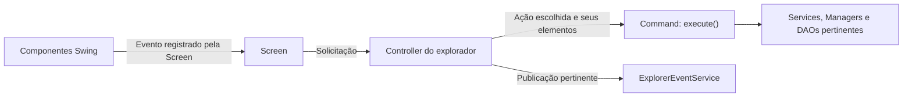
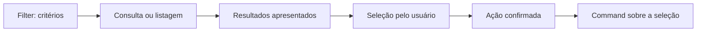
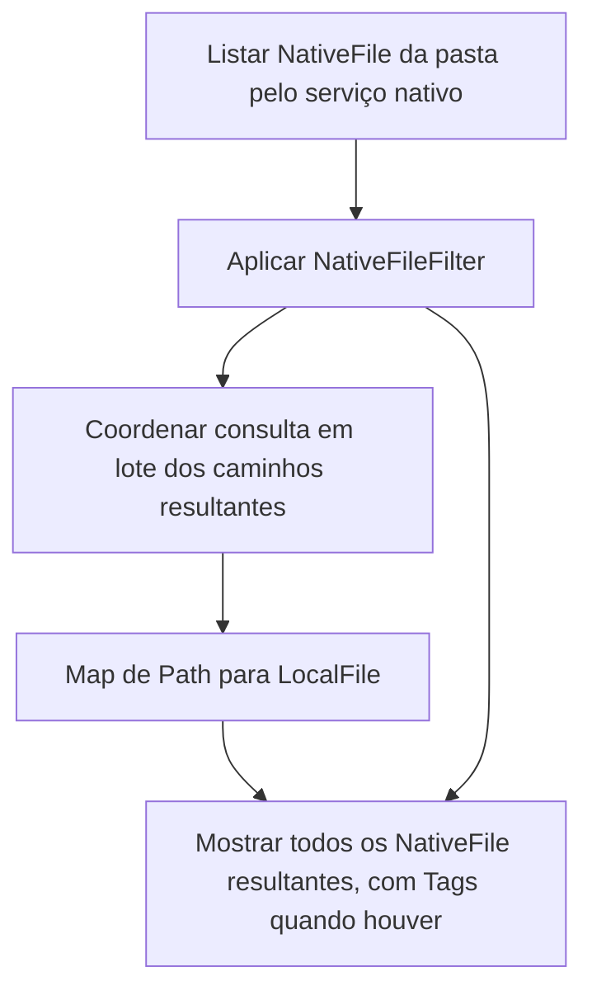
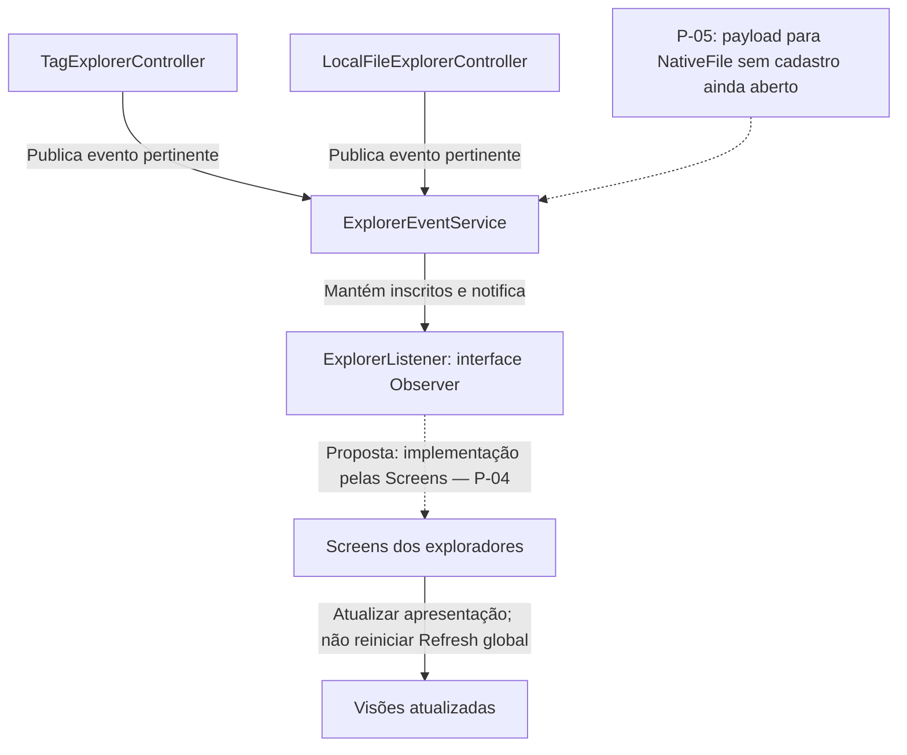
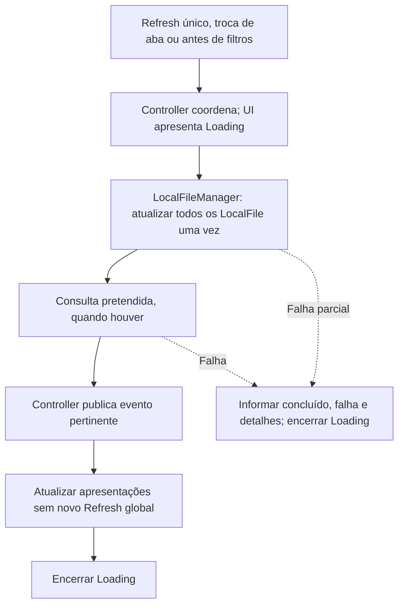
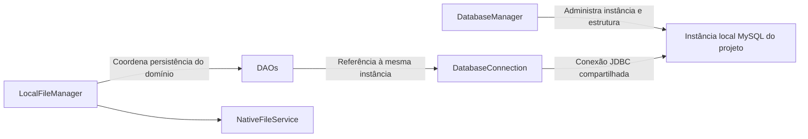

# Arquitetura e padrões

[Índice](../README.md) · [Modelo de domínio](modelo-de-dominio.md) · [Banco de dados](banco-de-dados.md) · [Interface](interface-e-fluxos.md)

Este documento é a referência principal de **ARQ-01 a ARQ-09**. Responsabilidade é o trabalho atribuído a uma classe; colaboração é como ela usa o trabalho de outras. Os padrões são explicados por essas responsabilidades no Tag-File, sem exigir classes adicionais apenas para preencher diagramas.

**Estado observado:** [src/Main.java](../src/Main.java) contém apenas o template de console `Main.main`, com mensagem e laço de 1 a 5. Não foram encontrados Models de negócio, Controllers, Screens/Panels, filtros, Commands, Services, Managers ou DAOs. Também não foram encontrados comentários de implementação dos padrões. Todas as colaborações a seguir descrevem a arquitetura planejada; ligações ainda propostas estão sinalizadas. Nenhum arquivo Java foi alterado.

<a id="arq-01"></a>

## ARQ-01 — Separação geral

| Elemento | Responsabilidade | Limite |
|---|---|---|
| Models | Conceitos, dados e relações do domínio | Não executar UI nem assumir persistência por padrão |
| Components | Apresentação reutilizável | Não conter a regra de negócio completa |
| Screens | Montar tela e ligar eventos aos Controllers | Não realizar SQL ou movimentação física diretamente |
| Controllers | Coordenar solicitações e publicar eventos | Não criar os componentes internos da UI |
| Commands | Encapsular operações escolhidas | Não redefinir seleção pela execução de filtros |
| Services | Trabalho especializado | Não concentrar UI, banco e disco indistintamente |
| DAOs | Persistência e consultas | Não manipular arquivos físicos nem publicar eventos de UI |
| Managers aprovados | Coordenação específica do seu assunto | Não criar novos padrões ou camadas pelo nome |

Models, Commands e Services foram explicitamente mantidos. Os demais grupos correspondem às responsabilidades discutidas posteriormente. Não existe uma decisão final de capitalização dos pacotes nem permissão para reorganizar o código nesta missão.

<a id="arq-02"></a>

## ARQ-02 — Factory de entidades

**Estado: confirmada.**

Uma mesma Factory cria `LocalFile` e `Tag`. `EntityFactory` foi o nome usado nos exemplos. Não criar duas fábricas independentes ou outra para Native como requisito do projeto.

`NativeFile` e `NativeDirectory` são instanciados diretamente. Ao construir um `LocalFile`, os atributos Native precisam ser inicializados corretamente; instanciar um Native internamente não o transforma em produto público adicional da Factory.

A motivação é centralizar a construção das entidades e suas regras pertinentes. A lista exata de validações e a distribuição entre construtor, Factory e serviços não foram totalmente homologadas.

**Consequência derivada:** materializar uma entidade já existente no banco deve preservar UUID e datas. Uma função de criação de entidade nova não pode gerar outro UUID ao carregar cada linha. O contrato de reconstrução não está definido e não há métodos homologados para essa finalidade.

**Classificação:** centralização de criação / Factory simples discutida. Não declarar Factory Method ou Abstract Factory GoF sem correspondência real e aprovação.

<a id="arq-03"></a>

## ARQ-03 — Command

**Estado: confirmada.**

O padrão GoF Command encapsula as ações sobre os elementos escolhidos. A interface simplificada discutida contém `execute()`. `MoveFileCommand`, `CopyFileCommand`, `RenameFileCommand`, `DeleteFileCommand`, e operações de recortar/colar foram exemplos de participantes.

Não existe Undo/Redo implementado. A possibilidade de `undo()` e pilhas futuras deverá ser apenas comentada no ponto adequado, como interface/base de Command. Não adicionar métodos reversíveis obrigatórios para “completar o padrão”.

Participação funcional:

```text
Screen recebe interação
→ Controller coordena a solicitação
→ Command encapsula a ação
→ Services/Managers/DAOs necessários executam responsabilidades específicas
```

A atribuição final de todos os receptores e métodos depende dos contratos ainda não fechados; a inspeção atual não encontrou implementação que os esclareça. Consultas e chamadas de métodos não precisam ser encapsuladas como Commands por convenção.

A separação Filter/seleção/Command permanece. Um Command não precisa executar novamente um filtro para escolher os arquivos a afetar depois da confirmação do usuário.

<a id="arq-04"></a>

## ARQ-04 — CrudDAO e DAO de associação

**Estado: confirmada.**

Abstração aprovada:

```java
CrudDAO<T, F extends Filter>
```

Especializações:

```text
LocalFileDAO implements CrudDAO<LocalFile, LocalFileFilter>
TagDAO       implements CrudDAO<Tag, TagFilter>
```

O contrato discutido abrange criar entidade, consultar por UUID, consultar por filtro, atualizar e excluir. Retorno de ausência, exceções, nomes alternativos e assinaturas adicionais permanecem não homologados.

`LocalFileTagDAO` é especializado em associação/desassociação e consultas relacionais, sem obrigação de implementar o mesmo CRUD genérico. Métodos como `associate`, `disassociate`, `findTagsByFile`, `findFilesByTag` e `hasAssociation` foram exemplos de operações pertinentes.

A join-table continua sofrendo criação, leitura e exclusão de registros. Ausência de método chamado literalmente `create` não elimina o conceito de CRUD. Não fabricar um UPDATE sem necessidade apenas para ter quatro métodos.

`TagDAO` também deve reconstruir/persistir as extensões da Tag. Não exigir que a UI monte a entidade consultando um DAO de extensões separado.

<a id="arq-05"></a>

## ARQ-05 — Dois Controllers

**Estado: confirmada.**

```text
TagExplorerController
LocalFileExplorerController
```

São separados e compartilham Services, Commands, DAOs e o clipboard pertinentes. Não devem chamar diretamente um ao outro como mecanismo necessário de sincronização visual.

As Screens registram eventos dos componentes e chamam seus Controllers. O Controller decide quando coordenar atualização ou operação e é responsável por publicar notificações pelo `ExplorerEventService`.

Consultas auxiliares que não alteram estado não devem ser documentadas como publicação obrigatória de sucesso. Falhas parciais também não autorizam afirmar sucesso completo.

<a id="arq-06"></a>

## ARQ-06 — Observer

**Estado: núcleo confirmado; ligação concreta e assinaturas em P-04/P-05.**

Participantes centrais:

```text
ExplorerListener     → interface de Observer
ExplorerEventService → mantém os inscritos e notifica
Controllers         → responsáveis por disparar/publicar os eventos
```

Os comentários devem identificar explicitamente a relação com o GoF Observer. DAOs e serviço nativo não publicam diretamente eventos de UI.

Inicialmente os Controllers foram apresentados como Observers. Depois, o solicitante propôs que as Screens implementassem `ExplorerListener` e tivessem seu próprio `onFileChanged()`. A solução foi desenvolvida nessa direção nas respostas subsequentes, mas os nomes e a composição de Panels/Screens não foram formalizados inequivocamente. A ligação proposta permanece em P-04; as duas arquiteturas não são requisitos simultâneos.

Os métodos didáticos foram `onFileChanged`, `onTagChanged` e `onFileTagsChanged`, com notificações correspondentes no serviço. Não há API final de todos os eventos.

Problema concreto: assinaturas ilustrativas que aceitam somente `LocalFile` não cobrem arquivo nativo sem cadastro. A mudança para `NativeFile` foi uma proposta de ajuste ainda não aprovada. A lacuna permanece em P-05 e não autoriza criar registro artificial apenas para publicar evento.

A classe `ExplorerEvent` e o enum de eventos ficam fora desta versão. O código deverá conter um comentário sobre essa possível evolução; a missão documental registra a exigência e não a implementa.

<a id="arq-07"></a>

## ARQ-07 — Services e LocalFileManager

**Estado: confirmada.**

| Classe | Responsabilidade e colaboradores |
|---|---|
| `NativeFileService` | Lê metadados e manipula arquivos reais; recebe NativeFile/NativeDirectory e usa Path internamente quando necessário. |
| `ClipboardService` | Guarda o estado interno de cópia/recorte e viabiliza colagem entre exploradores. |
| `LocalFileManager` | Coordena disponibilidade, sincronização de metadados e ciclo de vida dos registros, combinando serviço nativo e DAOs. |

`NativeFileService` substituiu o nome `FileService`. `LocalFileManager` substituiu a proposta de `LocalFileService` para a mesma coordenação. Não exigir coexistência redundante.

Nomes de operações como `refresh`, `refreshAll`, `cleanupOrphans` e `cleanupMissingTagFiles` foram utilizados como referência. A obrigação funcional é separar atualização rotineira de limpeza exclusiva da inicialização; não é copiar exatamente um exemplo que as misturava.

<a id="arq-08"></a>

## ARQ-08 — DatabaseManager e DatabaseConnection

**Estado: confirmada.**

| Classe | Responsabilidade |
|---|---|
| `DatabaseManager` | Administração da instância local: verificação/instalação autorizada, scripts, preparação dos dados, estrutura e procedimentos de início/parada. |
| `DatabaseConnection` | Concentrar abertura/tratamento/fechamento da conexão JDBC compartilhada. |
| DAOs | Guardar um atributo de tipo DatabaseConnection e usá-lo para SQL. |

A mesma instância de `DatabaseConnection` é compartilhada. Não criar pool nem várias classes de administração de sessões. Não transferir administração do processo MySQL para `LocalFileManager`.

Métodos como `getConnection()` e `close()` são referências de API discutidas; sua implementação não foi encontrada no repositório.

<a id="arq-09"></a>

## ARQ-09 — Padrões e justificativas acadêmicas

| Conceito | Categoria e explicação no Tag-File |
|---|---|
| Command | GoF comportamental; transforma uma operação escolhida em objeto e separa o pedido de seu trabalho específico. |
| Observer | GoF comportamental; comunica alterações aos interessados sem exigir dependência direta entre exploradores. |
| Factory simples | Centraliza construção de Tag e LocalFile; não é automaticamente um dos padrões GoF de fábrica. |
| DAO | Organização do acesso aos dados e isolamento de SQL. |
| CRUD | Operações de persistência; não é padrão GoF. |
| GRASP Controller | Responsabilidade de coordenar eventos atribuída aos Controllers, não aos componentes visuais. |
| Low Coupling | Reduz conhecimento direto entre UI, banco, sistema de arquivos e os dois exploradores. |
| High Cohesion | Mantém responsabilidades relacionadas nas classes específicas. |
| Information Expert | Analisar qual objeto dispõe da informação necessária; não rotular toda classe sem justificativa. |
| Herança de Filter | Abstração/polimorfismo; não comprova Strategy por si só. |
| Classes Manager | Coordenação aprovada; o nome não é um padrão GoF. |

Creator, Strategy, Singleton e fábricas GoF apareceram em explicações ou possibilidades. Não são padrões adicionais aprovados por isso. A inspeção não encontrou implementação desses padrões; portanto, não há evidência no código que acrescente participantes ou padrões ao modelo planejado.

Os comentários arquiteturais exigidos para padrões e melhorias futuras estão detalhados ao final deste documento, junto da ausência observada. A missão documental não autoriza inseri-los em arquivos Java.

## Caminho de uma operação

**Estado: colaboração funcional confirmada; diagrama sem contratos novos.** O grupo “responsabilidades especializadas” é uma explicação visual, não uma classe ou camada adicional.



No caso de recortar em `Arquivos por Tag` e colar em `Arquivos Local`, o primeiro Controller registra a intenção no `ClipboardService`; o segundo coordena a colagem usando esse estado. Não é necessário chamar diretamente o Controller da outra visão. O arquivo só se move ao colar; o registro cadastrado conserva UUID e Tags após sucesso completo ([UC-09](casos-de-uso.md#uc-09)).

Para arquivo sem cadastro, a operação local não cria `LocalFile` apenas para usar Command, clipboard ou notificação. O estado interno final do clipboard está aberto em [OP-08](requisitos-e-regras.md#op-08) e [P-12](decisoes-e-pendencias.md#p-12). Cópia e substituição preservam as pendências de [P-01](decisoes-e-pendencias.md#p-01), inclusive no desenho de `CopyFileCommand`; não há contrato final de UUID escolhido pela arquitetura.

Falhas de etapas físicas e SQL são comunicadas conforme [ERR-01](requisitos-e-regras.md#err-01). A publicação não transforma um resultado parcial em sucesso completo, nem significa que todas as consultas auxiliares devam emitir evento de mudança.

## Consulta, seleção e Command têm papéis diferentes

Filtro descreve os critérios de busca; seleção identifica o que o usuário escolheu; Command encapsula a ação confirmada sobre esses elementos. Por exemplo, pesquisar PDFs apresenta candidatos. Selecionar `prova.pdf` e confirmar a movimentação define o alvo da ação; executar o Command não reaplica a pesquisa para escolher outros arquivos.

**Estado: fluxo documental do comportamento confirmado; APIs de consulta ainda incompletas.**



A hierarquia de filtros confirmada em [EXP-02](interface-e-fluxos.md#exp-02) é:

```text
Filter (classe abstrata)
├── NativeFileFilter
├── LocalFileFilter
└── TagFilter
```

| Consulta | Critérios e retorno | Limite |
|---|---|---|
| Listagem física | `NativeFileFilter` sobre arquivos do serviço nativo; arquivos físicos resultantes | Não requer cadastro SQL de cada item. |
| Registros de arquivos | `LocalFileDAO` com `LocalFileFilter`; retorna `LocalFile` | Campos exatos e assinaturas não estão homologados por completo. |
| Tags | `TagDAO` com `TagFilter`; retorna `Tag` | Não retornar arquivos contrariando `CrudDAO<Tag, TagFilter>`. |
| Arquivos por Tags | AND exige todas as Tags; OR exige ao menos uma; resultado são arquivos | API e encaixe do filtro em [P-05](decisoes-e-pendencias.md#p-05); não incluir NOT. |
| Correspondências da visão local | Consulta em lote dos caminhos; `Map<Path, LocalFile>` | Não eliminar os arquivos sem correspondência; normalização de chaves em [P-08](decisoes-e-pendencias.md#p-08). |

O resultado de arquivos por Tags não deve duplicar o mesmo registro por ele satisfazer mais de uma Tag. O resultado sem nenhuma Tag selecionada e a ordenação estão em [P-13](decisoes-e-pendencias.md#p-13). O uso de herança nos filtros não comprova Strategy; isso depende de participantes e comportamentos que não foram aprovados como padrão adicional.

### Correspondência em lote na visão local

Resumo do fluxo principal de [EXP-03](interface-e-fluxos.md#exp-03), sem atribuir SQL ao serviço nativo:



O Map funciona como uma correspondência: para cada arquivo mostrado, a apresentação encontra o registro associado àquele caminho quando existe. Ele enriquece a lista física. Uma consulta separada obrigatória por arquivo foi substituída pela abordagem em lote. A assinatura da consulta em lote permanece não definida. Entrar em uma pasta realiza leitura/listagem, sem disparar por si só Refresh global ([SYN-01](requisitos-e-regras.md#syn-01)).

## Observer: núcleo confirmado e ligação proposta

**Legenda:** setas contínuas representam o fluxo do núcleo confirmado de [ARQ-05](#arq-05)/[ARQ-06](#arq-06); setas pontilhadas identificam a ligação proposta em P-04 e a ressalva de contrato em P-05. A ligação das Screens ao fluxo depende da proposta indicada. O diagrama não retrata implementação existente.



A intenção é que uma mudança relevante possa ser apresentada pelas duas visões, sem dependência direta entre elas. Controllers publicam pelo serviço. DAO persiste; `NativeFileService` trabalha no disco; nenhum deles publica diretamente eventos de UI.

A proposta final discutida foi Screens implementarem `ExplorerListener`, com métodos didáticos como `onFileChanged()`. A apresentação anterior de Controllers como Observers não é uma segunda estrutura obrigatória a implantar junto dessa proposta. `TagExplorerPanel` e `LocalFileExplorerPanel` são nomes aprovados, mas sua relação com Screens ainda está em [P-04](decisoes-e-pendencias.md#p-04). O diagrama não cria novas classes de Screen nem determina se os Panels serão telas completas ou componentes delas.

Os nomes `onFileChanged`, `onTagChanged` e `onFileTagsChanged` são referências discutidas, sem API final. Receber apenas `LocalFile` no evento não cobre arquivo nativo sem cadastro. Alterar para `NativeFile` foi proposta, ainda em [P-05](decisoes-e-pendencias.md#p-05). Essa lacuna não autoriza criar registro artificial nem introduzir `ExplorerEvent`/enum.

## Refresh, inicialização e Loading

A atualização completa pertence à coordenação do `LocalFileManager`; as regras de gatilho e alcance são [SYN-01 a SYN-03](requisitos-e-regras.md#syn-01). O botão Refresh é único para os exploradores. As duas apresentações receberem uma atualização não autoriza executar duas sincronizações globais.



**Estado:** sequência funcional de [UC-14](casos-de-uso.md#uc-14), não implementação de threads, fila ou tratamento completo de exceções. O diagrama mostra os caminhos principais, sem atribuir um método novo a um participante.

Na inicialização há duas responsabilidades separadas: a limpeza de registros sem classificação de [CIC-02](requisitos-e-regras.md#cic-02) e a atualização dos remanescentes. `refreshAll()` não chama essa limpeza. Reconexão, notificação do Observer, filtros e navegação não reiniciam a sessão de organização. Antes de usar um arquivo, a verificação é pontual; a mera navegação não atualiza todos os registros.

[UI-03](interface-e-fluxos.md#ui-03) exige o pop-up `Loading...` e o bloqueio de novas interações conflitantes. `SwingWorker` com diálogo modal foi uma possibilidade para manter a UI responsiva, não classe obrigatória ou presente. Bloquear cliques não resolve por si só tarefas automáticas já iniciadas: prevenção de reentrância e operações simultâneas está em [P-12](decisoes-e-pendencias.md#p-12). Não foi aprovado pool ou mecanismo de fila.

## Administração da instância e conexão compartilhada

Resumo de [ARQ-08](#arq-08) e [AMB-05](instalacao-e-execucao.md#amb-05):



O diagrama separa administração operacional de sincronização dos arquivos. `LocalFileManager` não instala nem inicia MySQL. Os DAOs possuem atributo de tipo `DatabaseConnection`; não devem fechar inadvertidamente a conexão compartilhada após cada chamada. Não se infere Singleton apenas porque a instância é compartilhada.

A opção aprovada `autoReconnect=true` não garante repetição de escrita, reversão ou conclusão de operação interrompida. Validação de conexão, serialização de acesso e encerramento detalhado permanecem abertos. Configurações, versões observadas e preparação operacional estão em [instalação e execução](instalacao-e-execucao.md), sem serviços ou scripts executados nesta missão.

## Como justificar os padrões na apresentação acadêmica

As classificações de [ARQ-09](#arq-09) respondem a problemas concretos:

- **Command / GoF comportamental:** a ação de mover escolhida pelo usuário é representada por um objeto, com `execute()` como operação discutida. A mesma seleção não precisa ser redescoberta por um filtro na execução.
- **Observer / GoF comportamental:** uma alteração pode atualizar ambas as visões por inscrições e notificações, com os Controllers publicando pelo serviço. A forma final de inscrição das Screens continua pendente.
- **Factory simples:** centralizar a construção de `Tag` e `LocalFile` evita distribuir regras de criação por telas e operações. Reconstruir um registro não deve gerar outra identidade. Os nomes “Factory Method” e “Abstract Factory” exigiriam estruturas específicas não aprovadas aqui.
- **DAO e CRUD:** DAO isola acesso aos dados; CRUD nomeia operações de criar, ler, atualizar e excluir. O DAO de associação pode ter operações adequadas ao vínculo sem inventar uma atualização só para completar uma sigla.
- **GRASP Controller, Low Coupling e High Cohesion:** as Screens encaminham solicitações; Controllers coordenam; classes com responsabilidades específicas reduzem dependência direta entre UI, disco e SQL. `DatabaseManager` e `LocalFileManager` exemplificam assuntos diferentes que não devem ser concentrados na mesma classe.
- **Information Expert:** analisar quem já dispõe da informação para cada decisão. Conhecer as extensões da Tag ajuda a discutir compatibilidade; isso não homologa sozinho um método ou a distribuição final da validação entre entidade, Factory e serviço.

Nenhuma quantidade mínima de padrões, pontuação ou rubrica foi fornecida. Os tópicos acima explicam o modelo do projeto; não comprovam padrões implementados no template atual.

## Comentários arquiteturais exigidos para uma implementação futura

A especificação requer que o código explique os padrões e as melhorias abaixo. **Estado observado:** esses comentários não foram encontrados, pois só existe o template `Main`; esta missão documenta sua exigência e não os insere em Java.

| Assunto | Conteúdo a explicar em comentário | Limite atual |
|---|---|---|
| Command | Identificar o GoF Command e o papel de encapsular operações; mencionar `undo()` e pilhas como possível evolução no ponto adequado da interface/base. | Sem Undo/Redo, métodos reversíveis ou pilhas obrigatórias. |
| Observer | Identificar explicitamente o GoF Observer, inscritos, publicação pelos Controllers e atualização da apresentação. | Contratos de Screens e payload continuam em P-04/P-05. |
| Eventos estruturados | Explicar possível evolução para `ExplorerEvent` e enum de eventos. | Não criar classe/enum nesta versão. |
| Clipboard do sistema | Explicar possível integração futura a partir do clipboard interno. | `ClipboardService` permanece interno; não há integração atual. |
| Transações | Explicar como controle transacional poderia ser estudado no futuro nos pontos de persistência pertinentes. | Sem transações explícitas; nenhuma atomicidade entre disco e banco garantida. |
| Factory e responsabilidades | Explicar a centralização de criação e distinguir fábrica simples, DAO, CRUD e GRASP conforme o trabalho real das classes. | Não acrescentar padrões apenas pelo nome de uma classe. |

Não há código de referência executável criado por este documento. As assinaturas e nomes mencionados são os discutidos na fonte consolidada e têm seus limites indicados. A ausência de implementação não resolve nenhuma pendência de [P-01 a P-13](decisoes-e-pendencias.md#p-01).
