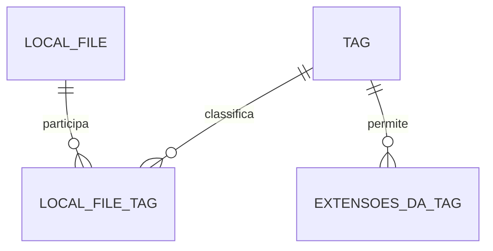

# Banco de dados

[Índice](README.md) · [Rastreabilidade](rastreabilidade.md) · [Decisões e pendências](decisoes-e-pendencias.md)

[SQL-01](banco-de-dados.md#sql-01) a [SQL-06](banco-de-dados.md#sql-06) definem o modelo a construir no MySQL. O modelo lógico diz quais informações se relacionam e quais restrições obedecem; o físico escolhe tipos, tamanhos, índices e mecanismos. **O modelo físico permanece parcialmente aberto.** As descrições e exemplos desta página não são DDL homologado nem SQL executado.

## SQL-01 — Tabelas e cardinalidades

**Estado: modelo lógico/conceitual confirmado.**

| Tabela/conceito | Papel |
|---|---|
| `LOCAL_FILE` | Registros de arquivos conhecidos pelo aplicativo. |
| `TAG` | Etiquetas. |
| `LOCAL_FILE_TAG` | Relação muitos-para-muitos. |
| `TAG_EXTENSION` / `TAG_EXTENSIONS` | Extensões permitidas por Tag; há variação de nome no histórico. |

Não criar duas tabelas por causa da variação singular/plural. O nome físico ainda precisa ser formalizado em [P-06](decisoes-e-pendencias.md#p-06); não inferir aprovação a partir de um eventual arquivo SQL preliminar.

Uma Tag pode ter zero a muitos arquivos. Um LocalFile pode ter várias Tags, com a regra de sentinela durante a sessão e limpeza na inicialização. Inconsistências temporárias são possíveis pela ausência de transações explícitas e motivam a limpeza defensiva.

Uma Tag tem zero a muitas extensões permitidas. Ausência de linhas representa ausência de restrição.

Não existem tabelas obrigatórias de NativeFile, NativeDirectory, conteúdo de arquivo, histórico de versões ou usuários do aplicativo.

## SQL-02 — Chaves e unicidade

**Estado: regras lógicas confirmadas.**

- UUID identifica LocalFile e Tag; a join-table referencia esses IDs.
- Caminho é único e alterável; não é chave primária.
- Nome de Tag não é único.
- A tabela de extensões não tem ID próprio; ainda precisa identificar a Tag à qual a extensão pertence.
- A combinação Tag/extensão deve ser única; Tags distintas podem usar a mesma extensão.

`PRIMARY KEY(tag_id, extension)` foi proposta para implementar a última regra. Uma constraint equivalente é detalhe físico; não apresentar um DDL não aprovado como o único mecanismo possível.

Uma restrição composta para evitar repetição do mesmo vínculo de arquivo/Tag é coerente com o conceito de associação, mas o DDL final não foi validado. Uma tentativa repetida de associação não autoriza criar outro LocalFile.

## SQL-03 — Tipos e dicionário físico

| Informação | Confirmado | Não homologado completamente |
|---|---|---|
| UUID | Tipo Java e identidade relacional por ID | `CHAR(36)` foi recomendado; `BINARY(16)` explicado como alternativa. |
| Caminho | Persistido, único, mutável | Comprimento, tipo textual, collation, normalização e desenho do índice. |
| Tamanho | Informação necessária | `long`/`BIGINT` foi a representação proposta. |
| Disponibilidade | Valor lógico conhecido | DDL, nulabilidade e valor inicial. |
| Datas | LocalDateTime ↔ DATETIME | Precisão, ausência de metadados, conversão e fuso. |
| Cor | Hexadecimal | Formato completo, limite e default. |
| Nome de Tag | Pode repetir | Tamanho, espaços, comparação e validação de vazio. |
| Extensão | Normalizada; única por Tag | Comprimento, extensões compostas, sem extensão e nomes especiais. |

Não tratar `path VARCHAR(1024) UNIQUE` de um exemplo antigo como SQL testado para a configuração final. Exemplos de DDL não homologados não resolvem as escolhas físicas ainda abertas.

As conversões apresentadas foram UUID/string, Path/texto e datas Java/SQL. Não adicione ORM ou serialização de todo o objeto como mecanismo aprovado.

## SQL-04 — Integridade e atualização de extensões

**Estado: efeitos funcionais confirmados; definição física parcial, a formalizar em [P-06](decisoes-e-pendencias.md#p-06).**

`TagDAO` consulta e sincroniza as extensões ao carregar, criar e atualizar Tag. Não existe necessidade aprovada de `TagExtensionDAO` separado nem de entidade de extensão com UUID.

As exclusões devem produzir os efeitos de [DEL-01](requisitos-e-regras.md#del-01) a [DEL-03](requisitos-e-regras.md#del-03) e [CIC-02](requisitos-e-regras.md#cic-02). `ON DELETE CASCADE` foi apresentado como possibilidade; não foi confirmado como mecanismo obrigatório para todas as relações.

Não inventar triggers para datas, disponibilidade, contador, sentinela ou limpeza. Restrições conceituais não provam que exista um trigger no banco.

## SQL-05 — Sem transações explícitas

**Estado: confirmada.**

A equipe decidiu não trabalhar com controle explícito de transações nesta versão por prazo e nível de aprendizado. Essa é uma limitação consciente da versão.

Não há garantia de atomicidade em operações que alteram múltiplas tabelas ou combinam arquivos e SQL. Uma etapa física concluída não é revertida automaticamente por falha no banco.

A ideia de acrescentar transações no futuro deve ser apenas comentada/documentada nos pontos pertinentes. [ERR-01](requisitos-e-regras.md#err-01) define a comunicação de falhas parciais; não existe política completa de compensação.

## SQL-06 — Schema de criação e alteração, sem histórico

**Estado: requisito confirmado; estratégia detalhada aberta.**

O aplicativo deve possuir scripts SQL de criação e alteração das tabelas. `schema_history` foi expressamente excluída.

Consultar a estrutura existente antes de aplicar alterações repetíveis foi sugerido. Não há algoritmo completo aprovado de migração, verificação de todas as versões, reaplicação ou recuperação de script incompleto.

Não documentar “sem histórico” como executar qualquer ALTER cegamente em toda abertura. Não apagar e recriar tabelas para simplificar atualização.

Esta missão documenta os objetivos, as relações e os efeitos esperados dos futuros scripts SQL. Não exige arquivos SQL prontos, não cria schemas operacionais e não executa SQL. Se houver um rascunho fornecido, sua leitura será apenas auxiliar.

## Cardinalidades do modelo lógico

Diagrama ilustrativo das relações confirmadas. `EXTENSOES_DA_TAG` é um rótulo do conceito com nome físico pendente entre `TAG_EXTENSION` e `TAG_EXTENSIONS`; não é uma terceira tabela.

Cada associação refere um arquivo e uma Tag; cada extensão pertence a uma Tag. Zero associações permite Tags vazias e exige a leitura das regras de sentinela/limpeza para LocalFile. O diagrama não escolhe cascade, índices ou UUID SQL. A combinação Tag/extensão é única, sem ID próprio da extensão; ausência de extensões significa ausência de restrição.

## Dicionário lógico e reconstrução

| Conceito | Dados a representar | Restrição ou decisão aberta |
|---|---|---|
| LOCAL_FILE | UUID, caminho, disponibilidade, tamanho, criação/modificação/último acesso físicos, nome e extensão reais | UUID identifica; caminho único muda. Nome/extensão em colunas separadas e representação do tamanho seguem [P-06](decisoes-e-pendencias.md#p-06). |
| TAG | UUID, nome, cor hexadecimal, criação e último arquivo marcado | Nome repetível; contador de disponíveis não será persistido. Validações e datas seguem [P-09](decisoes-e-pendencias.md#p-09)/[P-10](decisoes-e-pendencias.md#p-10). |
| LOCAL_FILE_TAG | IDs do arquivo e da Tag | Relação muitos-para-muitos; desenho final da restrição composta não homologado. |
| TAG_EXTENSION / TAG_EXTENSIONS | ID da Tag e extensão normalizada | Sem ID próprio; combinação única; nome físico e limites em [P-06](decisoes-e-pendencias.md#p-06). |

As datas Java `LocalDateTime` correspondem a `DATETIME` por decisão aprovada. A conversão de fuso, a precisão e a ausência de datas não têm política final; não preencher com data de cadastro ou zero. Reconstruir uma entidade conserva identidade e datas. Não se cria outro LocalFile ao repetir uma associação ou carregar uma linha.

## Como os DAOs colaborarão

[ARQ-04](arquitetura-e-padroes.md#arq-04) é a norma da divisão. LocalFileDAO recebe/retorna registros e utiliza LocalFileFilter para a consulta pertinente. TagDAO persiste/reconstrói a Tag com suas extensões; a Screen não monta entidades por SQL. LocalFileTagDAO associa/desassocia e consulta relações sem precisar de um UPDATE artificial. Os DAOs usam a mesma DatabaseConnection, responsável pelo ciclo da conexão compartilhada ([ARQ-08](arquitetura-e-padroes.md#arq-08)).

A consulta por Tags retorna arquivos com AND/OR, sem duplicação de identidade. Ela não altera o retorno de `CrudDAO<Tag, TagFilter>` para arquivos; o encaixe permanece em [P-05](decisoes-e-pendencias.md#p-05). A consulta em lote por caminhos retorna `Map<Path, LocalFile>` para enriquecer a listagem nativa ([EXP-03](interface-e-fluxos.md#exp-03)); registros ausentes do Map não eliminam arquivos da apresentação.

Consultar `available = true` responde quantos associados estão disponíveis. Encontrar Tags vazias pergunta se existe alguma associação. São consultas diferentes ([TAG-03](requisitos-e-regras.md#tag-03)), sem contador persistido ou trigger.

## Efeitos e limites na persistência

| Fluxo | Resultado esperado no banco | Limite |
|---|---|---|
| Primeira associação | Criar apenas o registro necessário ou reutilizar o caminho; persistir associação. | [OP-01](requisitos-e-regras.md#op-01); reconstrução e validações sem API completa. |
| Reorganizar sem Tag normal | Manter o registro na sessão com a sentinela. | [CIC-01](requisitos-e-regras.md#cic-01); alcance de exclusão explícita em [P-02](decisoes-e-pendencias.md#p-02). |
| Inicialização | Remover registros somente na sentinela e órfãos defensivos, com vínculos pertinentes. | [CIC-02](requisitos-e-regras.md#cic-02); não apagar arquivo físico nem Tag de sistema. |
| Refresh | Sincronizar disponibilidade/metadados; nenhuma limpeza por falta de Tags. | [SYN-01](requisitos-e-regras.md#syn-01) a [SYN-03](requisitos-e-regras.md#syn-03), [P-10](decisoes-e-pendencias.md#p-10). |
| Mover/renomear normalmente | Manter UUID, atualizar caminho e associações conforme decisão de compatibilidade. | [OP-03](requisitos-e-regras.md#op-03)/[OP-05](requisitos-e-regras.md#op-05); SQL e disco não são atômicos. |
| Copiar/substituir | Identidade e cópia sem Tags ainda em aberto. | [P-01](decisoes-e-pendencias.md#p-01): não transplantar o resultado de movimentação. |
| Excluir | Aplicar os efeitos da modalidade, com a segunda ainda parcialmente aberta. | [DEL-01](requisitos-e-regras.md#del-01) a [DEL-04](requisitos-e-regras.md#del-04), [P-02](decisoes-e-pendencias.md#p-02); sem cascata ou ordem inventada. |

Os futuros scripts em `database/schema` terão papel de criação e alteração. [SQL-06](banco-de-dados.md#sql-06) e [AMB-04](instalacao-e-execucao.md#amb-04) mantêm reaplicação e recuperação em [P-11](decisoes-e-pendencias.md#p-11); ausência de `schema_history` não autoriza repetir ALTER cegamente nem apagar/recriar tabelas. [ERR-01](requisitos-e-regras.md#err-01) exige comunicação de resultados parciais. A limpeza defensiva tem alcance específico e não é recuperação geral de qualquer falha.
