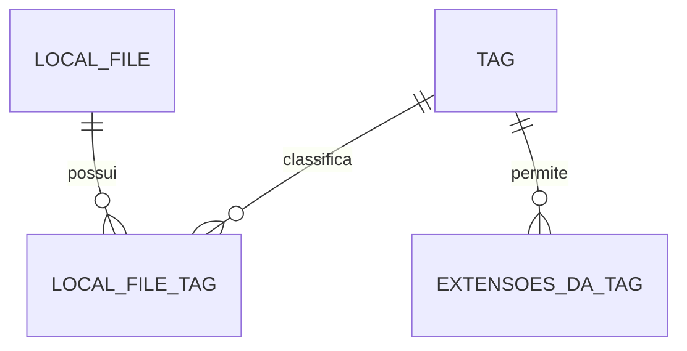

# Banco de dados: guardar cadastros e associações

[Índice](README.md) · [Modelo de domínio](modelo-de-dominio.md) · [DAOs](arquitetura-e-padroes.md#arq-04) · [Ambiente](instalacao-e-execucao.md)

O MySQL guarda o que o Tag-File conhece sobre arquivos e etiquetas. O conteúdo de prova.pdf permanece no disco. Esta página apresenta o **modelo lógico**, isto é, quais dados se relacionam. O DDL implementado está em `database/schema`; suas escolhas estão registradas em [P-06](decisoes-implementacao.md).

## As tabelas e suas relações

| Tabela ou conceito | O que guarda |
|---|---|
| LOCAL_FILE | Cadastros de arquivos, identidade, caminho e metadados. |
| TAG | Etiquetas e seus dados próprios. |
| LOCAL_FILE_TAG | Associações entre cadastros de arquivos e etiquetas. |
| TAG_EXTENSION | Extensões permitidas por etiqueta, com chave composta de UUID da Tag e extensão. |
| APP_METADATA | Marcador de conclusão da carga inicial de predefinidas; não é histórico de schema. |

Não há tabelas próprias obrigatórias para NativeFile, NativeDirectory, conteúdo dos arquivos, histórico de versões ou usuários do aplicativo.

### Exemplo de três associações

F1, F2, T1 e T2 abaixo são abreviações didáticas de UUIDs.

| LOCAL_FILE: id | Caminho |
|---|---|
| F1 | /Documentos/prova.pdf |
| F2 | /Documentos/trabalho.docx |

| TAG: id | Nome |
|---|---|
| T1 | Faculdade |
| T2 | Importante |

| LOCAL_FILE_TAG: arquivo | Tag |
|---|---|
| F1 | T1 |
| F1 | T2 |
| F2 | T1 |

A tabela de associação guarda pares de IDs. Assim, prova.pdf possui Faculdade e Importante; Faculdade classifica prova.pdf e trabalho.docx. Não é necessário criar uma coluna para cada nova etiqueta.

Essa relação é **muitos-para-muitos**: um arquivo pode ter várias Tags e uma Tag pode classificar vários arquivos. Uma Tag também pode existir sem associações. No ciclo de vida normal, um cadastro que perde sua última Tag recebe a sentinela; registros sem associação são tratados defensivamente na inicialização.

### Extensões são outra relação

Uma Tag pode permitir várias extensões, como .pdf e .docx. Cada linha da tabela de extensões referencia uma Tag e uma extensão. Zero linhas para a Tag significa ausência de restrição; qualquer extensão é aceita.

Cada associação referencia um arquivo e uma Tag. EXTENSOES_DA_TAG é o rótulo do conceito no desenho, não uma decisão adicional de nome físico.

## Identidade e unicidade

| Regra | Por que importa |
|---|---|
| LocalFile e Tag têm UUID. | Identificam a entidade independentemente do texto exibido ou do caminho atual. |
| Caminho é único e alterável; não é chave primária. | Um caminho cadastrado corresponde a um registro; mover não exige trocar sua identidade. |
| Nome de Tag pode repetir. | Duas Tags de mesmo nome continuam distintas pelos IDs. |
| Extensão não tem UUID próprio. | A linha precisa identificar sua Tag e a extensão permitida. |
| A combinação Tag/extensão é única. | Evita repetir .pdf na mesma Tag; outras Tags também podem aceitar .pdf. |

Chave primária identifica uma linha; chave estrangeira referencia outra entidade. Os pares Tag/extensão e arquivo/Tag são chaves primárias compostas. A mesma associação não cria outro LocalFile, e a pesquisa não duplica o cadastro por corresponder a várias Tags.

Unicidade de caminho usa texto absoluto normalizado lexicalmente e comparação binária. Aliases, hard links e diferenças de caixa no sistema de arquivos não são fundidos automaticamente. Os limites dessa escolha estão em [P-06](decisoes-e-pendencias.md#p-06) e [P-08](decisoes-e-pendencias.md#p-08).

## Tipos e armazenamento físico

| Informação | Contrato | Representação implementada |
|---|---|---|
| UUID | Tipo Java e identidade por ID. | CHAR(36), ASCII binário. |
| Caminho | Persistido, único e mutável. | VARCHAR(700), UNIQUE, utf8mb4_0900_bin. |
| Nome e extensão do arquivo | Informações do arquivo. | Derivados do Path, sem colunas separadas. |
| Tamanho | Bytes conhecidos. | Long/BIGINT anulável, nunca negativo. |
| Disponibilidade | Valor lógico conhecido. | BOOLEAN NOT NULL, informado na gravação. |
| Datas | LocalDateTime em Java e DATETIME em MySQL. | UTC, DATETIME(6); metadados físicos desconhecidos são nulos. |
| Nome e cor da Tag | Nome repetível; cor hexadecimal. | VARCHAR(100) e CHAR(7), validando nome e #RRGGBB no domínio. |
| Extensões permitidas | Normalizadas e únicas por Tag. | VARCHAR(64); sufixos compostos aceitos; string vazia indica sem extensão. |

UUID/string, Path/texto e datas Java/SQL são conversões a tratar nos DAOs. Não há ORM ou serialização do objeto inteiro no desenho. Um exemplo como path VARCHAR(1024) UNIQUE não equivale a uma definição validada de coluna e índice.

## Gravar, reconstruir e excluir relações

TagDAO persiste e reconstrói a Tag com suas extensões; a UI não precisa consultar um DAO de extensões separado. LocalFileDAO reconstrói cadastros preservando identidade e datas; LocalFileTagDAO trabalha com os vínculos.

Os efeitos das exclusões seguem [DEL-01 a DEL-04](requisitos-e-regras.md#del-01). Remover um vínculo preserva a Tag e o arquivo, salvo quando outra operação exige sua exclusão. A limpeza da inicialização segue [CIC-02](requisitos-e-regras.md#cic-02).

ON DELETE CASCADE remove vínculos/extensões quando sua entidade referenciada é excluída; não apaga arquivos físicos nem outras Tags. Não há triggers de produção para datas, disponibilidade, contadores ou sentinela; a coordenação e os DAOs mantêm essas regras. A demonstração de falha usa uma trigger temporária própria, removida ao terminar.

## Limite atual: operações podem ficar parciais

A versão não implementa controle explícito de transações. Por isso, não há garantia de que várias alterações SQL sejam concluídas como uma única unidade. Também não há operação atômica garantida entre disco e banco.

Exemplo: mover o arquivo pode funcionar e salvar o novo caminho pode falhar. O disco já mudou e o cadastro pode conservar o caminho anterior. A aplicação deve explicar o que concluiu e o que falhou, conforme [ERR-01](requisitos-e-regras.md#err-01), sem prometer reversão automática. O estudo de transações é uma possível evolução comentada.

## Criação e alteração do schema

Os scripts `001-create.sql` e `002-index.sql` são acionados pela preparação da aplicação. A tabela schema_history está fora do escopo.

DatabaseManager verifica colunas, tipos pertinentes, chaves e cascatas antes de prosseguir. Cria tabelas ausentes e só acrescenta o índice adicional quando falta. Estrutura incompatível gera erro e preserva dados, conforme [P-11](decisoes-e-pendencias.md#p-11).

## Consultas que ligam banco e interface

| Necessidade | Resultado esperado | Limite de contrato |
|---|---|---|
| Carregar Tags | Objetos Tag com suas extensões. | TagDAO mantém o tipo de entidade Tag. |
| Encontrar arquivos por Tags | Cadastros de arquivos que atendem AND/OR, sem duplicação. | LocalFileDAO.find com LocalFileFilter; sem Tags selecionadas retorna todos. |
| Mostrar Tags na pasta real | Correspondências em lote, apresentadas como Map<Path, LocalFile>. | LocalFileDAO.findByPaths, com caminhos absolutos normalizados lexicalmente. |
| Contar disponíveis | Quantidade de associados com available = true. | Valor calculado, não contador persistido. |
| Encontrar Tags vazias | Tags sem associações. | Zero disponíveis não significa Tag vazia; a sentinela continua protegida. |

As consultas fornecem os dados à aplicação. Publicar avisos e atualizar componentes visuais pertencem aos Controllers e à apresentação, conforme a [arquitetura](arquitetura-e-padroes.md).
