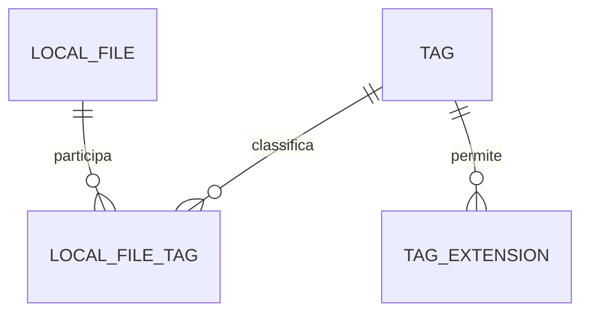

# Banco de dados

[Índice](../README.md) · [Modelo de domínio](modelo-de-dominio.md) · [Arquitetura](arquitetura-e-padroes.md) · [Instalação e execução](instalacao-e-execucao.md)

Este documento é a referência principal de **SQL-01 a SQL-06**. O modelo lógico descreve quais informações se relacionam e quais regras precisam ser preservadas. O modelo físico define tipos SQL, tamanhos, índices, nulabilidade e mecanismos concretos; ele permanece parcialmente aberto.

**Estado observado:** não foram encontrados diretório `database`, scripts SQL, DAOs ou conexão JDBC no conjunto inspecionado. O único Java é [src/Main.java](../src/Main.java), um template de console. Portanto, as tabelas e relações abaixo são especificação planejada, sem schema implementado ou validado por execução. A documentação não cria nem aplica DDL.

## SQL-01 — Tabelas e cardinalidades

**Estado: modelo lógico/conceitual confirmado.**

| Tabela/conceito | Papel |
|---|---|
| `LOCAL_FILE` | Registros de arquivos conhecidos pelo aplicativo. |
| `TAG` | Etiquetas. |
| `LOCAL_FILE_TAG` | Relação muitos-para-muitos. |
| `TAG_EXTENSION` / `TAG_EXTENSIONS` | Extensões permitidas por Tag; há variação de nome no histórico. |

A variação singular/plural se refere a um único conceito, sem duas tabelas obrigatórias. Nenhum nome físico implementado foi encontrado; a escolha permanece pendente em P-06.

Uma Tag pode ter zero a muitos arquivos. Um LocalFile pode ter várias Tags, com a regra de sentinela durante a sessão e limpeza na inicialização. Inconsistências temporárias são possíveis pela ausência de transações explícitas e motivam a limpeza defensiva.

Uma Tag tem zero a muitas extensões permitidas. Ausência de linhas representa ausência de restrição.

Não existem tabelas obrigatórias de NativeFile, NativeDirectory, conteúdo de arquivo, histórico de versões ou usuários do aplicativo.

### Diagrama lógico das cardinalidades

**Estado: relações conceituais confirmadas; não é DDL nem diagrama de tabelas existentes.** `TAG_EXTENSION` abaixo designa o conceito de extensões por Tag. O uso do singular para representar o conceito não resolve a escolha entre `TAG_EXTENSION` e `TAG_EXTENSIONS`, que permanece em [P-06](decisoes-e-pendencias.md#p-06).

Cada associação corresponde a um arquivo e a uma Tag. Cada extensão configurada pertence a uma Tag. O limite inferior zero representa Tags vazias e o modelo relacional de associações; a regra de sentinela e a limpeza defensiva detalham o tratamento de registros sem classificação em [CIC-01 a CIC-03](requisitos-e-regras.md#cic-01). O desenho não escolhe cascatas, tipos SQL ou índices.

## SQL-02 — Chaves e unicidade

**Estado: regras lógicas confirmadas.**

- UUID identifica LocalFile e Tag; a join-table referencia esses IDs.
- Caminho é único e alterável; não é chave primária.
- Nome de Tag não é único.
- A tabela de extensões não tem ID próprio; ainda precisa identificar a Tag à qual a extensão pertence.
- A combinação Tag/extensão deve ser única; Tags distintas podem usar a mesma extensão.

`PRIMARY KEY(tag_id, extension)` foi proposta para implementar a última regra. Uma constraint equivalente é detalhe físico; não há um único mecanismo de DDL homologado.

Uma restrição composta para evitar repetição do mesmo vínculo de arquivo/Tag é coerente com o conceito de associação, mas o DDL final não foi validado. Uma tentativa repetida de associação não autoriza criar outro LocalFile.

## SQL-03 — Tipos e dicionário físico

| Informação | Confirmado | Não homologado completamente |
|---|---|---|
| UUID | Tipo Java e identidade relacional por ID | `CHAR(36)` foi recomendado; `BINARY(16)` explicado como alternativa. |
| Caminho | Persistido, único, mutável | Comprimento, tipo textual, collation, normalização e desenho do índice. |
| Tamanho | Informação necessária | `long`/`BIGINT` foi a representação proposta. |
| Disponibilidade | Valor lógico conhecido | DDL, nulabilidade e valor inicial. |
| Datas | LocalDateTime ↔ DATETIME | Precisão, ausência de metadados, conversão e fuso. |
| Cor | Hexadecimal | Formato completo, limite e default. |
| Nome de Tag | Pode repetir | Tamanho, espaços, comparação e validação de vazio. |
| Extensão | Normalizada; única por Tag | Comprimento, extensões compostas, sem extensão e nomes especiais. |

`path VARCHAR(1024) UNIQUE` apareceu em um exemplo antigo e não é SQL testado para a configuração final. Esse exemplo e as alternativas de tipos permanecem propostas; nenhum DDL final foi homologado neste documento.

As conversões apresentadas foram UUID/string, Path/texto e datas Java/SQL. ORM e serialização de todo o objeto não são mecanismos aprovados.

## SQL-04 — Integridade e atualização de extensões

**Estado: efeitos funcionais confirmados; mecanismo físico não homologado e implementação não encontrada.**

`TagDAO` consulta e sincroniza as extensões ao carregar, criar e atualizar Tag. Não existe necessidade aprovada de `TagExtensionDAO` separado nem de entidade de extensão com UUID.

As exclusões devem produzir os efeitos de DEL-01 a DEL-03 e CIC-02. `ON DELETE CASCADE` foi apresentado como possibilidade; não foi confirmado como mecanismo obrigatório para todas as relações.

Não há triggers aprovados ou encontrados para datas, disponibilidade, contador, sentinela ou limpeza. As restrições conceituais não determinam esse mecanismo físico.

## SQL-05 — Sem transações explícitas

**Estado: confirmada.**

A equipe decidiu não trabalhar com controle explícito de transações nesta versão por prazo e nível de aprendizado. Essa é uma limitação consciente do escopo; a arquitetura documentada preserva a decisão.

Não há garantia de atomicidade em operações que alteram múltiplas tabelas ou combinam arquivos e SQL. Uma etapa física concluída não é revertida automaticamente por falha no banco.

A ideia de acrescentar transações no futuro deve ser apenas comentada/documentada nos pontos pertinentes. ERR-01 define a comunicação de falhas parciais; não existe política completa de compensação.

## SQL-06 — Schema de criação e alteração, sem histórico

**Estado: requisito confirmado; estratégia detalhada aberta.**

O aplicativo deve possuir scripts SQL de criação e alteração das tabelas. `schema_history` foi expressamente excluída.

Consultar a estrutura existente antes de aplicar alterações repetíveis foi sugerido. Não há algoritmo completo aprovado de migração, verificação de todas as versões, reaplicação ou recuperação de script incompleto.

A exclusão do histórico não aprova executar qualquer ALTER cegamente em toda abertura, nem apagar e recriar tabelas para simplificar atualização.

Não foram encontrados arquivos SQL na inspeção. Nenhum SQL foi criado fora da documentação, aplicado ou executado.

## Dicionário lógico para leitura do modelo

A tabela organiza as informações já definidas em [DOM-03](modelo-de-dominio.md#dom-03), [DOM-04](modelo-de-dominio.md#dom-04) e SQL-01 a SQL-03. Os nomes de informação não são uma lista final de colunas.

| Conceito | Informações a representar | Decisão ou ressalva |
|---|---|---|
| `LOCAL_FILE` | UUID | Identifica o registro; caminho não é a chave primária. Tipo SQL aberto. |
| `LOCAL_FILE` | Caminho | Persistido, único e alterável; normalização, comprimento, collation e índice não fechados. |
| `LOCAL_FILE` | Nome e extensão real | Informações do domínio; sua presença em colunas separadas continua pendente. |
| `LOCAL_FILE` | Tamanho | Necessário para apresentação e filtros; bytes, `long` e `BIGINT` foram propostos. |
| `LOCAL_FILE` | Disponibilidade | Estado lógico conhecido; DDL, ausência e valor inicial não fechados. |
| `LOCAL_FILE` | Criação, modificação e último acesso físicos | `LocalDateTime` em Java e `DATETIME` em MySQL; não são datas de inserção da linha. Precisão/ausência/fuso pendentes. |
| `TAG` | UUID | Identidade independente do nome; tipo SQL aberto. |
| `TAG` | Nome e cor hexadecimal | Nome pode repetir; comprimentos, formato completo, defaults e validações abertos. |
| `TAG` | Criação e último arquivo marcado | `LocalDateTime`/`DATETIME`; efeitos especiais em `lastFileTaggedAt` não fechados. |
| `LOCAL_FILE_TAG` | Identificadores de arquivo e Tag | Vínculo muitos-para-muitos; não depender de nomes ou caminhos como identidade da relação. |
| `TAG_EXTENSION` / `TAG_EXTENSIONS` | Identificador da Tag e extensão | Sem ID próprio; extensão normalizada e combinação única; nome físico ainda aberto. |

Nenhum campo persistido de contagem de disponíveis é necessário ou aprovado. Consultá-la sob demanda não equivale a procurar Tags vazias: o primeiro resultado conta associados com `available = true`; o segundo verifica ausência de qualquer associação ([TAG-03](requisitos-e-regras.md#tag-03)).

Não foram aprovados mecanismos que substituam datas físicas ausentes por datas de cadastro ou zero. A definição de unidade de apresentação de tamanho também segue aberta; MB e MiB não são unidades idênticas.

## DAOs, reconstrução e consultas

A arquitetura normativa de DAO está em [ARQ-04](arquitetura-e-padroes.md#arq-04). Aqui estão seus efeitos na persistência:

| Colaborador | Conteúdo persistido/consultado | Limite |
|---|---|---|
| `LocalFileDAO` | Registros `LocalFile`, por UUID ou `LocalFileFilter` e demais operações CRUD discutidas | Carregar uma linha conserva UUID e datas; o contrato concreto de reconstrução está aberto. |
| `TagDAO` | Tags, incluindo leitura e sincronização de extensões | `CrudDAO<Tag, TagFilter>` retorna Tags; a UI não deve montar a entidade por consultas separadas de extensão. |
| `LocalFileTagDAO` | Associação/desassociação e consultas relacionais | Especializado, sem obrigação de implementar o CRUD genérico ou um UPDATE artificial. |
| `DatabaseConnection` compartilhada | Acesso JDBC usado pelos DAOs | Não constitui pool; administra abertura/tratamento/fechamento da conexão compartilhada. |

A consulta de arquivos por Tags usa AND/OR e retorna arquivos, sem duplicar sua identidade. Seu encaixe de API está em [P-05](decisoes-e-pendencias.md#p-05): não se muda o retorno de `TagDAO.find(...)` para arquivos contrariando o tipo aprovado. A consulta em lote de correspondências retorna `Map<Path, LocalFile>` para enriquecer a visão local, preservando os arquivos sem registro ([EXP-03](interface-e-fluxos.md#exp-03)); a assinatura exata permanece aberta.

Não há ORM aprovado. As conversões discutidas são UUID/string, `Path`/texto e datas Java/SQL, conforme SQL-03. Criar entidade nova e reconstruir entidade existente têm necessidades diferentes: [ARQ-02](arquitetura-e-padroes.md#arq-02).

## Efeitos no banco, no registro e no disco

Os documentos de regras são a referência principal de cada operação. Esta matriz apenas conecta os efeitos ao modelo relacional.

| Situação | Efeito relevante para persistência | Regra principal |
|---|---|---|
| Navegar no sistema de arquivos | Consultar correspondências sem cadastrar cada arquivo exibido. | [DOM-01](modelo-de-dominio.md#dom-01), [EXP-03](interface-e-fluxos.md#exp-03) |
| Primeira associação | Reutilizar registro do caminho ou criar o necessário; persistir associação confirmada. | [OP-01](requisitos-e-regras.md#op-01) |
| Retirar a última Tag normal na reorganização | Preservar registro e associar a sentinela durante a sessão. | [CIC-01](requisitos-e-regras.md#cic-01) |
| Limpeza na inicialização | Remover registros somente na sentinela e registros sem associação, além de vínculos pertinentes; preservar disco e Tag de sistema. | [CIC-02](requisitos-e-regras.md#cic-02) |
| Refresh ou reconexão | Não executar limpeza de ausência de Tags. | [CIC-03](requisitos-e-regras.md#cic-03) |
| Mover/renomear normalmente | Preservar identidade; salvar mudança de localização e efeitos de compatibilidade aprovados. | [OP-03](requisitos-e-regras.md#op-03), [OP-05](requisitos-e-regras.md#op-05) |
| Copiar/substituir | Efeito de UUID/associações e cópia sem Tags ainda pendente; não transplantar a regra de movimentação. | [OP-04](requisitos-e-regras.md#op-04), [P-01](decisoes-e-pendencias.md#p-01) |
| Exclusão de Tag/registro/arquivo | Aplicar a modalidade escolhida; alcance da segunda permanece pendente. | [DEL-01 a DEL-04](requisitos-e-regras.md#del-01), [P-02](decisoes-e-pendencias.md#p-02) |

Sem controle explícito de transações, exclusão, gravação de extensões e outras operações com mais de uma etapa podem terminar parcialmente. A falha precisa mostrar o que foi concluído e o que falhou, sem promessa de rollback ou compensação ([ERR-01](requisitos-e-regras.md#err-01)). A limpeza defensiva da inicialização tem alcance específico; ela não é uma recuperação geral de qualquer falha.

## Estrutura operacional e decisões pendentes

Os scripts de criação e alteração pertencem ao futuro `database/schema` sob a raiz do projeto. Não foi encontrado esse diretório. Os nomes `001_initial_schema.sql`/`002_add_indexes.sql` e `create.sql`/`update.sql` são alternativas de referência, não dois conjuntos obrigatórios. O requisito proíbe `schema_history`; reaplicação e recuperação de preparo incompleto continuam abertas.

O procedimento de primeira preparação, reutilização dos dados, conexão e encerramento é descrito em [AMB-02 a AMB-07](instalacao-e-execucao.md#amb-02), sem executar essas ações. Preparar schema não autoriza apagar dados nem recriar automaticamente predefinidas removidas pelo usuário.

| Pendência | Assunto que impede fechar o modelo físico/comportamento |
|---|---|
| [P-01](decisoes-e-pendencias.md#p-01) | Identidade e associações após cópia/substituição; registro de cópia sem Tags. |
| [P-02](decisoes-e-pendencias.md#p-02) | Remoção imediata ou adiamento na modalidade 2 e destino da Tag selecionada. |
| [P-05](decisoes-e-pendencias.md#p-05) | Contrato de consulta de arquivos por Tags. |
| [P-06](decisoes-e-pendencias.md#p-06) | DDL físico, UUID SQL, nulabilidade, limites, índices, collation, nome da tabela de extensões e cascatas. |
| [P-07](decisoes-e-pendencias.md#p-07) | Identificação técnica da sentinela e preparação das predefinidas, sem inventar coluna/enum/UUID fixo. |
| [P-08](decisoes-e-pendencias.md#p-08) | Equivalência de caminhos, colisões e casos de extensão. |
| [P-09](decisoes-e-pendencias.md#p-09) | Validação de nomes e cor. |
| [P-10](decisoes-e-pendencias.md#p-10) | Ausência e conversão de metadados; efeitos nas datas. |
| [P-11](decisoes-e-pendencias.md#p-11) | Versões, preparação/reaplicação de schema e recuperação operacional. |
| [P-12](decisoes-e-pendencias.md#p-12) | Política de lote após falhas e prevenção de operações simultâneas. |
