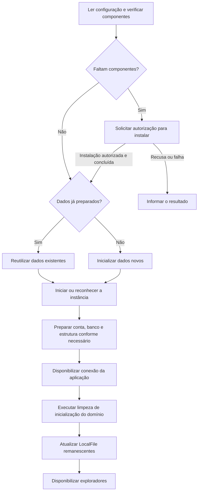

# Instalação e execução: ambiente local

[Índice](README.md) · [Banco de dados](banco-de-dados.md) · [Pendências de ambiente](decisoes-e-pendencias.md#p-11)

O Tag-File usa uma instância MySQL local, administrada pela aplicação por scripts. Esta página explica o papel de cada parte e o fluxo de referência. Os scripts estão em `database/scripts`; versões, comandos reproduzíveis e resultados executados estão em [implementação](implementacao.md). O [registro P-11](decisoes-implementacao.md) define distribuição portátil, identificação da instância, schema incompleto e encerramento; Windows está implementado, mas não executado neste host.

## Entenda as peças antes de preparar o ambiente

| Peça | Papel |
|---|---|
| JDK | Ferramentas e ambiente Java usados para desenvolver e executar a aplicação. Deve ser superior à versão 21. |
| JDBC | API Java de acesso a banco, com tipos como Connection, PreparedStatement, ResultSet, DriverManager e SQLException. |
| MySQL Connector/J | Driver que permite à aplicação conversar com MySQL pela API JDBC. |
| Servidor mysqld | Processo que mantém o banco disponível para conexões. |
| Cliente mysql | Programa de terminal que pode ser usado na preparação/administração do banco. |
| DatabaseManager | Coordena a preparação e o ciclo da instância local do Tag-File. |
| DatabaseConnection | Centraliza a conexão JDBC compartilhada pelos DAOs. |

O driver Java não contém o servidor. Um DAO não precisa iniciar o cliente mysql de terminal para cada consulta: ele usa JDBC e o driver para comunicar-se com o servidor.

<a id="amb-01"></a>

## Plataformas e instalação autorizada

| Plataforma | Scripts | Autorização prevista |
|---|---|---|
| Windows | PowerShell, arquivos .ps1. | Confirmação na interface; pacote portátil preparado com a conta atual, sem UAC ou serviço global. Consulte [Windows portátil](windows-portatil.md). |
| Ubuntu e Linux Mint | Bash, arquivos .sh. | Autorização pelo agente polkit, via pkexec, para baixar/extrair o pacote portátil; sem alterar pacotes do sistema. |

Ao abrir, o aplicativo verifica os componentes necessários de cliente e servidor MySQL. Se faltarem, solicita autorização para instalar. ProcessBuilder é o recurso definido para iniciar scripts/processos externos pelo Java.

`Main.executeScriptWithElevation` é o ponto que delega a autorização ao sistema; `Application` fornece esse método ao `DatabaseManager` como executor da instalação. A mesma função é usada por `Main --build` para compilar com autorização nativa. O Java não recebe senhas. Consulte [comandos e detalhes](implementacao.md#execução-de-scripts-com-elevação).

Recusa ou cancelamento não representa instalação concluída. A elevação para instalar não exige manter a UI permanentemente como administrador. A preparação deve respeitar as outras instalações MySQL da máquina.

Os scripts verificam os executáveis privados em `database/runtime/mysql/bin`. A distribuição oficial portátil MySQL 8.4.9 é baixada para esse runtime. Dependências nativas do pacote precisam existir no sistema; sua instalação administrativa não é feita pelos scripts. A instância é reconhecida por marcador do projeto, diretório de dados, porta e PID, conforme [P-11](decisoes-implementacao.md).

<a id="amb-02"></a>

## Organização dos arquivos operacionais

A pasta database fica **dentro da raiz do projeto**. Os dados ficam em database/runtime/data. A árvore abaixo apresenta os principais arquivos implementados; cada pasta de scripts também contém um auxiliar `common`:

```text
database/
├── config/
│   ├── database.properties.example
│   ├── database.properties
│   ├── mysql-windows.ini.template
│   └── mysql-linux.cnf.template
├── scripts/
│   ├── windows/
│   │   ├── check.ps1
│   │   ├── install.ps1
│   │   ├── initialize.ps1
│   │   ├── start.ps1
│   │   └── stop.ps1
│   └── linux/
│       ├── check.sh
│       ├── install.sh
│       ├── initialize.sh
│       ├── start.sh
│       └── stop.sh
├── schema/
│   ├── 001-create.sql
│   └── 002-index.sql
└── runtime/
    ├── mysql/
    ├── data/
    ├── logs/
    └── run/
```

| Grupo | Responsabilidade |
|---|---|
| Configurações e templates | Informar diretórios, parâmetros da instância e conexão. |
| check | Verificar os componentes necessários. |
| install | Instalar componentes ausentes depois da autorização. |
| initialize | Preparar pela primeira vez um diretório de dados ainda não inicializado. |
| start | Iniciar ou reconhecer a instância administrada. |
| stop | Encerrar a instância identificada como pertencente ao Tag-File. |
| schema | Criar tabelas ausentes e índice adicional, conferindo a estrutura existente antes de continuar. |
| runtime | Manter dados, logs e informações de execução. |

Os dados são preparados no local previsto e reutilizados nas próximas execuções. Runtime, logs e configuração real não são versionados. O JAR do Connector/J, a configuração de exemplo, templates, scripts e SQL acompanham o projeto.

<a id="amb-03"></a>

## Parâmetros públicos da instância didática

| Parâmetro | Valor de referência |
|---|---|
| Endereço | 127.0.0.1 |
| Porta | 3333 |
| Banco | tag_file |
| Usuário dos DAOs | root |
| Senha didática pública | TagFile123! |
| Reconexão solicitada | autoReconnect=true |
| Dados | database/runtime/data |

Exemplo mínimo de configuração. Na primeira abertura, o arquivo local ausente é criado a partir de `database/config/database.properties.example`, que também define fuso e limites de espera. Arquivos locais existentes não são sobrescritos:

```properties
db.url=jdbc:mysql://127.0.0.1:3333/tag_file?autoReconnect=true
db.user=root
db.password=TagFile123!
```

Esses valores pertencem à instância local exclusiva do projeto. A senha é a da conta do servidor usada pelo cliente; não há senhas independentes para manter iguais. A configuração administrativa é uma limitação didática e não deve redefinir root de outras instalações.

Se a porta estiver ocupada, será necessário informar a situação; não há troca automática de porta definida.

<a id="amb-04"></a>

## Primeira preparação e próximas aberturas



O diagrama apresenta o fluxo funcional. Na primeira preparação, cria-se a estrutura inicial; nas seguintes, reutilizam-se os dados. O Manager confere tabelas, chaves e tipos; estrutura incompatível gera erro sem apagar dados. Esperas e identificação da instância estão registradas em P-11. `Application.start()` chama `LocalFileManager.initialize()` uma vez por sessão, realizando a limpeza de cadastros órfãos ou apenas com a sentinela e sincronizando os restantes. O fechamento libera JDBC e encerra o servidor exclusivo, preservando cadastros, Tags e arquivos físicos. Consulte [o guia de execução](implementacao.md).

**Inicializar os dados** e **iniciar o servidor** são operações diferentes. Uma falha de conexão não autoriza apagar o diretório, reinicializar o banco ou iniciar outro servidor com o mesmo conjunto de dados.

A limpeza de domínio remove apenas cadastros com única Tag Etiqueta Ausente e cadastros sem associações, conforme [CIC-02](requisitos-e-regras.md#cic-02). Preserva arquivos físicos e a Tag protegida. Preparar o schema não recria automaticamente predefinidas apagadas pelo usuário.

<a id="amb-05"></a>

## Conexão compartilhada e reconexão

Os DAOs guardam referência à mesma instância de DatabaseConnection. Ela controla a abertura e o fechamento da conexão; não há pool. `open` abre ou verifica a conexão existente; `getConnection` a empresta sem transferir sua propriedade; `close` pertence ao encerramento da sessão. Os DAOs fecham somente seus Statements e ResultSets.

A configuração mantém autoReconnect=true. Essa opção não garante concluir uma operação interrompida, repetir escritas, desfazer alterações ou evitar exceções. A documentação do driver descreve limites e efeitos sobre estado de sessão e consistência. [Referência de autoReconnect](https://dev.mysql.com/doc/connector-j/en/connector-j-connp-props-high-availability-and-clustering.html).

Reconectar durante a sessão não executa novamente a limpeza de Etiqueta Ausente. Todas as ações respeitam o limite compartilhado de [uma ação por vez](requisitos-e-regras.md#op-09), sem fila. `ActionGate` faz a admissão atômica antes de iniciar a thread de trabalho; Loading acompanha essa posse até a conclusão real.

<a id="amb-06"></a>

## JDK, JDBC e inclusão do driver

O projeto requer **JDK superior à versão 21**, sem Maven. JDBC faz parte da API Java; o Connector/J **9.7.0** é versionado como JAR na pasta `lib` e acompanha o clone. A implementação foi executada com MySQL **8.4.9**; fontes de compatibilidade estão no [registro P-11](decisoes-implementacao.md).

```text
lib/
└── mysql-connector-j-9.7.0.jar
```

Colocar o JAR em lib e incluí-lo como biblioteca/classpath são tarefas diferentes. O classpath informa ao Java onde encontrar as classes da dependência. Os scripts de compilação e os comandos do [guia](implementacao.md) incluem `lib/*`.

A estrutura permanece sem Gradle, Spring, Hibernate ou outro gerenciador/ORM adicional. Uma atualização futura de versões precisa conferir novamente a compatibilidade do JDK, servidor e driver.

<a id="amb-07"></a>

## Encerramento e preservação

DatabaseManager coordena a parada da instância administrada e DatabaseConnection o fechamento da conexão compartilhada. No fechamento normal da janela, a conexão é fechada antes do servidor. A janela recusa encerramento durante uma ação ativa. Não há promessa de recuperação automática após encerramento forçado.

O aplicativo deve reconhecer sua instância, sem parar qualquer mysqld encontrado no computador. Dados existentes permanecem preservados; falha operacional não autoriza uma limpeza destrutiva.

Use [UC-01](casos-de-uso.md#uc-01), [ACE-23](criterios-de-aceite.md#ace-23) e [ACE-24](criterios-de-aceite.md#ace-24) para conferir parâmetros, reutilização e tratamento da autorização. As evidências e limitações por plataforma estão em [verificação](verificacao.md).
