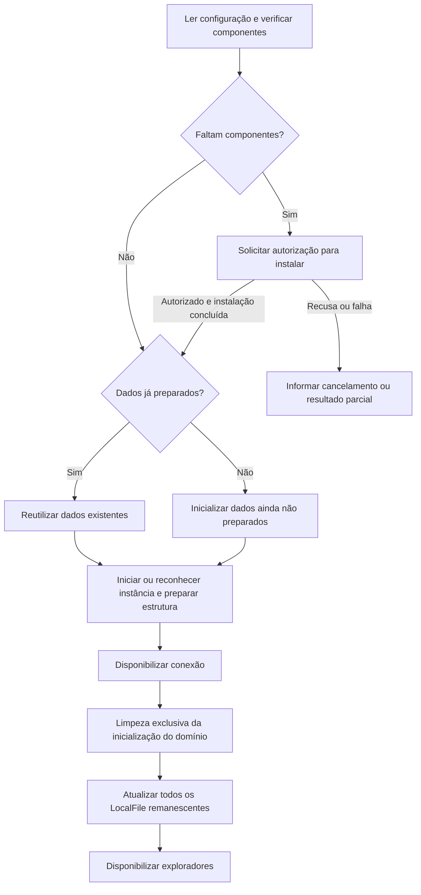

# Planejamento de instalação e execução

[Índice](README.md) · [Rastreabilidade](rastreabilidade.md) · [Decisões e pendências](decisoes-e-pendencias.md)

Este documento orienta a preparação futura do ambiente. [AMB-01](instalacao-e-execucao.md#amb-01) a [AMB-07](instalacao-e-execucao.md#amb-07) definem responsabilidades e parâmetros de referência; os comandos definitivos e as versões ainda abertas não são inventados. **As árvores de arquivos são estruturas a construir posteriormente, e os procedimentos não foram executados nesta missão.**

DatabaseManager administrará a instância local; DatabaseConnection centralizará a conexão utilizada pelos DAOs. Cliente `mysql`, servidor `mysqld` e driver Java têm papéis diferentes. Nenhum artefato operacional é exigido para compreender este planejamento.

<a id="amb-01"></a>

## AMB-01 — Plataformas e autorização para instalar

**Estado: confirmada.**

Plataformas consideradas:

```text
Windows
Ubuntu
Linux Mint
```

Ao abrir, o Tag-File deve verificar se os componentes necessários de cliente MySQL e servidor MySQL estão disponíveis. Se faltarem, solicitar autorização para instalar.

No Windows, o solicitante pediu o pop-up de elevação do sistema, o UAC. Scripts PowerShell fazem parte da solução. No Linux, scripts Bash devem contemplar Ubuntu e Linux Mint. `pkexec` foi apresentado como mecanismo possível de autenticação administrativa, mas não é comando obrigatório homologado.

`ProcessBuilder` foi aprovado para iniciar scripts/processos externos pelo Java. O cliente `mysql` e o servidor `mysqld` não são dois servidores que devem permanecer abertos: o cliente pode ser usado para preparar/administrar a estrutura; o servidor é o processo que atende as conexões.

Verificar os executáveis não equivale a descobrir todas as instalações apenas por PATH. A estratégia de detecção é detalhe ainda não fechado. Também não foram definidos download, repositório de pacotes, versão ou distribuição de binários junto do aplicativo.

O cancelamento da autorização não pode ser tratado como instalação bem-sucedida. Não redefinir as credenciais nem alterar dados de outras instâncias do usuário. A elevação para instalar não significa que a UI deva executar permanentemente como administrador.

<a id="amb-02"></a>

## AMB-02 — Estrutura database e localização dos dados

**Estado: organização planejada e confirmada, com nomes de arquivos de referência.**

O diretório está na raiz do projeto:

```text
<raiz-do-projeto>/database
```

Isso não significa `/database` na raiz do sistema operacional. A correção final permite subdiretório de dados e descarta a necessidade de inicializar em uma pasta temporária para depois mover tudo.

Local de dados de referência aprovado na estrutura:

```text
database/runtime/data
```

Organização:

```text
database/
├── config/
│   ├── database.properties.example
│   ├── database.properties
│   ├── mysql-windows.ini.template
│   └── mysql-linux.cnf.template
│
├── scripts/
│   ├── windows/
│   │   ├── check.ps1
│   │   ├── install.ps1
│   │   ├── initialize.ps1
│   │   ├── start.ps1
│   │   └── stop.ps1
│   │
│   └── linux/
│       ├── check.sh
│       ├── install.sh
│       ├── initialize.sh
│       ├── start.sh
│       └── stop.sh
│
├── schema/
│   └── scripts de criação e alteração
│
└── runtime/
    ├── data/
    ├── logs/
    └── run/
```

Os diretórios organizam configurações, scripts de plataforma, esquema, dados, logs e arquivos de execução. `check` e `install` surgiram na evolução dos exemplos para cobrir o requisito de verificação/instalação.

Nomes de schema que apareceram em versões diferentes:

```text
001_initial_schema.sql / 002_add_indexes.sql
create.sql / update.sql
```

Essas variações não são dois mecanismos cumulativos obrigatórios. Os papéis dos futuros scripts de criação e alteração estão definidos; seus nomes finais permanecem abertos. Não é necessário encontrar arquivos SQL para explicar a estrutura. O exemplo `add_indexes` não aprova um índice específico.

Na primeira preparação, inicializar o subdiretório de dados vazio/ainda não preparado. Nas próximas aberturas, reutilizar os dados. Não reapresentar a proposta descartada de criar dados fora de `database` e transferi-los.

Não afirmar que logs, dados reais ou credenciais pessoais devem ser versionados. A política concreta de versionamento não foi fechada; registre o limite sem criar ou alterar arquivos de controle do repositório nesta missão documental.

<a id="amb-03"></a>

## AMB-03 — Parâmetros públicos de desenvolvimento

| Parâmetro | Valor de referência consolidado | Estado |
|---|---|---|
| Usuário dos DAOs | `root` | Acesso administrativo solicitado explicitamente. |
| Senha | `TagFile123!` | Deliberadamente escolhida/confirmada para o projeto didático. |
| Porta | `3333` | Solicitação posterior substituindo exemplos anteriores. |
| Banco | `tag_file` | Nome usado na configuração de referência. |
| Endereço local | `127.0.0.1` | Configuração local apresentada. |
| Reconexão | `autoReconnect=true` | Solicitada expressamente. |
| Diretório de dados | `database/runtime/data` | Estrutura com subdiretório, após a correção final. |

URL de referência:

```text
jdbc:mysql://127.0.0.1:3333/tag_file?autoReconnect=true
```

Configuração ilustrativa que não deve ser criada ou alterada fora de `doc` nesta missão:

```properties
db.url=jdbc:mysql://127.0.0.1:3333/tag_file?autoReconnect=true
db.user=root
db.password=TagFile123!
```

O cliente fornece a senha da conta existente no servidor; não há duas senhas independentes para manter iguais por acaso.

Esses valores são públicos e didáticos. O uso administrativo e a senha previsível são limitações conhecidas, não uma configuração segura a recomendar genericamente para servidores expostos. A instância foi discutida como exclusiva e local do Tag-File; não redefinir `root` de outras instalações.

Não trocar silenciosamente para usuário limitado, outra senha ou porta. Também não copiar credenciais reais eventualmente descobertas no repositório para a documentação sob o pretexto de consolidar o ambiente.

A documentação pode registrar necessidade de detectar porta ocupada e mostrar erro. Não escolher outra porta automaticamente como requisito aprovado.

<a id="amb-04"></a>

## AMB-04 — Preparação inicial e abertura subsequente

**Primeira preparação — sequência funcional discutida:**

```text
Ler configuração
→ verificar os componentes necessários
→ solicitar e realizar instalação autorizada, se faltarem
→ inicializar o diretório de dados ainda não preparado
→ iniciar o servidor
→ preparar conta e banco
→ criar estrutura inicial
→ disponibilizar a conexão da aplicação
→ executar a inicialização do domínio
```

**Aberturas seguintes:**

```text
Reutilizar instalação e dados
→ iniciar ou reconhecer a instância administrada
→ preparar alterações necessárias do schema
→ conectar
→ executar limpeza exclusiva da inicialização
→ atualizar todos os LocalFile
→ disponibilizar os exploradores
```

Não apresentar essas sequências como scripts testados. Os tempos de espera, comandos definitivos, identificação de instância iniciada, estado de instalação incompleta e recuperação de falhas permanecem detalhes de implementação.

Inicializar os dados pela primeira vez e iniciar um servidor preparado são operações diferentes. Uma falha de conexão não autoriza apagar o diretório nem iniciar outro servidor usando o mesmo conjunto de dados.

A preparação estrutural também não autoriza recriar Tags predefinidas excluídas pelo usuário. Separar instalação inicial de dados de domínio, manutenção do schema e limpeza da sessão.

<a id="amb-05"></a>

## AMB-05 — Conexão JDBC compartilhada e reconexão

**Estado: confirmada no modelo simplificado.**

Uma classe `DatabaseConnection` concentra o tratamento da conexão. Os DAOs guardam referência à mesma instância. Não criar pool nem outro conjunto de classes de sessões para sofisticar a proposta.

O solicitante escolheu `autoReconnect=true`. Reconexão não garante conclusão de uma operação interrompida, não desfaz alterações e não elimina a possibilidade de exceção. Não implementar repetição automática de escritas como consequência inventada dessa opção.

Loading bloqueia novas interações conflitantes durante uma operação. A execução simultânea e a política completa de validade da conexão não foram homologadas; exemplos com `isClosed()` ou `isValid()` não devem ser apresentados como contratos testados.

A classe central controla fechamento da conexão compartilhada. DAOs não devem destruir inadvertidamente a conexão usada por todos após cada chamada. Métodos como `getConnection()` e `close()` são referências de API discutidas, não código final certificado.

Reconectar durante a sessão não executa novamente a limpeza de `Etiqueta Ausente`.

<a id="amb-06"></a>

## AMB-06 — JDK, JDBC e dependências

**Maven foi expressamente rejeitado.**

O ambiente de referência discutido para o desenvolvimento considera o **JDK/SDK 24**. Esse é o contexto de referência, sem exigir configuração de IDE existente ou afirmar versão instalada. Não escolher outra versão por preferência nem criar requisito novo de suporte prolongado.

Os tipos `Connection`, `PreparedStatement`, `ResultSet`, `DriverManager` e `SQLException` pertencem à API JDBC do Java. Maven não é necessário para esses imports.

O MySQL Connector/J foi discutido como driver de referência para comunicação JDBC com MySQL. A inclusão manual de seu JAR, sem Maven, é a proposta de dependência utilizada:

```text
lib/
└── mysql-connector-j-<versão>.jar
```

A notação `<versão>` indica uma versão realmente não fechada, não uma informação aprovada omitida. A equipe precisará escolher a versão do driver e adicioná-lo manualmente no desenvolvimento futuro; [P-11](decisoes-e-pendencias.md#p-11) permanece aberta. Não exija o JAR nesta fase, não baixe nem instale bibliotecas.

Adicionar um JAR à pasta e configurá-lo como biblioteca/classpath são tarefas distintas a explicar no procedimento de execução. O driver Java não contém o servidor e não equivale a iniciar o cliente `mysql` de terminal para cada consulta.

Não foram fixadas versões finais de MySQL Server e Connector/J. Versões numéricas citadas em exemplos didáticos anteriores não são escolha definitiva. Não acrescente Gradle, Spring, Hibernate ou outro gerenciador/ORM para substituir Maven sem autorização.

<a id="amb-07"></a>

## AMB-07 — Encerramento e preservação

`DatabaseManager` foi aprovado para administrar a instância e os procedimentos de parada discutidos. Não foram formalizados todos os detalhes de fechamento forçado, reconhecimento de processo já iniciado e sequência de encerramento.

A administração do Tag-File não deve parar qualquer `mysqld` arbitrário do computador. Não assumir que todos os servidores MySQL encontrados pertencem ao projeto.

O encerramento é uma responsabilidade planejada, com detalhes ainda não definidos e sem execução de scripts nesta missão. Na futura aplicação, dados existentes deverão ser preservados; falha operacional não autorizará limpeza destrutiva.


## Responsabilidade dos futuros arquivos operacionais

| Grupo / referência | O que deverá orientar sua construção |
|---|---|
| Configurações e templates | Parametrizar a instância local, diretório de dados e conexão; nomes da árvore [AMB-02](instalacao-e-execucao.md#amb-02) são referências. Não versionar dados pessoais por inferência. |
| `check` | Verificar componentes necessários, sem considerar PATH uma estratégia completa já homologada. |
| `install` | Instalar ausências mediante autorização; recusa/cancelamento e falhas precisam de comunicação clara. |
| `initialize` | Preparar pela primeira vez o diretório ainda não inicializado, sem destruir dados anteriores. |
| `start` | Iniciar ou reconhecer a instância administrada, conforme identificação a definir. |
| `stop` | Encerrar a instância identificada como pertencente ao Tag-File, sem parar servidores arbitrários. |
| Scripts de schema | Criar e alterar estrutura; [SQL-06](banco-de-dados.md#sql-06) não escolhe algoritmo de reaplicação e proíbe schema_history. |

Os nomes `.ps1` e `.sh` correspondem às plataformas descritas em [AMB-02](instalacao-e-execucao.md#amb-02). A tabela explica responsabilidades, não entrega scripts executáveis. Versões, detecção, tempos de espera, estado parcial e encerramento detalhado continuam em [P-11](decisoes-e-pendencias.md#p-11).

## Primeira preparação e reutilização



**Fluxo funcional planejado de [AMB-04](instalacao-e-execucao.md#amb-04)/[UC-01](casos-de-uso.md#uc-01).** Os demais pontos podem falhar e devem aplicar [ERR-01](requisitos-e-regras.md#err-01); a figura não afirma recuperação de instalação ou schema incompleto. Identificação de instância e comandos definitivos continuam abertos. Falha de conexão não autoriza reinicializar dados. A limpeza remove registros e associações nas condições de [CIC-02](requisitos-e-regras.md#cic-02), sem apagar arquivos físicos ou a Tag de sistema; indisponibilidade por si só não causa exclusão.

## Preparação da execução quando a equipe implementar o sistema

A equipe precisará distinguir a escolha e disponibilidade do JDK de referência, a escolha da versão do Connector/J, a colocação do JAR no local adotado e sua inclusão como biblioteca/classpath. **Colocar o JAR em `lib` e configurar o classpath são tarefas diferentes.** Depois, configuração e scripts deverão cumprir [AMB-01](instalacao-e-execucao.md#amb-01) a [AMB-07](instalacao-e-execucao.md#amb-07) e [SQL-06](banco-de-dados.md#sql-06). As escolhas ainda não fechadas permanecem em [P-11](decisoes-e-pendencias.md#p-11), sem downloads ou comandos prescritos por suposição.

O driver Java usa JDBC para comunicar-se com o servidor; não contém o servidor nem precisa abrir o cliente `mysql` para cada consulta dos DAOs. DatabaseConnection disponibiliza a conexão compartilhada. Reconectar não repete a limpeza da sessão, não garante replay de escrita e não desfaz etapas físicas já concluídas.

[ACE-23](criterios-de-aceite.md#ace-23)/[ACE-24](criterios-de-aceite.md#ace-24) orientam a futura verificação do ambiente. Não houve instalação, execução de procedimentos ou validação da aplicação para produzir este planejamento.
