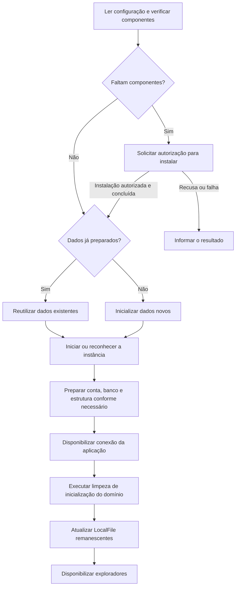

# Instalação e execução: ambiente planejado

[Índice](README.md) · [Banco de dados](banco-de-dados.md) · [Pendências de ambiente](decisoes-e-pendencias.md#p-11)

O Tag-File usará uma instância MySQL local, administrada pela aplicação por scripts. Esta página explica o papel de cada parte e o fluxo a construir. Os scripts ainda não existem; versões, comandos definitivos e recuperação de preparação incompleta permanecem em P-11.

## Entenda as peças antes de preparar o ambiente

| Peça | Papel |
|---|---|
| JDK | Ferramentas e ambiente Java usados para desenvolver e executar a aplicação. A referência do projeto é o JDK 24. |
| JDBC | API Java de acesso a banco, com tipos como Connection, PreparedStatement, ResultSet, DriverManager e SQLException. |
| MySQL Connector/J | Driver que permite à aplicação conversar com MySQL pela API JDBC. |
| Servidor mysqld | Processo que mantém o banco disponível para conexões. |
| Cliente mysql | Programa de terminal que pode ser usado na preparação/administração do banco. |
| DatabaseManager | Coordena a preparação e o ciclo da instância local do Tag-File. |
| DatabaseConnection | Centraliza a conexão JDBC compartilhada pelos DAOs. |

O driver Java não contém o servidor. Um DAO não precisa iniciar o cliente mysql de terminal para cada consulta: ele usa JDBC e o driver para comunicar-se com o servidor.

<a id="amb-01"></a>

## Plataformas e instalação autorizada

| Plataforma | Scripts | Autorização prevista |
|---|---|---|
| Windows | PowerShell, arquivos .ps1. | Elevação pelo UAC quando necessária à instalação. |
| Ubuntu e Linux Mint | Bash, arquivos .sh. | Mecanismo administrativo a definir; pkexec é uma possibilidade. |

Ao abrir, o aplicativo verifica os componentes necessários de cliente e servidor MySQL. Se faltarem, solicita autorização para instalar. ProcessBuilder é o recurso definido para iniciar scripts/processos externos pelo Java.

Recusa ou cancelamento não representa instalação concluída. A elevação para instalar não exige manter a UI permanentemente como administrador. A preparação deve respeitar as outras instalações MySQL da máquina.

Detecção de executáveis/instâncias, download, pacotes, versão e distribuição de binários ainda não foram escolhidos. Procurar no PATH é uma possibilidade, não uma estratégia completa já definida.

<a id="amb-02"></a>

## Organização dos arquivos operacionais

A pasta database fica **dentro da raiz do projeto**. O local de referência dos dados é database/runtime/data. A árvore abaixo apresenta a organização e os nomes de referência a construir:

```text
database/
├── config/
│   ├── database.properties.example
│   ├── database.properties
│   ├── mysql-windows.ini.template
│   └── mysql-linux.cnf.template
├── scripts/
│   ├── windows/
│   │   ├── check.ps1
│   │   ├── install.ps1
│   │   ├── initialize.ps1
│   │   ├── start.ps1
│   │   └── stop.ps1
│   └── linux/
│       ├── check.sh
│       ├── install.sh
│       ├── initialize.sh
│       ├── start.sh
│       └── stop.sh
├── schema/
│   └── scripts SQL de criação e alteração
└── runtime/
    ├── data/
    ├── logs/
    └── run/
```

| Grupo | Responsabilidade |
|---|---|
| Configurações e templates | Informar diretórios, parâmetros da instância e conexão. |
| check | Verificar os componentes necessários. |
| install | Instalar componentes ausentes depois da autorização. |
| initialize | Preparar pela primeira vez um diretório de dados ainda não inicializado. |
| start | Iniciar ou reconhecer a instância administrada. |
| stop | Encerrar a instância identificada como pertencente ao Tag-File. |
| schema | Criar e alterar tabelas. Nomes finais dos scripts e estratégia de reaplicação estão abertos. |
| runtime | Manter dados, logs e informações de execução. |

Os dados são preparados no local previsto e reutilizados nas próximas execuções; não há transferência obrigatória de uma inicialização feita em outra pasta. A política detalhada de versionamento ainda será combinada; dados pessoais, logs reais e credenciais pessoais não se tornam arquivos a compartilhar apenas por aparecerem nessa organização.

<a id="amb-03"></a>

## Parâmetros públicos da instância didática

| Parâmetro | Valor de referência |
|---|---|
| Endereço | 127.0.0.1 |
| Porta | 3333 |
| Banco | tag_file |
| Usuário dos DAOs | root |
| Senha didática pública | TagFile123! |
| Reconexão solicitada | autoReconnect=true |
| Dados | database/runtime/data |

Exemplo da configuração a construir:

```properties
db.url=jdbc:mysql://127.0.0.1:3333/tag_file?autoReconnect=true
db.user=root
db.password=TagFile123!
```

Esses valores pertencem à instância local exclusiva do projeto. A senha é a da conta do servidor usada pelo cliente; não há senhas independentes para manter iguais. A configuração administrativa é uma limitação didática e não deve redefinir root de outras instalações.

Se a porta estiver ocupada, será necessário informar a situação; não há troca automática de porta definida.

<a id="amb-04"></a>

## Primeira preparação e próximas aberturas



O diagrama apresenta o fluxo funcional. Na primeira preparação, cria-se a estrutura inicial; nas seguintes, reutilizam-se os dados e tratam-se as alterações necessárias de schema. Comandos, esperas, identificação da instância e recuperação de etapas incompletas continuam em P-11.

**Inicializar os dados** e **iniciar o servidor** são operações diferentes. Uma falha de conexão não autoriza apagar o diretório, reinicializar o banco ou iniciar outro servidor com o mesmo conjunto de dados.

A limpeza de domínio remove apenas cadastros com única Tag Etiqueta Ausente e cadastros sem associações, conforme [CIC-02](requisitos-e-regras.md#cic-02). Preserva arquivos físicos e a Tag protegida. Preparar o schema não recria automaticamente predefinidas apagadas pelo usuário.

<a id="amb-05"></a>

## Conexão compartilhada e reconexão

Os DAOs guardam referência à mesma instância de DatabaseConnection. Ela controla a abertura, tratamento e fechamento da conexão; não há pool. O DAO não deve fechar a conexão compartilhada ao terminar cada chamada. getConnection e close são nomes de referência, sem contrato completo de implementação.

A configuração mantém autoReconnect=true. Essa opção não garante concluir uma operação interrompida, repetir escritas, desfazer alterações ou evitar exceções. A documentação do driver descreve limites e efeitos sobre estado de sessão e consistência. [Referência de autoReconnect](https://dev.mysql.com/doc/connector-j/en/connector-j-connp-props-high-availability-and-clustering.html).

Reconectar durante a sessão não executa novamente a limpeza de Etiqueta Ausente. A validade da conexão e a coordenação de operações simultâneas ainda precisam ser combinadas; Loading apenas bloqueia novas interações conflitantes.

<a id="amb-06"></a>

## JDK, JDBC e inclusão do driver

O ambiente de referência é **JDK 24**, sem Maven. JDBC faz parte da API Java; o driver MySQL Connector/J será incluído manualmente como JAR no desenvolvimento. A versão final de servidor e driver ainda precisa ser escolhida em P-11.

```text
lib/
└── mysql-connector-j-<versão>.jar
```

Colocar o JAR em lib e incluí-lo como biblioteca/classpath são tarefas diferentes. O classpath informa ao Java onde encontrar as classes da dependência. A equipe precisará configurar essa inclusão ao implementar a aplicação.

A estrutura permanece sem Gradle, Spring, Hibernate ou outro gerenciador/ORM adicional. Ao escolher as versões, será preciso conferir a compatibilidade do JDK, servidor e driver; esta página não fixa uma versão por exemplo.

<a id="amb-07"></a>

## Encerramento e preservação

DatabaseManager coordena a parada da instância administrada e DatabaseConnection o fechamento da conexão compartilhada. A ordem detalhada, identificação de um processo já iniciado e tratamento de encerramento forçado ainda estão em P-11.

O aplicativo deve reconhecer sua instância, sem parar qualquer mysqld encontrado no computador. Dados existentes permanecem preservados; falha operacional não autoriza uma limpeza destrutiva.

Ao implementar o ambiente, use [UC-01](casos-de-uso.md#uc-01), [ACE-23](criterios-de-aceite.md#ace-23) e [ACE-24](criterios-de-aceite.md#ace-24) para conferir parâmetros, reutilização e tratamento da autorização.
