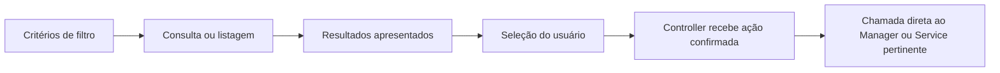

# Interface e fluxos

[Índice](README.md) · [Rastreabilidade](rastreabilidade.md) · [Decisões e pendências](decisoes-e-pendencias.md)

[EXP-01](interface-e-fluxos.md#exp-01) a [EXP-05](interface-e-fluxos.md#exp-05) e [UI-01](interface-e-fluxos.md#ui-01) a [UI-03](interface-e-fluxos.md#ui-03) descrevem o que a interface deverá mostrar e como encaminhará ações. Os componentes e diagramas são planejamento. Os fluxos completos estão em [casos de uso](casos-de-uso.md); regras de operações, sincronização e falhas permanecem no documento principal de [requisitos](requisitos-e-regras.md).

<a id="exp-01"></a>

## EXP-01 — Duas visões interoperáveis

**Estado: confirmada.**

Nomes de interface aprovados:

```text
Arquivos por Etiqueta / Arquivos por Tag
Arquivos Local
```

Preserve a expressão `Arquivos Local`; não a renomeie silenciosamente por preferência gramatical.

- A visão por Tag mostra arquivos classificados nas Tags selecionadas, sem colocar a hierarquia física como foco principal.
- A visão local mostra o sistema de arquivos real e pode exibir arquivos desconhecidos pelo banco. Se houver registro, suas etiquetas aparecem.

Os exploradores ficam em abas; `JTabbedPane` foi discutido e adotado como organização das abas. O solicitante também pediu poder exibi-los lado a lado. Essa intenção não foi retirada, mas o mecanismo visual não foi especificado.

Foram aprovados os nomes de classes `TagExplorerPanel` e `LocalFileExplorerPanel`. A conversa posterior usou Screens sem formalizar completamente se os Panels seriam as telas ou seus componentes. Preserve [P-04](decisoes-e-pendencias.md#p-04).

<a id="exp-02"></a>

## EXP-02 — Filtros por tipo de informação

**Estado: confirmada.**

```text
Filter (classe abstrata)
├── NativeFileFilter
├── LocalFileFilter
└── TagFilter
```

`NativeFileFilter` atua sobre os arquivos físicos obtidos pelo serviço nativo. `LocalFileFilter` atua sobre registros persistidos. `TagFilter` precisa manter coerência com as consultas que retornam Tags.

Extensões, tamanho e datas foram aprovados como critérios relevantes de consulta. Campos exatos, tipos de intervalos e todos os métodos não estão homologados.

Filtros de somente etiquetados/sem etiquetas, busca textual por nome e seleção explícita de disponibilidade surgiram como sugestões. Não os apresente como funcionalidades obrigatórias confirmadas.

<a id="exp-03"></a>

## EXP-03 — Correspondência em lote com Map

**Estado: confirmada.**

Fluxo da visão local:

```text
Listar arquivos físicos da pasta
→ aplicar NativeFileFilter
→ consultar em lote correspondências persistidas
→ obter Map<Path, LocalFile>
→ mostrar todos os NativeFile resultantes, com Tags quando houver LocalFile
```

A consulta de correspondências enriquece a apresentação; não elimina automaticamente os arquivos não registrados.

```text
prova.pdf       [Faculdade] [PDF]
apostila.pdf
foto.png        [Imagens]
```

Evitar uma consulta SQL separada obrigatória por arquivo exibido foi parte da decisão. A assinatura exata do método em lote e a normalização das chaves do Map precisam ser coerentes com os caminhos, mas não foram totalmente definidas.

<a id="exp-04"></a>

## EXP-04 — AND e OR

**Estado: confirmada.**

O usuário escolhe entre:

```text
AND → o arquivo possui todas as Tags selecionadas
OR  → o arquivo possui ao menos uma das Tags selecionadas
```

Não incluir NOT.

O resultado dessa consulta são arquivos. O mesmo registro não deve virar múltiplos `LocalFile` porque correspondeu a várias Tags; a apresentação sem duplicação de identidade decorre do modelo.

Há um encaixe de API pendente: exemplos antigos colocaram critérios de arquivos por Tags em `TagFilter`, mas `TagDAO` implementa `CrudDAO<Tag, TagFilter>`. Não faça `TagDAO.find(...)` retornar arquivos contrariando o tipo aprovado. Registre [P-05](decisoes-e-pendencias.md#p-05) e diferencie retorno de Tags de retorno de `LocalFile`.

O caso de nenhuma Tag selecionada não foi definido.

<a id="exp-05"></a>

## EXP-05 — Ordenação e desempate

**Estado: parcialmente definido / futuro.**

Tamanho e datas devem permitir filtragem. O tamanho como critério de desempate foi mencionado como possibilidade futura.

Não foram escolhidos ordenação padrão, precedência de critérios, direção, implementação de `Comparable` ou `Comparator`. Não complete esses pontos arbitrariamente.

<a id="ui-01"></a>

## UI-01 — Screens conectam componentes aos Controllers

**Estado: confirmada na divisão de responsabilidades.**

```text
Componente Swing
→ evento ligado pela Screen
→ método do Controller
→ coordenação da operação
```

A Screen registra listeners dos componentes; o Controller não deve registrar diretamente listeners conhecendo botões, campos e painéis internos. A Screen também não implementa SQL ou manipulação física.

`TagBadge`, `TagButton`, `FileItemPanel` e classes de diálogos específicos foram exemplos de composição visual. Não são uma lista de novas classes obrigatórias.

<a id="ui-02"></a>

## UI-02 — Etiquetas visíveis e Drag and Drop

**Estado: confirmada.**

As etiquetas de um arquivo devem aparecer junto dele. Quando não houver Tags, deixar o espaço em branco, sem exigir marcador artificial de “sem etiquetas”. Isso não elimina a apresentação normal de `Etiqueta Ausente` quando ela estiver realmente associada.

O Drop acontece sobre a representação da Tag. As origens aprovadas são o explorador de arquivos do sistema e o explorador interno.

Arrastar uma Tag sobre um arquivo apareceu em uma explicação, mas não foi aprovado como nova interação. Não invente esse fluxo.

O componente visual exato do alvo do Drop ficou para a UI.

<a id="ui-03"></a>

## UI-03 — Loading durante consultas/operações

**Estado: confirmada na interação.**

Apresentar um pop-up “Loading...” durante a operação, bloqueando novas interações conflitantes até o término. O comportamento atende aos dois exploradores e não exige pool ou botão por aba.

A implementação modal com `SwingWorker` foi explicada como alternativa para manter a interface responsiva. O uso de `SwingWorker` em si não foi confirmado como classe obrigatória. A documentação pode explicá-lo como possibilidade, sem criar uma dependência nova ou alegar que já existe.

O bloqueio de cliques não resolve sozinho tarefas automáticas já iniciadas. O mecanismo para impedir reentrância e operações de banco simultâneas ainda não foi definido; registre esse limite de planejamento em [P-12](decisoes-e-pendencias.md#p-12), sem depender de código para reconhecê-lo.


<a id="fluxo-refresh"></a>

## Refresh e integração das apresentações

A regra principal é [SYN-01](requisitos-e-regras.md#syn-01) a [SYN-03](requisitos-e-regras.md#syn-03). Um único botão atende aos exploradores; troca de aba e aplicação de filtros também atualizam todos os registros. O [percurso de Refresh](arquitetura-e-padroes.md#percurso-refresh) explica a colaboração completa e as falhas. A notificação do Observer atualiza a apresentação, sem uma nova solicitação global por Screen.

A Screen deverá mostrar as etiquetas ao lado do arquivo. Na visão local, a consulta em lote acrescenta as informações do LocalFile sem ocultar NativeFile sem correspondência. Ler uma pasta é parte da navegação normal, sem cadastro automático ou sincronização global a cada pasta.

## Diálogos que a equipe deverá diferenciar

| Situação | Informação e alternativas aprovadas | Regra / limite |
|---|---|---|
| Nome repetido de Tag | Pedir confirmação e permitir outra identidade. | [TAG-01](requisitos-e-regras.md#tag-01); comparação/validação em [P-09](decisoes-e-pendencias.md#p-09). |
| Associação incompatível | Informar extensão e Tag; criar Tag, adicionar extensão à atual ou cancelar. | [EXT-02](requisitos-e-regras.md#ext-02); também vale no Drop. |
| Restrição alterada | Listar os arquivos que perderiam compatibilidade e pedir confirmação. | [EXT-03](requisitos-e-regras.md#ext-03); considerar o conjunto final. |
| Novo LocalFile | Oferecer predefinida compatível e supressão por sessão. | [TAG-04](requisitos-e-regras.md#tag-04); [P-03](decisoes-e-pendencias.md#p-03) mantém o efeito futuro aberto. |
| Arquivo indisponível | Localizar, remover do Tag-File ou cancelar. | [OP-02](requisitos-e-regras.md#op-02); [P-02](decisoes-e-pendencias.md#p-02)/[P-08](decisoes-e-pendencias.md#p-08) para remoção e colisão. |
| Cópia | Perguntar sobre herdar Tags. | [OP-04](requisitos-e-regras.md#op-04); identidade em [P-01](decisoes-e-pendencias.md#p-01). |
| Renomear com incompatibilidade | Retirar Tags incompatíveis, permitir nova extensão nelas ou cancelar. | [OP-05](requisitos-e-regras.md#op-05); não é conversão de conteúdo. |
| Conflito de nome/caminho | Substituir, manter os dois ou cancelar, conforme aplicável. | [OP-06](requisitos-e-regras.md#op-06); matriz por operação/nomenclatura em [P-08](decisoes-e-pendencias.md#p-08). |
| Exclusão | Distinguir somente Tag, todas as etiquetas dos arquivos atingidos e exclusão física permanente. Listar outras Tags afetadas antes de remover registros/arquivos. | [DEL-01](requisitos-e-regras.md#del-01) a [DEL-04](requisitos-e-regras.md#del-04); modalidade 2 ainda em [P-02](decisoes-e-pendencias.md#p-02). |
| Predefinidas | Reforçar confirmação para as comuns; proteger Etiqueta Ausente inclusive vazia. | [TAG-02](requisitos-e-regras.md#tag-02)/[TAG-03](requisitos-e-regras.md#tag-03); identificação técnica em [P-07](decisoes-e-pendencias.md#p-07). |
| Falha parcial | Mensagem compreensível, concluído, falha e detalhes expansíveis. | [ERR-01](requisitos-e-regras.md#err-01); encerrar Loading sem declarar sucesso integral. |
| Instalação necessária | Solicitar autorização; cancelamento não representa sucesso. | [AMB-01](instalacao-e-execucao.md#amb-01); UAC no Windows e mecanismo Linux não fechado. |

A tabela resume regras existentes, sem acrescentar layouts, botões ou tratamento de lotes. Seleção múltipla geral, prevenção de reentrância, clipboard após colagem e arranjo lado a lado continuam em [P-12](decisoes-e-pendencias.md#p-12). Consulta sem Tags, estados vazios e ordenação continuam em [P-13](decisoes-e-pendencias.md#p-13).

## Filtro, seleção e operação na interface



**Modelo de colaboração aprovado, sem API adicional.** A ação usa a seleção confirmada, sem repetir o filtro para afetar outros elementos. Telas não implementam SQL ou movimentação; Controllers não registram listeners dos botões diretamente. A formalização das Screens como Observer e suas relações com Panels continua em [P-04](decisoes-e-pendencias.md#p-04)/[P-05](decisoes-e-pendencias.md#p-05).
