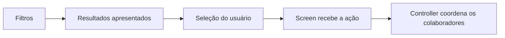

# Interface e fluxos

[Índice](README.md) · [Observer na interface](arquitetura-e-padroes.md#arq-06) · [Casos de uso](casos-de-uso.md)

A UI permite navegar, classificar e operar sobre arquivos. Esta página começa pelo que o usuário vê e depois relaciona essas interações às responsabilidades das classes.

<a id="exp-01"></a>

## As duas visões

| Nome da visão | O que o usuário faz | Origem dos dados |
|---|---|---|
| **Arquivos Local** | Navega pelas pastas reais e seleciona arquivos. | Sistema de arquivos, enriquecido com as classificações que existem no banco. |
| **Arquivos por Etiqueta / Arquivos por Tag** | Escolhe etiquetas e encontra arquivos classificados. | Cadastros e associações persistidos. |

Os nomes acima fazem parte do projeto, incluindo Arquivos Local. As visões ficam em abas com JTabbedPane. Também está prevista a possibilidade de exibi-las lado a lado; o arranjo concreto permanece em [P-12](decisoes-e-pendencias.md#p-12).

Os nomes TagExplorerPanel e LocalFileExplorerPanel estão definidos. Screen é o papel de montar a apresentação e encaminhar eventos. Ainda é preciso decidir se cada Panel exerce esse papel ou compõe outra classe visual; essa relação está em [P-04](decisoes-e-pendencias.md#p-04). Não é necessário deduzir duas camadas de UI apenas pela existência dos dois termos.

<a id="ui-02"></a>

## Um arquivo com suas etiquetas

Exemplo de conteúdo da visão local, sem definir um layout final:

```text
Pasta: Documentos

prova.pdf       [Faculdade] [PDF]
apostila.pdf
foto.png        [Imagens]
```

As etiquetas aparecem junto do arquivo. Se não houver etiquetas, a região fica em branco. Etiqueta Ausente aparece normalmente quando estiver realmente associada ao cadastro.

Para associar por Drag and Drop, o usuário **solta um arquivo sobre a representação de uma Tag**. O arquivo pode vir do explorador do sistema operacional ou do explorador interno do Tag-File. O componente que receberá o Drop ainda será escolhido; arrastar uma Tag sobre um arquivo não é uma interação definida.

JFileChooser e FileNameExtensionFilter são os componentes previstos para seleção por diálogo. O filtro visual ajuda a selecionar, mas a regra de compatibilidade também precisa funcionar quando a entrada vier por Drop.

<a id="exp-04"></a>

## Encontrar arquivos com AND e OR

Considere estes cadastros:

```text
prova.pdf      → Faculdade, Importante
trabalho.docx  → Faculdade
conta.pdf      → Importante
```

| Seleção | Modo | Resultado |
|---|---|---|
| Faculdade e Importante | AND: todas as Tags | prova.pdf |
| Faculdade e Importante | OR: pelo menos uma Tag | prova.pdf, trabalho.docx, conta.pdf |

O mesmo cadastro aparece uma vez no resultado, mesmo correspondendo a várias Tags. NOT está fora do escopo. O resultado quando nenhuma Tag está selecionada permanece em [P-13](decisoes-e-pendencias.md#p-13).

Essa pesquisa retorna arquivos. Já uma consulta de TagDAO retorna Tags, conforme seu contrato CrudDAO<Tag, TagFilter>. O encaixe final dos critérios e do método de pesquisa de arquivos por Tags está em [P-05](decisoes-e-pendencias.md#p-05).

<a id="exp-02"></a>

## O papel dos filtros

Um filtro representa os critérios que restringem uma consulta ou listagem. Ele não é a seleção de arquivos sobre a qual o usuário confirmou uma operação.

```text
Filter (classe abstrata)
├── NativeFileFilter
├── LocalFileFilter
└── TagFilter
```

| Tipo | Informação filtrada |
|---|---|
| NativeFileFilter | Arquivos físicos obtidos pelo serviço nativo. |
| LocalFileFilter | Cadastros persistidos de arquivos. |
| TagFilter | Etiquetas, mantendo o retorno de Tags nas consultas correspondentes. |

Extensões, tamanho e datas estão previstos como critérios relevantes. Campos exatos, intervalos e métodos ainda não estão todos definidos. Busca textual por nome, somente etiquetados/sem etiquetas e seleção de disponibilidade permanecem sugestões, não requisitos adicionais.

<a id="exp-03"></a>

## Como a visão local reúne disco e banco

```text
Listar arquivos físicos da pasta
→ aplicar NativeFileFilter
→ consultar correspondências no banco em lote
→ obter Map<Path, LocalFile>
→ mostrar os arquivos resultantes com suas Tags, quando houver cadastro
```

Map é uma estrutura que relaciona uma chave a um valor. Aqui, a chave é o caminho e o valor é o LocalFile correspondente. A apresentação procura nesse mapa o cadastro de cada arquivo listado. Se não houver correspondência, o arquivo continua aparecendo.

A consulta em lote evita exigir uma consulta SQL separada para cada arquivo. Sua assinatura e a normalização das chaves Path ainda precisam ser combinadas com a política de caminhos, em P-05/P-08. Listar a pasta e consultar correspondências não cria cadastros automaticamente nem equivale ao Refresh global.

<a id="exp-05"></a>

## Ordenação

Tamanho e datas permitem filtragem. A ordenação padrão, a direção, a precedência de critérios e o uso de Comparable/Comparator ainda não foram escolhidos. Tamanho como desempate permanece uma possibilidade futura. Veja [P-13](decisoes-e-pendencias.md#p-13).

<a id="ui-01"></a>

## Da interação ao Controller



A Screen registra os listeners dos seus componentes e encaminha a solicitação ao Controller. O Controller recebe os dados da ação, sem precisar registrar listeners diretamente nos botões da Screen. SQL fica nos DAOs; manipulação física fica no serviço nativo.

A operação usa a seleção confirmada. Repetir um filtro não pode trocar os arquivos afetados depois dessa confirmação. Seleção múltipla está definida no fluxo de associação inicial; seu comportamento geral em outras operações continua em [P-12](decisoes-e-pendencias.md#p-12).

TagBadge, TagButton, FileItemPanel e classes específicas de diálogo são exemplos possíveis de componentes; não constituem uma lista obrigatória de classes. O [exemplo de Observer](arquitetura-e-padroes.md#arq-06) mostra como ligar a ação enviada pela Screen ao aviso recebido depois da alteração.

<a id="ui-03"></a>

## Durante uma operação: Loading e erros

Apresentar um pop-up Loading durante consultas/operações, bloqueando novas interações conflitantes até o término. Ao concluir ou falhar, encerrar esse estado e apresentar o resultado correspondente.

SwingWorker é uma alternativa para manter a UI responsiva; a seção de Observer explica EDT e trabalho em segundo plano. A escolha de implementação e a prevenção de tarefas simultâneas/reentrância continuam em P-12. Bloquear cliques não resolve sozinho operações automáticas que já começaram.

Em falha parcial, a mensagem precisa separar o que foi concluído do que falhou, com detalhes técnicos expansíveis. Por exemplo: o arquivo foi movido, mas o novo caminho não foi salvo no banco. As regras estão em [ERR-01](requisitos-e-regras.md#err-01).

<a id="fluxo-refresh"></a>

## Refresh compartilhado

Há um único botão Refresh para os exploradores. Trocar de aba e aplicar filtros também atualizam todos os LocalFile. Navegar por pastas realiza as leituras necessárias à listagem, sem disparar uma sincronização global em cada pasta.

Depois da atualização, o Controller publica o aviso pertinente. Os observadores atualizam a apresentação; não chamam outro Refresh global. A limpeza de cadastros sem classificação só ocorre na inicialização. Veja [gatilhos e alcance](requisitos-e-regras.md#syn-01).

## Diálogos e consequências

| Situação | Informação e alternativas | Referência |
|---|---|---|
| Nome repetido de Tag | Pedir confirmação; se confirmado, criar outra Tag com outro UUID. | [TAG-01](requisitos-e-regras.md#tag-01) |
| Associação incompatível | Informar Tag e extensão; criar Tag, ampliar a atual ou cancelar. | [EXT-02](requisitos-e-regras.md#ext-02) |
| Edição de restrições | Listar arquivos que perderiam compatibilidade e pedir confirmação. | [EXT-03](requisitos-e-regras.md#ext-03) |
| Novo LocalFile | Oferecer predefinida compatível; opção de silenciar na sessão. O efeito automático futuro está aberto. | [TAG-04](requisitos-e-regras.md#tag-04), P-03 |
| Arquivo indisponível | Localizar, remover do Tag-File ou cancelar. | [OP-02](requisitos-e-regras.md#op-02), P-02/P-08 |
| Cópia | Perguntar se deve herdar Tags. | [OP-04](requisitos-e-regras.md#op-04), P-01 |
| Renomear com nova extensão incompatível | Retirar Tags incompatíveis, permitir a nova extensão nelas ou cancelar. | [OP-05](requisitos-e-regras.md#op-05) |
| Conflito de nome/caminho | Substituir, manter os dois ou cancelar, conforme a operação. | [OP-06](requisitos-e-regras.md#op-06), P-08 |
| Exclusão | Diferenciar exclusão da Tag, retirada de classificações dos arquivos atingidos e exclusão física permanente; listar outras Tags afetadas na confirmação adicional. | [DEL-01 a DEL-04](requisitos-e-regras.md#del-01), P-02 |
| Exclusão de predefinida | Confirmação reforçada para as comuns; Etiqueta Ausente permanece protegida, inclusive vazia. | [TAG-02](requisitos-e-regras.md#tag-02) |
| Instalação necessária | Solicitar autorização; recusa e cancelamento não são sucesso. | [AMB-01](instalacao-e-execucao.md#amb-01) |

Os textos de botões podem ser trabalhados pela equipe, preservando os efeitos definidos. Estados vazios, ordenação e consulta sem Tag selecionada continuam em P-13; o layout lado a lado e detalhes de lotes continuam em P-12.
