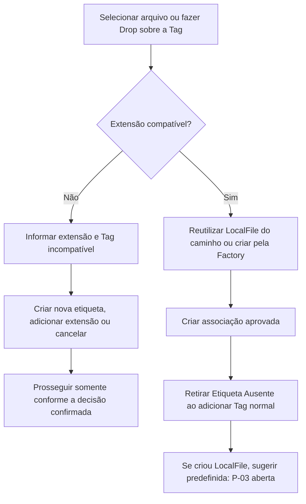
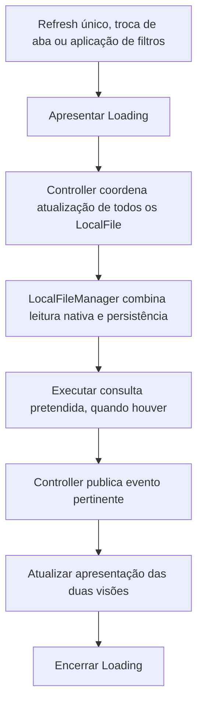

# Interface e fluxos do Tag-File

[Índice da documentação](../README.md) · [Regras funcionais](requisitos-e-regras.md) · [Casos de uso](casos-de-uso.md) · [Arquitetura](arquitetura-e-padroes.md)

Este é o documento principal de `EXP-01` a `EXP-05` e `UI-01` a `UI-03`. A interface descrita é planejada pela especificação consolidada. A inspeção encontrou [src/Main.java](../src/Main.java) como exemplo inicial de console, sem telas Swing, exploradores ou diálogos implementados. Os exemplos e diagramas abaixo não são capturas de aplicação existente nem fluxos testados.

As regras de Tags, arquivos, sincronização e erros permanecem em [requisitos e regras](requisitos-e-regras.md). Esta página explica sua apresentação e faz referência à norma principal.

<a id="exp-01"></a>

## EXP-01 — Duas visões interoperáveis

**Estado: confirmada; composição concreta e arranjo lado a lado parcialmente abertos.**

| Visão | Conteúdo e finalidade |
|---|---|
| `Arquivos por Etiqueta` / `Arquivos por Tag` | Arquivos classificados nas Tags selecionadas, sem a hierarquia física como foco principal. |
| `Arquivos Local` | Sistema de arquivos real; pode mostrar arquivos sem cadastro no banco. Se houver registro, suas Tags aparecem junto do arquivo. |

`Arquivos Local` é o nome aprovado, preservado mesmo com sua forma gramatical particular. Um `NativeFile` visível não precisa possuir `LocalFile` ([DOM-01](modelo-de-dominio.md#dom-01)).

Os exploradores ficam em abas, com `JTabbedPane` adotado para essa organização. O pedido de poder exibi-los lado a lado permanece válido, mas o mecanismo visual não foi definido ([P-12](decisoes-e-pendencias.md#p-12)). Não existe um arranjo pronto comprovado no repositório.

`TagExplorerPanel` e `LocalFileExplorerPanel` são nomes de classes aprovados. O uso posterior de Screens não formalizou se os Panels seriam as próprias telas ou componentes delas ([P-04](decisoes-e-pendencias.md#p-04)). Não se exige renomeá-los nem criar duas estruturas redundantes.

A interoperabilidade inclui recortar `prova.pdf` pela Tag `Faculdade`, navegar em `Arquivos Local` até `~/Documentos/Faculdade` e colar. O clipboard interno compartilhado permite essa passagem entre visões; após movimentação bem-sucedida, UUID e Tags permanecem ([UC-09](casos-de-uso.md#uc-09)).

<a id="exp-02"></a>

## EXP-02 — Filtros por tipo de informação

**Estado: confirmada na separação e nos critérios gerais.**

```text
Filter (classe abstrata)
├── NativeFileFilter
├── LocalFileFilter
└── TagFilter
```

| Filtro | Informação consultada |
|---|---|
| `NativeFileFilter` | Arquivos físicos obtidos pelo serviço nativo. |
| `LocalFileFilter` | Registros persistidos. |
| `TagFilter` | Critérios coerentes com consultas que retornam Tags. |

Extensões, tamanho e datas foram aprovados como critérios relevantes. Campos exatos, tipos de intervalos e todos os métodos não foram homologados. Filtrar antes de uma operação não elimina a distinção entre filtro, seleção e Command: a operação usa os elementos escolhidos; não executa novamente o filtro para redefinir a seleção já confirmada ([ARQ-03](arquitetura-e-padroes.md#arq-03)).

**Propostas, sem obrigatoriedade confirmada:** filtros de somente etiquetados/sem etiquetas, busca textual por nome e seleção explícita de disponibilidade. A herança de `Filter` é abstração/polimorfismo e não comprova Strategy por si só.

O encaixe de consultas de arquivos por Tags permanece em [P-05](decisoes-e-pendencias.md#p-05). Antes de aplicar filtros, atualizar todos os registros conforme [SYN-01](requisitos-e-regras.md#syn-01), sem limpeza de inicialização.

<a id="exp-03"></a>

## EXP-03 — Correspondência em lote com Map

**Estado: confirmada.**

Na visão local, o serviço nativo fornece os arquivos físicos. Uma consulta em lote acrescenta o que o banco conhece sobre eles:

```text
Listar arquivos físicos da pasta
→ aplicar NativeFileFilter
→ consultar em lote correspondências persistidas
→ obter Map<Path, LocalFile>
→ mostrar todos os NativeFile resultantes, com Tags quando houver LocalFile
```

O Map associa um caminho ao registro correspondente. Por exemplo, ao consultar o caminho de `prova.pdf`, a apresentação pode encontrar o registro e exibir `Faculdade` e `PDF`. Sem correspondência, o arquivo continua visível:

```text
prova.pdf       [Faculdade] [PDF]
apostila.pdf
foto.png        [Imagens]
```

A consulta enriquece a apresentação; não elimina automaticamente arquivos desconhecidos pelo banco nem cria cadastro para eles. Evitar uma consulta SQL separada obrigatória por arquivo exibido foi parte da decisão.

Assinatura exata do método em lote e normalização das chaves do Map não estão totalmente fechadas. A política precisa ser coerente com os caminhos, cuja equivalência permanece em [P-08](decisoes-e-pendencias.md#p-08). Listar pasta e obter correspondências não se confundem com sincronização global. Ver [UC-02](casos-de-uso.md#uc-02).

<a id="exp-04"></a>

## EXP-04 — AND e OR

**Estado: confirmada na semântica; encaixe de API e consulta vazia pendentes.**

O usuário escolhe o operador:

| Operador | Arquivos que entram no resultado |
|---|---|
| AND | Possuem todas as Tags selecionadas. |
| OR | Possuem ao menos uma das Tags selecionadas. |

NOT está fora do escopo. O resultado é de arquivos. Um registro que corresponde a várias Tags não se transforma em vários `LocalFile`; a ausência de duplicação de identidade decorre do modelo.

**Exemplo didático da semântica:** com `Faculdade` e `PDF` selecionadas, AND exige as duas associações; OR aceita arquivo com qualquer uma ou com ambas. Isso não altera fisicamente as pastas dos arquivos.

Exemplos antigos colocaram critérios de arquivos por Tags em `TagFilter`, porém `TagDAO` implementa `CrudDAO<Tag, TagFilter>`. O retorno de `TagDAO.find(...)` não pode ser transformado em arquivos contrariando esse tipo. O contrato da consulta de arquivos precisa ser resolvido em [P-05](decisoes-e-pendencias.md#p-05), separado da consulta de Tags.

O caso sem nenhuma Tag selecionada permanece em [P-13](decisoes-e-pendencias.md#p-13); este documento não define se retorna todos, nenhum ou outra apresentação. Ver [UC-03](casos-de-uso.md#uc-03).

<a id="exp-05"></a>

## EXP-05 — Ordenação e desempate

**Estado: parcialmente definido / futuro.**

Tamanho e datas devem permitir filtragem. Tamanho como desempate foi mencionado como possibilidade futura.

Ordenação padrão, precedência entre critérios, direção e uso de `Comparable` ou `Comparator` não foram escolhidos. Essas lacunas continuam em [P-13](decisoes-e-pendencias.md#p-13), junto dos estados vazios da UI. Não existe algoritmo homologado a reproduzir na apresentação.

<a id="ui-01"></a>

## UI-01 — Screens conectam componentes aos Controllers

**Estado: confirmada na divisão de responsabilidades.**

```text
Componente Swing
→ evento ligado pela Screen
→ método do Controller
→ coordenação da operação
```

A Screen registra listeners dos componentes; o Controller não registra diretamente listeners conhecendo botões, campos e painéis internos. A Screen não implementa SQL nem manipulação física. A divisão detalhada está em [ARQ-01](arquitetura-e-padroes.md#arq-01).

`TagExplorerController` e `LocalFileExplorerController` coordenam suas solicitações e compartilham os colaboradores pertinentes; não precisam chamar diretamente um ao outro para sincronizar a apresentação. Controllers publicam notificações por `ExplorerEventService`; DAOs e serviço nativo não publicam UI ([ARQ-05](arquitetura-e-padroes.md#arq-05), [ARQ-06](arquitetura-e-padroes.md#arq-06)).

**Proposta final ainda não inteiramente formalizada:** Screens implementarem `ExplorerListener`, com métodos como `onFileChanged()`, para atualizar a apresentação. A relação Screens/Panels e a ligação concreta permanecem em [P-04](decisoes-e-pendencias.md#p-04). Não se impõe simultaneamente Controllers e Screens como Observers obrigatórios.

Assinaturas ilustrativas que recebem só `LocalFile` não cobrem eventos de arquivo nativo sem registro. Receber `NativeFile` foi proposta de ajuste, ainda aberta em [P-05](decisoes-e-pendencias.md#p-05). Não se cria `LocalFile` artificial para notificar.

`TagBadge`, `TagButton`, `FileItemPanel` e diálogos específicos são exemplos de composição visual, não uma lista de classes obrigatórias. `ExplorerEvent` e enum de eventos não serão criados nesta versão; a possível evolução deve ser comentada no código futuro, conforme [ARQ-06](arquitetura-e-padroes.md#arq-06); esta missão apenas documenta essa exigência.

<a id="ui-02"></a>

## UI-02 — Etiquetas visíveis e Drag and Drop

**Estado: confirmada.**

As etiquetas de um arquivo devem aparecer junto dele. Se não houver Tags, a região fica em branco, sem marcador artificial obrigatório de “sem etiquetas”. Se `Etiqueta Ausente` estiver realmente associada, aparece normalmente como uma Tag; deixar espaço vazio não a oculta.

O Drop de arquivos acontece **sobre a representação da Tag**. Origens aprovadas: explorador de arquivos do sistema e explorador interno. Arrastar uma Tag sobre um arquivo apareceu em explicação, mas não foi aprovado como nova interação. O componente visual concreto que recebe Drop ficou para definição da UI.

A seleção inicial adota `JFileChooser` e `FileNameExtensionFilter` ([OP-01](requisitos-e-regras.md#op-01)). O filtro facilita escolher arquivos compatíveis, mas a validação também precisa atuar no Drop: uma extensão incompatível apresenta as alternativas de [EXT-02](requisitos-e-regras.md#ext-02). Ver [UC-04](casos-de-uso.md#uc-04) e [UC-05](casos-de-uso.md#uc-05).

### Fluxo de associação

**Diagrama do comportamento aprovado, sem implementação comprovada.** As alternativas de incompatibilidade são decisões do usuário; não são associação automática. A pendência de supressão aparece na etapa de sugestão.



O ramo de incompatibilidade termina na decisão porque não há detalhe técnico homologado para todas as alternativas e falhas parciais. Ao criar novo registro, a sugestão segue [TAG-04](requisitos-e-regras.md#tag-04); silenciar por sessão continua em [P-03](decisoes-e-pendencias.md#p-03). O caso completo está em [UC-05](casos-de-uso.md#uc-05).

<a id="ui-03"></a>

## UI-03 — Loading durante consultas/operações

**Estado: confirmada na interação; implementação interna aberta.**

Durante a operação, apresentar pop-up **“Loading...”**, bloqueando novas interações conflitantes até terminar. O comportamento atende aos dois exploradores, sem exigir pool ou botão por aba. Loading indica trabalho em andamento; não significa operação já concluída.

Implementação modal com `SwingWorker` foi explicada como alternativa para manter a interface responsiva. Seu uso não foi confirmado como obrigatório e não há evidência de implementação no repositório.

Bloquear cliques não resolve sozinho tarefas automáticas já iniciadas. Prevenir reentrância e operações de banco simultâneas continua em [P-12](decisoes-e-pendencias.md#p-12); fila, trava ou outro mecanismo específico não foi aprovado.

Ao terminar com sucesso ou falha, encerrar Loading. Em caso de erro, a interface apresenta etapas concluídas, etapa que falhou e detalhes expansíveis, conforme [ERR-01](requisitos-e-regras.md#err-01) e [UC-15](casos-de-uso.md#uc-15), sem permanecer bloqueada indefinidamente.

<a id="fluxo-refresh"></a>

## Refresh compartilhado e atualização visual

**Resumo das regras [SYN-01](requisitos-e-regras.md#syn-01) a [SYN-03](requisitos-e-regras.md#syn-03), sem nova norma independente.**

Existe um único botão Refresh. Troca de aba e aplicação de filtros também coordenam atualização de todos os registros. Verificar disponibilidade antes de usar um arquivo é uma verificação pontual. Navegar por pasta permite leitura e consulta do Map, sem Refresh global automático.



**Legenda e limites:** diagrama funcional planejado, não código executado. A ligação concreta dos observadores depende de [P-04](decisoes-e-pendencias.md#p-04), e assinaturas de eventos dependem de [P-05](decisoes-e-pendencias.md#p-05). O fluxo não inclui limpeza: somente a inicialização executa [CIC-02](requisitos-e-regras.md#cic-02). Notificar as duas visões não pode iniciar novo Refresh global nem duplicar a mesma solicitação.

Se alguma etapa falhar, encerrar Loading e apresentar resultado parcial por [UC-15](casos-de-uso.md#uc-15); o diagrama mostra o percurso de sucesso e não afirma que todos os eventos sejam sucesso integral. Consultas auxiliares sem mudança de estado não implicam publicação obrigatória de sucesso. A sequência da inicialização está em [UC-01](casos-de-uso.md#uc-01).

## Diálogos e decisões do usuário

Esta tabela localiza as regras principais; os textos são referências de interação, sem homologar novos layouts, botões ou política em lote.

| Situação | Informação e alternativas | Regra principal / pendência |
|---|---|---|
| Nome de Tag repetido | Pedir confirmação e permitir criar outra Tag com identidade própria. | [TAG-01](requisitos-e-regras.md#tag-01); comparação e validação em [P-09](decisoes-e-pendencias.md#p-09). |
| Associação incompatível | Informar extensão e Tag; criar nova etiqueta, adicionar extensão à atual ou cancelar. | [EXT-02](requisitos-e-regras.md#ext-02). |
| Edição de restrições | Listar arquivos que se tornarão incompatíveis e pedir confirmação antes de retirar associações. | [EXT-03](requisitos-e-regras.md#ext-03); lotes em [P-12](decisoes-e-pendencias.md#p-12). |
| Novo LocalFile | Oferecer predefinida compatível e “Não perguntar novamente nesta sessão”. | [TAG-04](requisitos-e-regras.md#tag-04); efeito nos próximos arquivos em [P-03](decisoes-e-pendencias.md#p-03). |
| Arquivo indisponível | Localizar, remover do Tag-File ou cancelar. | [OP-02](requisitos-e-regras.md#op-02); remoção em [P-02](decisoes-e-pendencias.md#p-02), colisão ao relocalizar em [P-08](decisoes-e-pendencias.md#p-08). |
| Copiar | Perguntar se a cópia recebe Tags do original. | [OP-04](requisitos-e-regras.md#op-04); identidade e cópia sem Tags em [P-01](decisoes-e-pendencias.md#p-01). |
| Renomear com extensão incompatível | Remover Tags incompatíveis, adicionar nova extensão a elas ou cancelar. | [OP-05](requisitos-e-regras.md#op-05). |
| Nome/caminho em conflito | Substituir, manter os dois ou cancelar, conforme aplicável. | [OP-06](requisitos-e-regras.md#op-06); UUID em [P-01](decisoes-e-pendencias.md#p-01), matriz por operação e nomes em [P-08](decisoes-e-pendencias.md#p-08). |
| Exclusão | Distinguir apenas etiqueta, todas as etiquetas dos arquivos atingidos e arquivos físicos permanentes; listar outras Tags afetadas e pedir confirmação adicional. | [DEL-01](requisitos-e-regras.md#del-01) a [DEL-04](requisitos-e-regras.md#del-04); modalidade 2 em [P-02](decisoes-e-pendencias.md#p-02). |
| Exclusão de predefinida | Reforçar confirmação das comuns; impedir exclusão de `Etiqueta Ausente`, mesmo vazia. | [TAG-02](requisitos-e-regras.md#tag-02), [TAG-03](requisitos-e-regras.md#tag-03); identidade técnica em [P-07](decisoes-e-pendencias.md#p-07). |
| Operação em andamento | Loading bloqueia novas interações conflitantes até terminar. | [UI-03](#ui-03); reentrância em [P-12](decisoes-e-pendencias.md#p-12). |
| Falha parcial | Mensagem compreensível, concluído, falha e detalhes técnicos expansíveis. | [ERR-01](requisitos-e-regras.md#err-01). |
| Componentes MySQL ausentes | Solicitar autorização de instalação; cancelamento não equivale a sucesso. UAC solicitado no Windows; mecanismo Linux não fechado. | [AMB-01](instalacao-e-execucao.md#amb-01); comandos e recuperação em [P-11](decisoes-e-pendencias.md#p-11). |

Cancelar uma ação pendente não é Undo/Redo. Não há garantia de reversão entre banco e disco ou repetição por reconexão. Estados sem resultados, comportamento sem Tags selecionadas e ordenação continuam em [P-13](decisoes-e-pendencias.md#p-13), sem telas ou mensagens inventadas.

## Conferência documental dos diagramas

Os diagramas foram revisados como texto: preservam Drop sobre Tag, UUID por reutilização de registro, sugestão com P-03 aberta, Refresh único e ausência de retorno do evento ao Refresh. O ramo de falha está explicado no texto. Não foi instalada ferramenta de renderização nem executada a aplicação para validar aparência, responsividade ou fluxo Swing.
