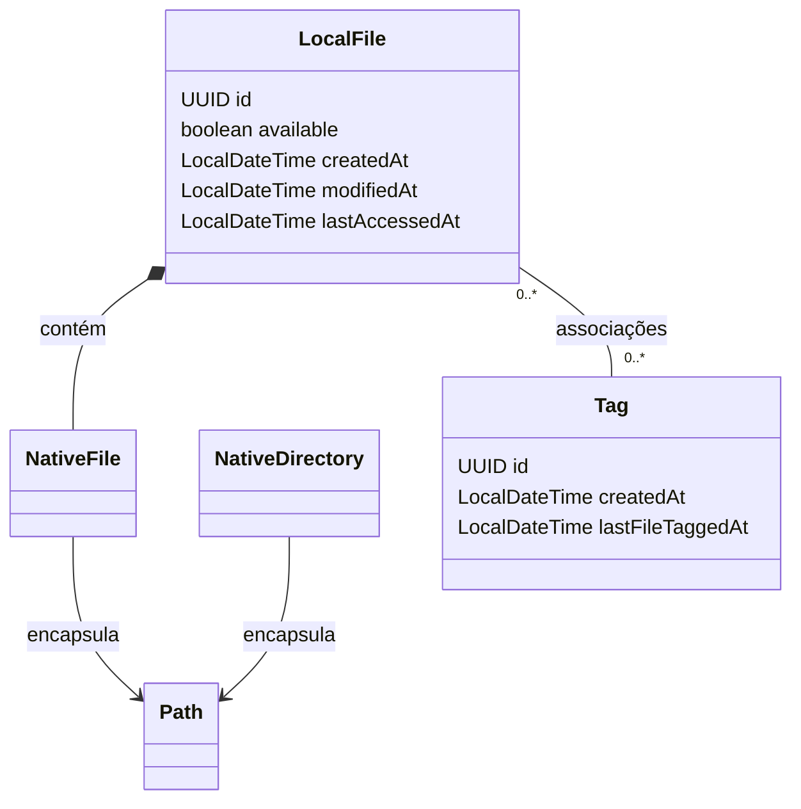
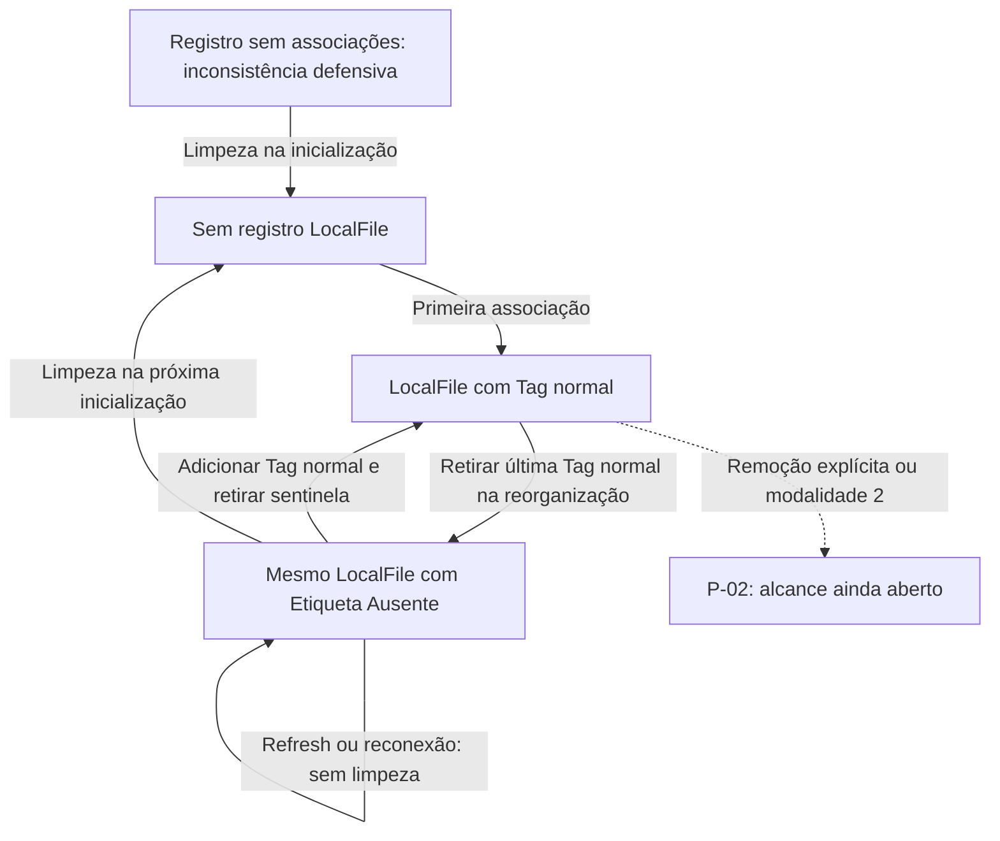

# Modelo de domínio

[Índice](README.md) · [Rastreabilidade](rastreabilidade.md) · [Decisões e pendências](decisoes-e-pendencias.md)

[DOM-01](modelo-de-dominio.md#dom-01) a [DOM-04](modelo-de-dominio.md#dom-04) descrevem as representações a construir. Um objeto é a representação em memória; uma linha SQL é a representação persistida; o arquivo físico é o conteúdo no disco. Os diagramas mostram o modelo aprovado e suas consequências, sem fechar atributos ou contratos pendentes.

<a id="dom-01"></a>

## DOM-01 — Representações do domínio

**Estado: confirmada.**

| Conceito | Significado |
|---|---|
| `NativeFile` | Representa um arquivo físico da máquina e encapsula um `Path`. |
| `NativeDirectory` | Representa um diretório físico e encapsula um `Path`. |
| `LocalFile` | Representa o registro do que o Tag-File conhece e persiste sobre um arquivo, incluindo identidade, metadados e Tags. Contém um `NativeFile`. |
| `Tag` | Etiqueta com identidade, nome, cor e possíveis extensões permitidas. |
| Associação | Vínculo entre um `LocalFile` e uma `Tag`, persistido na join-table. |
| Caminho | Localização alterável, não identidade permanente do registro. |
| Disponibilidade | Estado conhecido do arquivo no caminho registrado. |
| Filtro | Critérios de uma consulta ou listagem. |
| Seleção | Elementos escolhidos pelo usuário para uma ação. |
| Operação | Ação sobre elementos selecionados, coordenada pelo Controller e realizada pelos Managers/Services e DAOs pertinentes. |
| Refresh | Sincronização controlada de disponibilidade e metadados; não é a limpeza de falta de Tags. |

Um arquivo pode ser mostrado como `NativeFile` sem qualquer `LocalFile`. Um `LocalFile` pode permanecer cadastrado mesmo com o arquivo indisponível.

**Consequência derivada:** a representação nativa de um caminho não pode exigir que o arquivo continue existindo durante toda a vida do objeto. Arquivos indisponíveis precisam poder ser representados e relocalizados.

<a id="dom-02"></a>

## DOM-02 — Identidade versus localização

**Estado: confirmada.**

`LocalFile` e `Tag` utilizam UUID. O caminho de `LocalFile` é alterável e deve ser único no SQL, mas não é sua chave primária. A join-table utiliza os IDs.

```text
Identidade de LocalFile: UUID
Localização: NativeFile → Path
Persistência da localização: coluna de caminho
Restrição: um registro por caminho cadastrado
```

Arquivos com mesmo nome em caminhos diferentes podem ser registros distintos. Tamanho, nome, extensão e datas não substituem o UUID e não foi aprovada deduplicação por conteúdo.

A política de normalização dos caminhos, diferenças de maiúsculas entre plataformas, links simbólicos e caminhos equivalentes permanece em [P-08](decisoes-e-pendencias.md#p-08).

<a id="dom-03"></a>

## DOM-03 — LocalFile e metadados

| Informação | Definição recuperada | Estado da representação |
|---|---|---|
| Identidade | `UUID id` | Confirmada |
| Referência nativa | `NativeFile nativeFile` | Confirmada |
| Nome | Nome do arquivo | Informação confirmada; obtenção por Native foi proposta |
| Extensão | Extensão real do arquivo | Conceito confirmado; classe/enum separada não exigida |
| Tamanho | Tamanho para apresentação e filtros | Confirmado; `long sizeBytes` e `BIGINT` foram representações propostas |
| Disponibilidade | `boolean available` | Confirmada |
| Criação física | `LocalDateTime createdAt` | Tipo e significado confirmados |
| Modificação física | `LocalDateTime modifiedAt` | Tipo e significado confirmados |
| Último acesso físico | `LocalDateTime lastAccessedAt` | Tipo e significado confirmados |
| Tags | Associações do arquivo | Relação confirmada; `Set<Tag>` apareceu como representação em memória |

As três datas são do arquivo físico, não a data em que a linha foi inserida no SQL. O solicitante determinou `LocalDateTime` em Java e `DATETIME` no MySQL.

Os nomes de atributos acima são os usados nos modelos didáticos. Não há aprovação de uma API completa de setters, getters e construtores, nulabilidade integral ou validação de cada atributo.

A proposta de remover completamente colunas de nome e extensão no SQL não foi inequivocamente aprovada. A decisão física permanece em [P-06](decisoes-e-pendencias.md#p-06); o caminho estar encapsulado em `NativeFile` não obriga uma única estratégia de armazenamento desses outros valores.

Tamanho em bytes foi a representação recomendada. MB e MiB não são unidades idênticas; a unidade de apresentação e sua formatação não foram fixadas.

Datas indisponíveis, precisão e conversão de fuso estão em [P-10](decisoes-e-pendencias.md#p-10). Não invente valores, timestamps de cadastro substitutos ou sentinelas numéricas.

<a id="dom-04"></a>

## DOM-04 — Tag

| Informação | Definição |
|---|---|
| Identidade | UUID |
| Nome | Pode repetir mediante confirmação |
| Cor | Escolhida pelo usuário e representada em hexadecimal |
| Extensões permitidas | Zero, uma ou várias |
| Criação da Tag | `LocalDateTime createdAt` / `DATETIME` |
| Último arquivo marcado | `LocalDateTime lastFileTaggedAt` / `DATETIME` |
| Quantidade disponível | Derivada por consulta; não armazenar em Tag |

`String name`, `String colorHex` e `Set<String> allowedExtensions` foram representações usadas nos exemplos. Limites de comprimento, valor padrão de cor, obrigação de escolha, validação de nome vazio e formato hexadecimal completo permanecem abertos.

`lastFileTaggedAt` significa o último instante em que um arquivo foi marcado com a Tag. Não há política fechada para associação repetida, marcação automática pela sentinela, cópia de Tags ou exclusões. Não introduza gatilho que atualize essa data em toda consulta ou edição sem base.

## Composição, relações e disponibilidade

**Modelo aprovado; desenho ilustrativo.** LocalFile contém NativeFile; não herda dele. NativeFile e NativeDirectory encapsulam Path. Essa composição não significa propriedade sobre a existência do arquivo: excluir um objeto ou registro não apaga automaticamente conteúdo físico.



A cardinalidade mostra a relação lógica, sem impor a representação `Set<Tag>`. A falta de Tags normais durante reorganização leva à sentinela; inconsistências sem associação são tratadas defensivamente na inicialização. Diretórios servem à navegação e aos destinos físicos, sem tabela própria ou classificação automática ([SQL-01](banco-de-dados.md#sql-01)).

## Identidade em movimento e cópia

Exemplo ilustrativo de sucesso de [OP-03](requisitos-e-regras.md#op-03):

| Momento | Identidade | Caminho | Tags |
|---|---|---|---|
| Antes de recortar | UUID do registro de `prova.pdf` | `/Documentos/prova.pdf` | Faculdade, PDF |
| Após recortar, antes de colar | Mesmo UUID | `/Documentos/prova.pdf` | Faculdade, PDF |
| Após colar com sucesso | Mesmo UUID | `/Documentos/Faculdade/prova.pdf` | Faculdade, PDF |

Recortar só guarda intenção. A mudança física ocorre na colagem; persistir o caminho é outra etapa, sujeita a falha parcial. O exemplo não decide a identidade da cópia/substituição nem o cadastro da cópia sem Tags: [P-01](decisoes-e-pendencias.md#p-01) continua aberta. Relocalizar preserva identidade e associações; colisão com caminho de outro registro permanece em [P-08](decisoes-e-pendencias.md#p-08).

## Tags normais, predefinidas e sentinela

Uma Tag normal é diferente da sentinela `Etiqueta Ausente`. As predefinidas comuns são `Imagens`, `PDF`, `Audios` e `Videos`, removíveis com confirmação reforçada. [TAG-02](requisitos-e-regras.md#tag-02) define esses nomes e a proteção da sentinela; [TAG-03](requisitos-e-regras.md#tag-03) distingue Tag vazia de Tag com zero disponíveis.

Como nomes podem repetir, identificar a Tag de sistema apenas pelo nome é insuficiente. [P-07](decisoes-e-pendencias.md#p-07) mantém o mecanismo técnico e a editabilidade especial em aberto; UUID fixo, enum ou coluna de sistema não foram aprovados. A preparação inicial não autoriza recriar predefinidas apagadas em toda abertura.

## Ciclo de vida do registro

Resumo gráfico de [CIC-01](requisitos-e-regras.md#cic-01) a [CIC-03](requisitos-e-regras.md#cic-03). As setas representam efeitos funcionais, sem escolher ordem de gravações, cascata ou mecanismo de transação.



A limpeza não apaga nem recupera o arquivo físico; sua existência é independente da classificação. Um registro indisponível não é removido só por essa condição. A Tag de sistema permanece. O resultado de [DEL-02](requisitos-e-regras.md#del-02) e da remoção explícita em [OP-02](requisitos-e-regras.md#op-02) não foi escolhido pelo diagrama.

## Da representação à construção

A Factory cria somente LocalFile e Tag ([ARQ-02](arquitetura-e-padroes.md#arq-02)). Reconstruir uma linha existente deve conservar UUID e datas, sem invocar indiscriminadamente a criação de nova identidade. NativeFile e NativeDirectory são instanciados diretamente. Validações, nulabilidade integral e reconstrução ainda não possuem API final.

O banco representa as relações e restrições lógicas ([SQL-01](banco-de-dados.md#sql-01) a [SQL-04](banco-de-dados.md#sql-04)). A sincronização de metadados é coordenada por LocalFileManager ([ARQ-07](arquitetura-e-padroes.md#arq-07)), sem misturar datas físicas com data de cadastro. As representações físicas e as datas ausentes permanecem em [P-06](decisoes-e-pendencias.md#p-06)/[P-10](decisoes-e-pendencias.md#p-10); nomes, extensões especiais e cores em [P-08](decisoes-e-pendencias.md#p-08)/[P-09](decisoes-e-pendencias.md#p-09).
