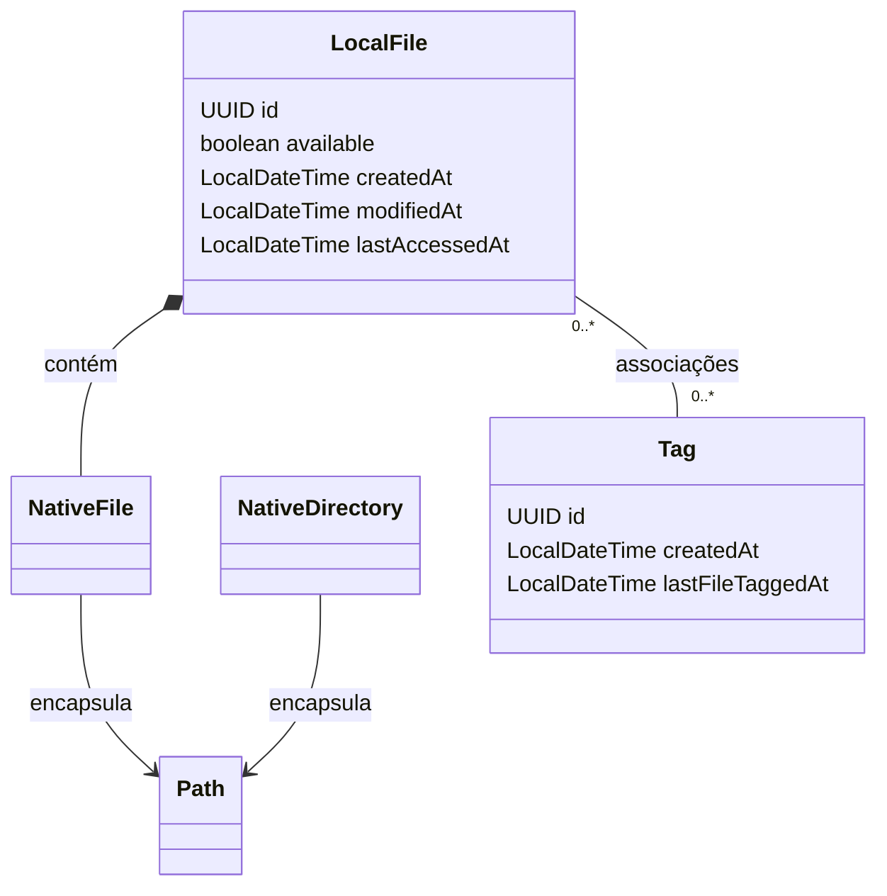
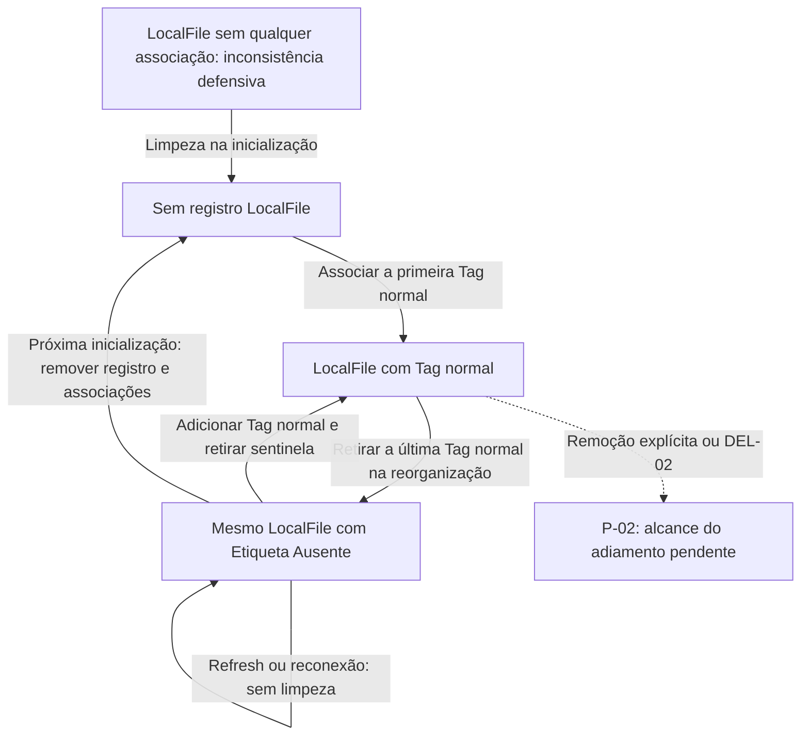

# Modelo de domínio

[Índice](../README.md) · [Regras de negócio](requisitos-e-regras.md) · [Persistência](banco-de-dados.md) · [Arquitetura](arquitetura-e-padroes.md)

Este documento é a referência principal de **DOM-01 a DOM-04**. Descreve o modelo planejado pela especificação consolidada, com as representações ainda propostas explicitamente identificadas. Um objeto é a representação usada pelo programa; uma linha SQL é a representação persistida; o arquivo físico é o conteúdo que continua no sistema de arquivos.

**Estado observado:** o inventário do repositório contém apenas [src/Main.java](../src/Main.java) como código Java, com `Main.main`, mensagem `Hello and welcome!` e laço de 1 a 5. Não foram encontradas classes de domínio. Os diagramas abaixo representam decisões e pendências do projeto, não classes implementadas. A inspeção foi textual, sem execução.

<a id="dom-01"></a>

## DOM-01 — Representações do domínio

**Estado: confirmada.**

| Conceito | Significado |
|---|---|
| `NativeFile` | Representa um arquivo físico da máquina e encapsula um `Path`. |
| `NativeDirectory` | Representa um diretório físico e encapsula um `Path`. |
| `LocalFile` | Representa o registro do que o Tag-File conhece e persiste sobre um arquivo, incluindo identidade, metadados e Tags. Contém um `NativeFile`. |
| `Tag` | Etiqueta com identidade, nome, cor e possíveis extensões permitidas. |
| Associação | Vínculo entre um `LocalFile` e uma `Tag`, persistido na join-table. |
| Caminho | Localização alterável, não identidade permanente do registro. |
| Disponibilidade | Estado conhecido do arquivo no caminho registrado. |
| Filtro | Critérios de uma consulta ou listagem. |
| Seleção | Elementos escolhidos pelo usuário para uma ação. |
| Command | Objeto que encapsula uma operação, separado dos filtros. |
| Refresh | Sincronização controlada de disponibilidade e metadados; não é a limpeza de falta de Tags. |

Um arquivo pode ser mostrado como `NativeFile` sem qualquer `LocalFile`. Um `LocalFile` pode permanecer cadastrado mesmo com o arquivo indisponível.

**Consequência derivada:** a representação nativa de um caminho não pode exigir que o arquivo continue existindo durante toda a vida do objeto. Arquivos indisponíveis precisam poder ser representados e relocalizados.

<a id="dom-02"></a>

## DOM-02 — Identidade versus localização

**Estado: confirmada.**

`LocalFile` e `Tag` utilizam UUID. O caminho de `LocalFile` é alterável e deve ser único no SQL, mas não é sua chave primária. A join-table utiliza os IDs.

```text
Identidade de LocalFile: UUID
Localização: NativeFile → Path
Persistência da localização: coluna de caminho
Restrição: um registro por caminho cadastrado
```

Arquivos com mesmo nome em caminhos diferentes podem ser registros distintos. Tamanho, nome, extensão e datas não substituem o UUID e não foi aprovada deduplicação por conteúdo.

A política de normalização dos caminhos, diferenças de maiúsculas entre plataformas, links simbólicos e caminhos equivalentes permanece em P-08.

<a id="dom-03"></a>

## DOM-03 — LocalFile e metadados

**Estado: informações de domínio confirmadas; representações indicadas como propostas e detalhes físicos ainda abertos.**

| Informação | Definição recuperada | Estado da representação |
|---|---|---|
| Identidade | `UUID id` | Confirmada |
| Referência nativa | `NativeFile nativeFile` | Confirmada |
| Nome | Nome do arquivo | Informação confirmada; obtenção por Native foi proposta |
| Extensão | Extensão real do arquivo | Conceito confirmado; classe/enum separada não exigida |
| Tamanho | Tamanho para apresentação e filtros | Confirmado; `long sizeBytes` e `BIGINT` foram representações propostas |
| Disponibilidade | `boolean available` | Confirmada |
| Criação física | `LocalDateTime createdAt` | Tipo e significado confirmados |
| Modificação física | `LocalDateTime modifiedAt` | Tipo e significado confirmados |
| Último acesso físico | `LocalDateTime lastAccessedAt` | Tipo e significado confirmados |
| Tags | Associações do arquivo | Relação confirmada; `Set<Tag>` apareceu como representação em memória |

As três datas são do arquivo físico, não a data em que a linha foi inserida no SQL. O solicitante determinou `LocalDateTime` em Java e `DATETIME` no MySQL.

Os nomes de atributos acima são os usados nos modelos didáticos. Não há aprovação de uma API completa de setters, getters e construtores, nulabilidade integral ou validação de cada atributo.

A proposta de remover completamente colunas de nome e extensão no SQL não foi inequivocamente aprovada. A decisão física permanece aberta em P-06; o caminho estar encapsulado em `NativeFile` não obriga uma única estratégia de armazenamento desses outros valores.

Tamanho em bytes foi a representação recomendada. MB e MiB não representam exatamente a mesma unidade; a unidade de apresentação e sua formatação não foram fixadas.

Datas indisponíveis, precisão e conversão de fuso estão em P-10. Não foram aprovados valores substitutos, timestamps de cadastro no lugar das datas físicas ou sentinelas numéricas.

<a id="dom-04"></a>

## DOM-04 — Tag

**Estado: informações de domínio confirmadas; API, validações e efeitos especiais nas datas parcialmente definidos.**

| Informação | Definição |
|---|---|
| Identidade | UUID |
| Nome | Pode repetir mediante confirmação |
| Cor | Escolhida pelo usuário e representada em hexadecimal |
| Extensões permitidas | Zero, uma ou várias |
| Criação da Tag | `LocalDateTime createdAt` / `DATETIME` |
| Último arquivo marcado | `LocalDateTime lastFileTaggedAt` / `DATETIME` |
| Quantidade disponível | Derivada por consulta; não armazenar em Tag |

`String name`, `String colorHex` e `Set<String> allowedExtensions` foram representações usadas nos exemplos. Limites de comprimento, valor padrão de cor, obrigação de escolha, validação de nome vazio e formato hexadecimal completo permanecem abertos.

`lastFileTaggedAt` significa o último instante em que um arquivo foi marcado com a Tag. Não há política fechada para associação repetida, marcação automática pela sentinela, cópia de Tags ou exclusões. Não introduza gatilho que atualize essa data em toda consulta ou edição sem base.

## Composição e relações em memória

**Estado: composição confirmada; representação gráfica documental.** `LocalFile` contém uma referência nativa: ele não herda de `NativeFile`. Isso permite que um arquivo apareça na visão local sem exigir registro, enquanto um registro conserva identidade e Tags mesmo se o caminho deixar de existir.



O diagrama não especifica construtores, métodos, nulabilidade completa ou uma política de compartilhamento das instâncias `Path`. A composição descreve a referência em memória; não significa que destruir um objeto ou registro deva apagar o arquivo físico. `NativeFile` e `NativeDirectory` não precisam de tabelas próprias. Diretórios servem para navegação e destino, sem classificação automática.

A cardinalidade `0..*` mostra a relação lógica. A ausência de Tags em um registro requer a leitura conjunta do ciclo de vida: durante a reorganização, a sentinela representa a falta de Tags normais; a inicialização também trata defensivamente registros sem associação. O modelo SQL e os limites de integridade estão em [SQL-01](banco-de-dados.md#sql-01) e [SQL-05](banco-de-dados.md#sql-05).

## Identidade em um exemplo de movimentação

Exemplo didático do resultado aprovado de [OP-03](requisitos-e-regras.md#op-03), sem afirmar execução:

| Momento | Identidade do registro | Caminho | Tags |
|---|---|---|---|
| Antes de recortar | Mesmo UUID do registro de `prova.pdf` | `/Documentos/prova.pdf` | `Faculdade`, `PDF` |
| Após recortar, antes de colar | Mesmo UUID | `/Documentos/prova.pdf` | `Faculdade`, `PDF` |
| Após colar com sucesso | Mesmo UUID | `/Documentos/Faculdade/prova.pdf` | `Faculdade`, `PDF` |

Recortar guarda a intenção no clipboard interno; a colagem realiza a movimentação. A atualização física e a gravação do novo caminho podem falhar separadamente: a tabela descreve sucesso completo, não atomicidade. O fluxo completo está em [UC-09](casos-de-uso.md#uc-09).

**Cópia possui uma decisão ainda aberta.** Este exemplo de movimentação não determina UUID ou associações sobreviventes ao copiar com substituição. [P-01](decisoes-e-pendencias.md#p-01) também precisa decidir se uma cópia sem Tags permanece apenas `NativeFile` ou recebe `LocalFile` temporário em `Etiqueta Ausente`. Consultar [OP-04](requisitos-e-regras.md#op-04) e [UC-08](casos-de-uso.md#uc-08); nenhum resultado de identidade foi escolhido aqui.

## Tag normal, predefinida e sentinela

Resumo para interpretar o modelo; a regra principal está em [TAG-01 a TAG-03](requisitos-e-regras.md#tag-01).

| Grupo | Nomes aprovados | Efeito relevante |
|---|---|---|
| Predefinidas comuns | `Imagens`, `PDF`, `Audios`, `Videos` | Podem ser excluídas com confirmação reforçada. |
| Tag de sistema / sentinela | `Etiqueta Ausente` | Não pode ser excluída pelo usuário, mesmo vazia. |
| Tags criadas pelo usuário | Nome e cor escolhidos | Nomes podem se repetir mediante confirmação; UUID distingue as Tags. |

Uma Tag vazia não tem associações. Uma Tag associada somente a arquivos indisponíveis possui associações, embora sua contagem de disponíveis seja zero. Essa contagem é consultada no banco; não é atributo persistido de `Tag`.

Como nomes se repetem, identificar `Etiqueta Ausente` somente pelo texto não resolve sua proteção. UUID fixo, coluna indicadora, enum ou outro mecanismo não foram aprovados: [P-07](decisoes-e-pendencias.md#p-07) mantém identificação, editabilidade especial e preparação das predefinidas em aberto. Criar predefinidas inicialmente não autoriza restaurar em toda abertura aquelas que o usuário excluiu.

Os catálogos de extensões iniciais são exemplos, não conjuntos finais completos. Extensões seguem [EXT-01](requisitos-e-regras.md#ext-01): múltiplas, normalizadas em minúsculas com ponto e únicas por Tag; nenhuma extensão configurada significa nenhuma restrição. Não há enum obrigatório de categorias `IMAGE`, `AUDIO` ou `VIDEO`.

## Ciclo de vida de `Etiqueta Ausente`

**Estado: resumo gráfico das regras confirmadas [CIC-01 a CIC-03](requisitos-e-regras.md#cic-01).** As setas descrevem efeitos funcionais, não ordem transacional ou métodos existentes.



Na primeira classificação, um caminho já cadastrado reutiliza o registro. Exibir ou navegar não cria `LocalFile`. A sentinela mantém o registro acessível durante a reorganização; receber uma Tag normal remove só a associação temporária à sentinela. A Tag de sistema continua cadastrada e fica vazia após a limpeza de inicialização. As duas formas de limpeza indicadas no diagrama não apagam nem restauram arquivos físicos e não comprovam que o arquivo ainda exista.

A disponibilidade é independente desse ciclo: um registro com arquivo indisponível não é excluído somente por essa condição. O caminho pode ser relocalizado conservando UUID e Tags; a colisão com outro registro continua em [P-08](decisoes-e-pendencias.md#p-08).

**Limite explícito de [P-02](decisoes-e-pendencias.md#p-02):** a modalidade [DEL-02](requisitos-e-regras.md#del-02) originalmente removia os registros e suas associações mantendo o disco. Ainda falta decidir se esse efeito continua imediato, como se relaciona com o adiamento e se a Tag selecionada é excluída ou fica vazia. A opção “Remover do Tag-File” para arquivo indisponível também depende desse alcance. O diagrama não atribui a essas ações um resultado fechado.

## Pontos de modelagem ainda abertos

| Pendência | Consequência neste modelo |
|---|---|
| [P-01](decisoes-e-pendencias.md#p-01) | Identidade na cópia/substituição e registro de cópia sem Tags. |
| [P-02](decisoes-e-pendencias.md#p-02) | Limite entre reorganização com sentinela e remoção explícita de registros. |
| [P-03](decisoes-e-pendencias.md#p-03) | Efeito futuro do silêncio de sugestões ao criar `LocalFile`; não pressupor associação automática. |
| [P-06](decisoes-e-pendencias.md#p-06) | Dicionário físico, incluindo persistir nome/extensão, nulabilidade e representação SQL do UUID. |
| [P-07](decisoes-e-pendencias.md#p-07) | Identificação e edição especial da sentinela; preparação das predefinidas. |
| [P-08](decisoes-e-pendencias.md#p-08) | Equivalência de caminhos, links, extensões compostas, nomes especiais e relocalização conflitante. |
| [P-09](decisoes-e-pendencias.md#p-09) | Validação e comparação de nomes, cor e defaults. |
| [P-10](decisoes-e-pendencias.md#p-10) | Datas ausentes, conversões e efeitos em `lastFileTaggedAt`. |

A Factory centraliza a criação das entidades, enquanto a leitura do banco deve preservar a identidade existente; o contrato de reconstrução permanece aberto em [ARQ-02](arquitetura-e-padroes.md#arq-02). A sincronização de metadados pertence a [ARQ-07](arquitetura-e-padroes.md#arq-07), conforme os gatilhos de [SYN-01](requisitos-e-regras.md#syn-01).
