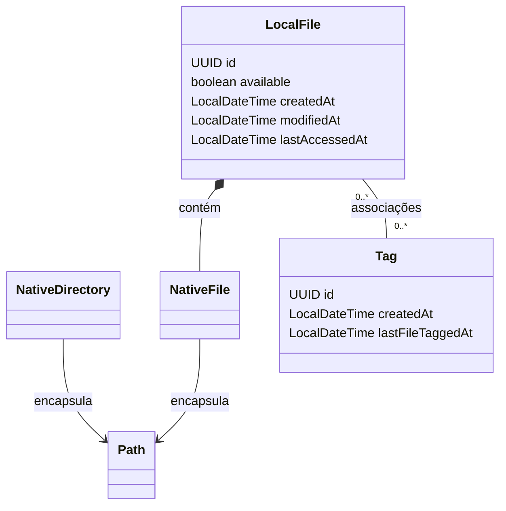
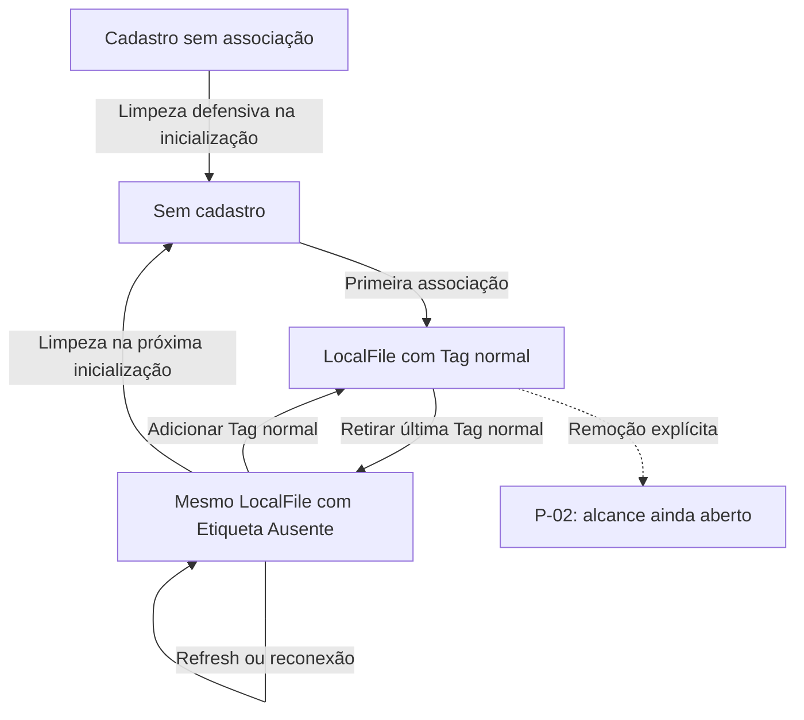

# Modelo de domínio: objetos e relações

[Índice](README.md) · [Visão geral](visao-geral.md) · [Banco de dados](banco-de-dados.md)

O modelo de domínio descreve os conceitos do Tag-File e suas relações. Comece distinguindo três coisas: o conteúdo no disco, o cadastro no banco e o objeto Java usado durante a execução.

<a id="dom-01"></a>

## Os conceitos principais

| Conceito | O que representa | Relação principal |
|---|---|---|
| NativeFile | Caminho de um arquivo físico, encapsulado em um Path. | Pode ser referenciado por um LocalFile. |
| NativeDirectory | Caminho de uma pasta, encapsulado em um Path. | Serve à navegação e aos destinos de operações. |
| LocalFile | Cadastro conhecido pelo aplicativo: identidade, referência nativa, metadados e Tags. | Contém NativeFile e se associa a Tags. |
| Tag | Etiqueta com identidade, nome, cor e possíveis restrições de extensão. | Pode classificar vários LocalFile. |
| Associação | Vínculo entre LocalFile e Tag. | É persistida em LOCAL_FILE_TAG. |

NativeFile e NativeDirectory representam caminhos; não precisam de tabelas próprias. Navegar por uma pasta não cria LocalFile para todos os arquivos. Um LocalFile já registrado pode continuar existindo se o arquivo ficar indisponível. Por isso, representar um caminho não pode exigir que o arquivo permaneça fisicamente disponível durante toda a vida do objeto.

### Como ler o diagrama



- **Encapsular Path:** o objeto guarda a representação do caminho.
- **LocalFile contém NativeFile:** há composição de objetos, não herança. Um cadastro guarda uma referência ao objeto que representa o caminho.
- **0..* dos dois lados:** uma Tag pode classificar vários arquivos, e um arquivo pode ter várias Tags. A regra da última Tag normal está explicada ao final desta página.

Excluir um objeto da memória ou uma linha do banco não apaga automaticamente o conteúdo no disco. A composição do diagrama não representa propriedade sobre a existência física do arquivo. O desenho mostra relações; não determina todos os atributos, construtores ou métodos.

<a id="dom-02"></a>

## Identidade: o cadastro permanece quando o caminho muda

LocalFile e Tag usam UUID como identidade. O caminho do LocalFile é alterável e único no banco, mas não é sua chave primária. A associação entre arquivo e etiqueta usa os IDs.

| Situação | Identidade | Localização |
|---|---|---|
| Arquivo cadastrado | UUID A | /Documentos/prova.pdf |
| Recortado, antes de colar | Mesmo UUID A | Mesmo caminho; recortar só guarda intenção. |
| Colado com sucesso em outra pasta | Mesmo UUID A | /Documentos/Provas/prova.pdf |

Arquivos de mesmo nome em pastas distintas podem ter cadastros diferentes. Nome, tamanho e conteúdo não substituem o UUID; não há deduplicação por conteúdo.

Normalização de caminhos, diferenças entre plataformas, links e caminhos equivalentes estão em [P-08](decisoes-e-pendencias.md#p-08). A identidade na cópia com substituição continua em [P-01](decisoes-e-pendencias.md#p-01). Esses casos não mudam a regra de preservar identidade em um movimento normal.

<a id="dom-03"></a>

## Informações de LocalFile

| Informação | Significado | Representação definida ou pendente |
|---|---|---|
| id | Identidade do cadastro. | UUID. |
| nativeFile | Referência ao caminho do arquivo. | NativeFile. |
| Nome e extensão | Nome e extensão reais do arquivo. | Obtenção por Native e colunas separadas no SQL ainda não estão totalmente definidas. |
| Tamanho | Tamanho do arquivo. | long em bytes e BIGINT são propostas; apresentação em MB/MiB ainda aberta. |
| available | Disponibilidade conhecida no caminho salvo. | boolean. |
| createdAt | Criação física do arquivo. | LocalDateTime em Java / DATETIME no MySQL. |
| modifiedAt | Modificação física do arquivo. | LocalDateTime / DATETIME. |
| lastAccessedAt | Último acesso físico ao arquivo. | LocalDateTime / DATETIME. |
| Tags | Classificações associadas. | A relação está definida; `Set<Tag>` é uma representação sugerida em memória. |

As datas acima pertencem ao arquivo físico, não ao momento do cadastro no banco. Valores ausentes, precisão e conversão de fuso são decisões de [P-10](decisoes-e-pendencias.md#p-10). A API completa de atributos, nulabilidade e validações também não está fechada.

<a id="dom-04"></a>

## Informações de Tag

| Informação | Significado |
|---|---|
| id | UUID da etiqueta; nomes iguais podem ter IDs diferentes. |
| Nome | Texto exibido; repetição permitida mediante confirmação. |
| Cor | Cor escolhida pelo usuário, representada em hexadecimal. |
| Extensões permitidas | Zero, uma ou várias extensões. Sem restrição configurada, qualquer extensão é aceita. |
| createdAt | Criação da Tag: LocalDateTime / DATETIME. |
| lastFileTaggedAt | Último instante em que um arquivo foi marcado com a Tag: LocalDateTime / DATETIME. |
| Quantidade disponível | Calculada por consulta, sem contador persistido. |

String para nome/cor e `Set<String>` para extensões são exemplos de representação. Limites, padrão de cor, validação de nome vazio e formato completo estão em [P-09](decisoes-e-pendencias.md#p-09). O efeito de associação repetida, sentinela, cópia ou exclusões sobre lastFileTaggedAt está em P-10.

## A mesma Tag pode classificar muitos arquivos

```text
prova.pdf      → Faculdade, Importante
trabalho.docx  → Faculdade
```

Faculdade é uma Tag compartilhada pelas duas associações. Remover a associação de prova.pdf com Faculdade não apaga a Tag nem a associação de trabalho.docx. O [modelo relacional](banco-de-dados.md#sql-01) mostra como guardar esses vínculos.

As predefinidas comuns são Imagens, PDF, Audios e Videos. A Tag Etiqueta Ausente é protegida. Nomes repetidos impedem identificar a Tag protegida apenas pelo texto do nome; seu mecanismo técnico permanece em [P-07](decisoes-e-pendencias.md#p-07).

## Ciclo de vida do cadastro durante a reorganização

Quando a última Tag normal é retirada, o cadastro recebe Etiqueta Ausente. Isso permite encontrá-lo para continuar a organização. Adicionar uma Tag normal retira a associação com a sentinela; a Tag protegida continua existindo.



A limpeza da inicialização remove os cadastros cuja única Tag é a sentinela e os cadastros sem associações. Preserva arquivos físicos e a Tag protegida. Indisponibilidade, sozinha, não remove um cadastro. O alcance de exclusões explícitas permanece em [P-02](decisoes-e-pendencias.md#p-02).

## Quem cria, carrega e atualiza esses objetos

A Factory única cria Tag e LocalFile; NativeFile e NativeDirectory são instanciados diretamente. Ao reconstruir um cadastro vindo do banco, os DAOs conservam UUID e datas existentes. A forma exata de reconstrução ainda precisa de contrato; gerar outro UUID a cada leitura perderia a identidade.

LocalFileManager coordena a atualização de disponibilidade e metadados, usando NativeFileService e DAOs. Essas colaborações estão na [arquitetura](arquitetura-e-padroes.md).
